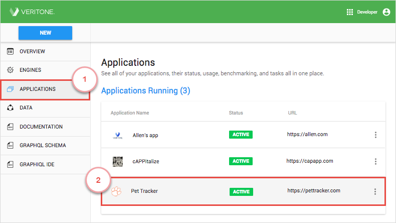
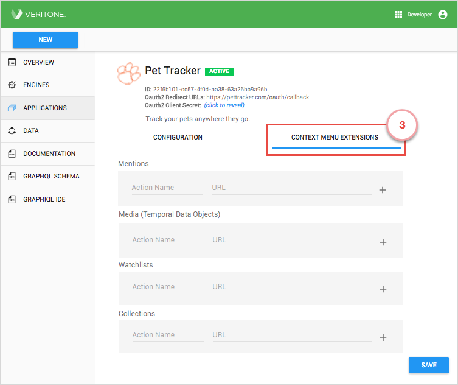

# Context Menu Extensions


### Overview
A Context Menu contains a list of additional commands that a user can select to perform various actions on selected content. Veritone presents different Context Menus throughout the UI that appear when a user clicks the **more options icon** (vertical ellipsis). As a VDA developer, you can add custom Context Menu Extensions in various sections of the Veritone UI and create a shortcut for users to access your application. When creating Context Menu Extensions, you choose the name that will display and provide a redirect URL where users will be taken when your item is selected from the menu. Once an extension is added, any Veritone user of your application can view and interact with it when the associated Context Menu is open.

You can add any number of extensions to the following Context Menu types: 
 <ol type="a">
  <li><b>Watchlist:</b> A Watchlist is a saved set of criteria that Veritone performs continuous searches against to find matching content in the database index. Veritone creates a folder in Discovery for each watchlist and automatically adds content (known as “Mentions”) that matches the search criteria. The Watchlist Context Menu is located on the right of a Watchlist name in the left menu of Discovery.</li>
 <li><b>Mention:</b> A Mention is a matching result for a Watchlist’s criteria. The Mentions Context Menu is located on the far right of an individual Mention in Discovery.</li>
</ol>


### Create a Context Menu Extension
*Context Menu Extensions* can be added in [Veritone Developer App (VDA)](https://developer.veritone.com/applications/overview) when creating a new application or by modifying an existing application’s settings.

#### Access Context Menu Extension Settings
The step to add Context Menu Extensions for a new application is built directly into the [application registration workflow](/applications/quick-start/step-1). To access the *Context Menu Extensions* page for an existing app, log in to Veritone Developer and follow the steps below.
1. Select **Applications** on the left menu of the Veritone Developer homepage. A list of your organization’s *Applications* displays.
2. Select the **application name** in the list where the Context Menu Extension will be added. The selected application’s settings open.

3. Click the **Context Menu Extensions** tab. The *Context Menu Extensions* settings open.


#### Add a Context Menu Extension
1. Choose the Context Menu type where you’d like your extension to appear.
   *   **Mention:** On the far right of a Mention in Discovery.
   *   **Watchlist:** A W On the right of a Watchlist name in the left menu of Discovery.
   *   **Media:** *Coming soon!*
   *   **Collections:** *Coming soon!*

2. Enter an `Action Name` (label) for your extension. The `Action Name` is the text that’s shown to users in the menu. The name should be short and describe the behavior your extension performs. (e.g., "Send to Pet Finder")

3. Enter the `URL` where users will be taken when your Context Menu item is clicked. A Context Menu `URL` is constructed of two parts: the URL of your application’s external server location and an appended template string that extracts the ID of the resource where the menu item was clicked. Template strings are similar in structure but differ between the Context Menu types (e.g., Mention: `${mentionId}`, Watchlist: `${watchlistId}`). Full URL configuration examples are provided as a reference for each Context Menu type and can be viewed by clicking in the `URL` field.

4. Click **+** to add an additional item to the menu, if desired.

5. Add extensions to additional Context Menu types, as desired. Click **Save** when all Context Menu Extensions have been added.


##### Example

The example below creates an extension that displays as `Send to Pet Tracker` on the Context Menu for Mentions. When a user clicks `Send to Pet Tracker`, they will be routed to the URL that's registered in the Context Menu Extensions settings (`www.pettracker.com/${mentionId}`). In addition, the template string (`${mentionId}`) will automatically be replaced with the unique ID of the Mention where the `Send to Pet Tracker` Context Menu Extension was selected (`www.pettracker.com?mentionId=12345`).
```json
label: Send to Pet Tracker
url: www.pettracker.com?mentionId=${mentionId}
```

### Handling the Redirect URL

When a user clicks on your Context Menu Extension, Veritone sends a GET request that includes the captured resource ID to your URL. To ensure proper handling of Context Menu redirects, it’s recommended to set up URL routing rules for the receiving server to accept GET requests. 

In order to use the resource ID, you'll need to parse the URL down to its components. Depending on how the URL was constructed when the Context Menu Extension was created, the ID will either be parsed from the request parameters or from the query string. 

**Example:**
* Parse from parameters: `www.pettracker.com/12345/example` 
* Parse from query string: `www.pettracker.com?mentionId=12345` 

Once the URL is parsed, pass the resource ID in the correlating query below to fetch the full resource.

**Mention**
```graphql
query{
    mention(mentionId: "mentionId") {
      id
    }  
}
```

**Watchlist**
```graphql
query{
    watchlist(id: "watchlistId") {
      id
    }  
}
```
