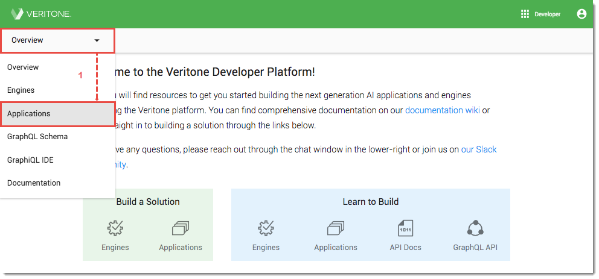
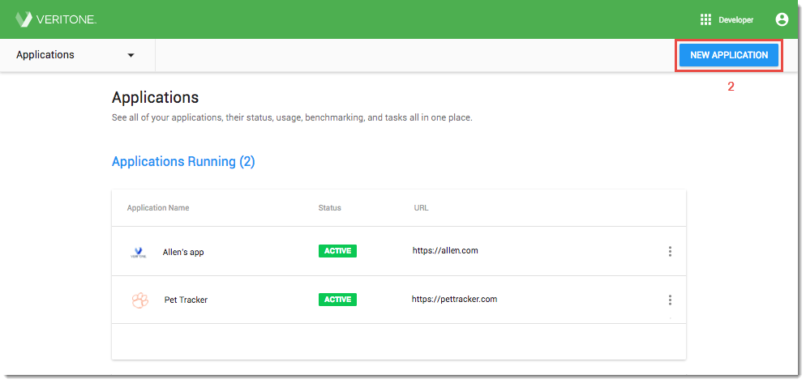
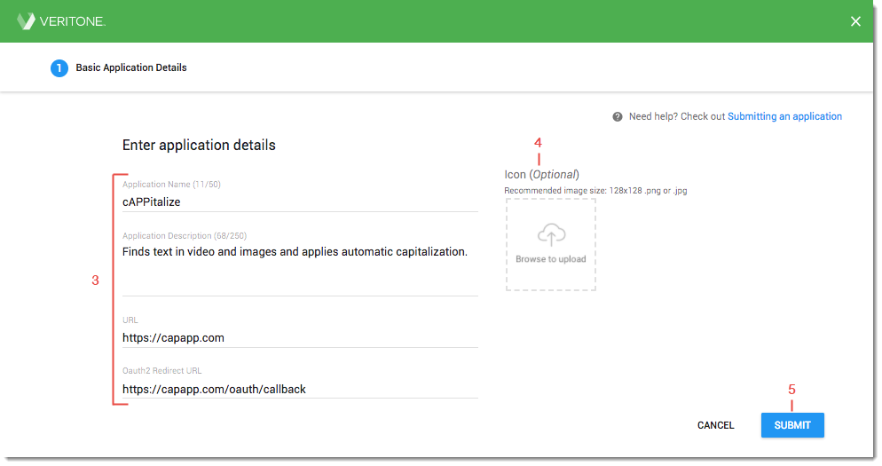
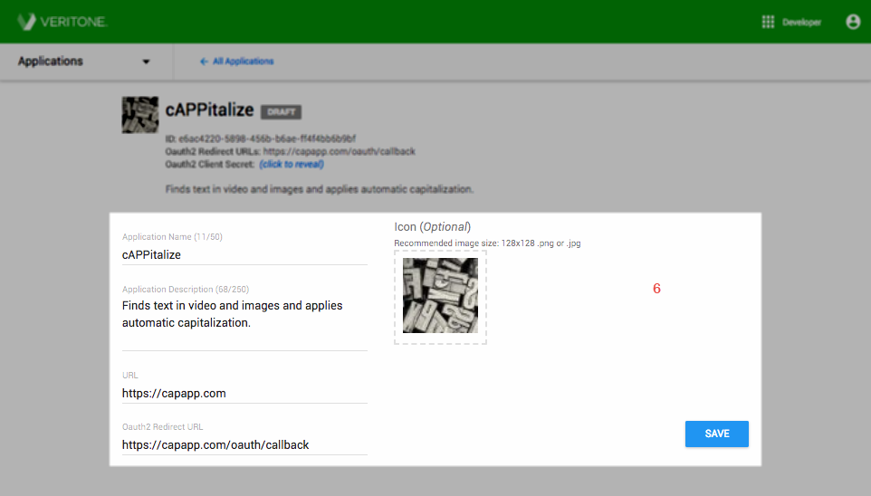
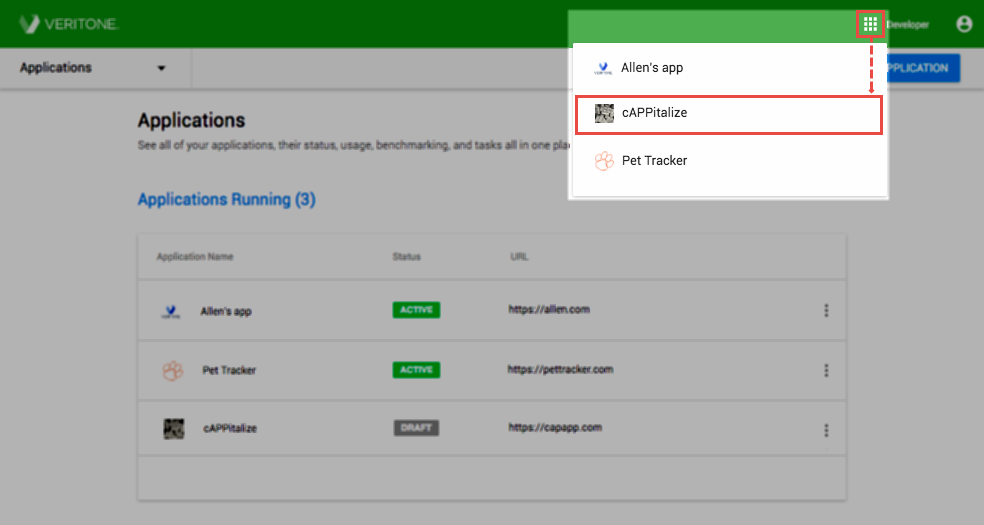

# Step 1. Register Your Application

Registering your app allows you to specify general information and basic configuration details about your application and add it to the Veritone platform in a draft state. Once your app is registered, you'll be provided with a unique Application ID and other credentials that your app will use to configure [user authentication](/applications/quick-start/step-2). 

### To register your application
1\.  Log into Veritone Developer. Click **Overview** in the upper left of the window and select **Applications** from the dropdown. The _Applications_ page opens. (*Note:* If you're new to Veritone Developer, no registered applications will display.)

2\. Click **New Application** in the upper right of the window. The _Basic Application Details_ page opens.

3\. Enter the following information about your application:  

* **Application Name**: Enter your application's name (up to 50 characters in length) as you would like it to appear to users.
* **Application Description**: Describe what your application does in a few sentences. This description will display to users.
*   **URL:** Enter the URL where the application can be accessed.
*   **Redirect URL:** Enter your application server's Oauth2 redirect/callback URL. See the section on [OAuth](/applications/oauth) for more information. 

4\. Upload an *icon* to represent your application from your local file system as a 128x128 png or jpg file. For best results, upload a square image. The icon will display to the left of the application name in the *Veritone App Picker*. Images are automatically resized and converted to grayscale in the Veritone UI. If an icon is not uploaded, a generic icon will display with your application name.

5\. Click **Submit** to continue. A "Application created successfully" confirmation message momentarily displays and the app is added to Veritone in a *Draft* state. 

6\. Review your application details.

*   If no changes need to be made, no further action is necessary.
*   If changes are required, make the necessary edits and click _Save_. An "Application updated successfully" message displays momentarily. Note that the _Save_ button remains blue after your changes have been applied. 

Once your app is registered, use the values at the top of the page to [configure your app with OAuth 2.0 authentication](/applications/oauth). 

### View and Access Your App 
Your registered applications display on the main *Applications* page of your Veritone Developer account. In addition, apps are accessible through the **App Picker** at the top right of the window. 

