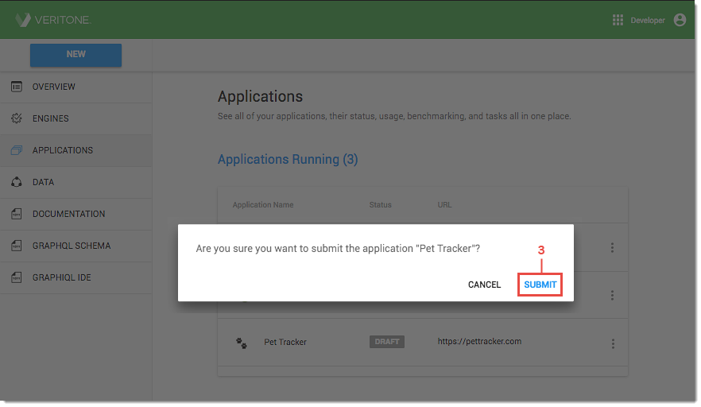

# Step 4. Submit Your Application for Review

When your app has been [registered](/applications/quick-start/step-1), set up with [OAuth 2.0](/applications/oauth), and development is complete, you'll submit it for review by our Veritone's development team. All applications must pass a Compliance Review prior to deployment to ensure certain security and integration requirements are met. Most apps pass the review with no further development required. 

### To submit your application for review:

1\. Log into Veritone Developer and click **Applications** on the left menu. The _Applications_ dashboard opens.

2\. Click the **vertical ellipsis icon** on the far right of the application name and select **Submit for Approval** from the dropdown. The submission confirmation window opens.

3\. Click **Submit**. The *Applications* dashboard reopens and the application status displays as _Pending_.

## Compliance Review Results

Compliance Review results are available within two business days of submission. Once the review process is complete, your application will be updated with one of the following statuses: 

* **Approved:** Your application passed the Compliance Review and it can be [deployed to production](/applications/quick-start/step-5) at any time.

* **Rejected:** Your application did not pass the Compliance Review and it cannot currently be deployed. This status is issued when one or more security or integration requirements are not met. If your application fails the Compliance Review, contact our developer support team to review the results and disuss possible courses of action for correction. Once the identified issues have been resolved, resubmit your app for a follow-up review.

 
