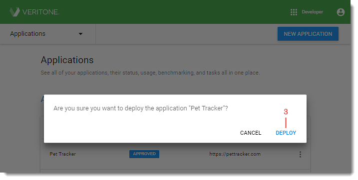

# Step 5. Deploy your Application

When your application's status shows _Approved_, you can deploy it and make it available to users in your organization.

To deploy an Approved application:

  

1\.  Log into Veritone Developer. Click **Overview** in the upper left of the window and select **Applications** from the dropdown. The _Applications_ page opens.

2\. Click the **vertical ellipsis** on the right of the application entry in the _Applications_ table and select **Deploy**. The confirmation window opens.

3\. Click **Deploy**. The confirmation window closes and the application status changes to _Active_.

Once deployed, your application can be accessed from the App Picker by all users in your organization.

