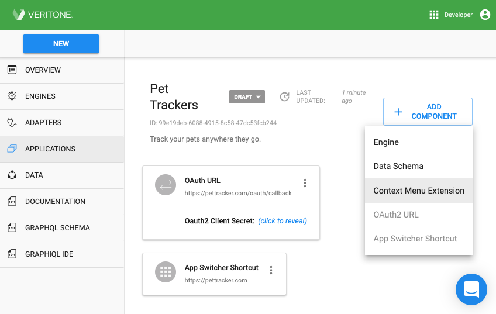

# Step 1. Register Your Application

Registering your app allows you to specify general information and basic configuration details about your application and add it to the Veritone platform in a draft state. Once your app is registered, you'll be provided with a unique Application ID and other credentials that your app will use to configure [user authentication](/developer/applications/quick-start/step-2).

### To register your application:

1\.  Log into Veritone Developer. Click **New** in the upper left of the window and select **Application** from the dropdown. The *New Application* window opens to the _Basic Application Details_ page.

2\. Enter the following information about your application:

* **Application Name**: Enter your application's name (up to 50 characters in length) as you would like it to appear to users.
* **Application Description**: Describe what your application does in a few sentences. This description will display to users.
* **URL:** Enter the URL where the application can be accessed.
* **Redirect URL:** Enter your application server's Oauth2 redirect/callback URL. See the section on [OAuth](/developer/applications/oauth) for more information.

3\. Upload an *icon* to represent your application as a 128x128 png or jpg file. For best results, upload a square image. The icon will display to the left of the application name in the *Veritone App Picker*. Images are automatically resized and converted to grayscale in the Veritone UI. If an icon is not uploaded, a generic icon will display next to your application name.

4\. Click **Create** to continue. 

> A confirmation message ("Application created successfully") momentarily displays and the app is added to Veritone in a *Draft* state.

5\. Review your application details.

*   If no changes need to be made, no further action is necessary.
*   If changes are required, click the **DRAFT** button next to the app's name to expose a dropdown containing Edit, Submit, and Delete commands. 
Select the **Edit** command and make any necessary edits, then click **Save**. 
An "Application updated successfully" message displays momentarily. 

### Create a Context Menu Extension (Optional)

If your app will have a content menu extension 
(see the [Context Menu Extensions](/developer/applications/context-menu-extensions) section of our docs to learn more), 
it's easy to create one.

1\. Click the **Add Component** (plus sign) button near the upper right of the 
main panel to expose a dropdown menu. 

2\. Select **Context Menu Extension** from the menu.
An **Add Context Menu Extension** dialog appears.

3\. The **Type** field offers a dropdown list. 
Select the appropriate object type from the list. 
(The choices are Mention, Watchlist, Collection, or Media/Temporal Data Object.) 

4\. Enter a **Label** for the action. 
(This value will be displayed to the user.)

5\. Enter the action URL for this action, following the syntax of the hint displayed 
as a placeholder value.

> The exact placeholder hint you see here will depend on the **Type** you selected in Step 3.

6\. When you are satisfied with the values in the dialog, click the blue **Add** button.

### View and Access Your Application

Your application can now be viewed and accessed in the following ways:

<b>a. Applications Dashboard:</b> To manage your applications, click <b>Applications</b> on the left menu in Veritone Developer, then select an app from the <i>Applications</i> dashboard list to view and edit the settings.

<b>b. App Picker:</b> Registered applications display by clicking the <i>App Picker</i> icon in the upper right of the window. The App Picker provides an easy way for users to find and access applications that have been enabled for their organization.

> When your application is first registered, it will be in `DRAFT` state.
When an application is in `DRAFT` state that means that it is available to use for Developer users of your organization.
So anyone with access to Developer app in your organization will see it in the app switcher, will be able to OAuth against it, etc.
In draft state, this is usually just for development and testing purposes.
In order to make that application available to other users of aiWARE (either users of other organizations or non-developers in your organization), the application must be submitted for [review](/developer/applications/quick-start/step-4).

[On to Step 2: Setting Up Authentication](developer/applications/quick-start/step-2)