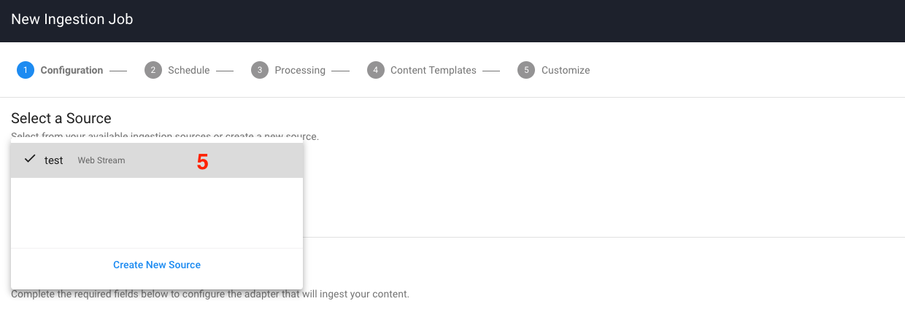

# Testing your Engine

Before submitting your build, you should test your engine thoroughly using the techniques described here.

## Data Validation Testing

Before doing functional testing of your engine, you should take care to see that your engine is outputting valid data according to the [engine output standard (vtn-standard)](/developer/engines/standards/engine-output/).

### Engine Output Validation API (Beta)

We understand that writing valid engine output for the first time can be difficult and confusing.
To make it easier to write conforming output, Veritone provides a simple HTTP POST endpoint that you can use to test the validity of your engine's output.

For example, to validate a speech-to-text engine, you can make the following call:

```bash
curl --request POST \
  --url https://api.veritone.com/v3/tools/engine/validate/ \
  --header 'content-type: application/json' \
  --data '{
  "schemaId": "https://docs.veritone.com/schemas/vtn-standard/master.json",
  "validationContracts": [
    "transcript"
  ],
  "series": [
    {
      "startTimeMs": 0,
      "stopTimeMs": 300,
      "words": [
        {
          "word": "this",
          "extra": "not part of the standard"
        }
      ]
    },
    {
      "startTimeMs": 300,
      "stopTimeMs": 500,
      "words": [
        {
          "word": "is"
        }
      ]
    },
    {
      "startTimeMs": 500,
      "stopTimeMs": 800,
      "words": [
        {
          "word": "a"
        }
      ]
    },
    {
      "startTimeMs": 800,
      "stopTimeMs": 1200,
      "words": [
        {
          "word": "sentence"
        }
      ]
    }
  ]
}'
```

If the engine output is valid, you will see `valid: true` under the `data` key of the response, as well as a `processed` field, which will show you only the fields that have been validated against the vtn-standard.

Here is an example of validating the above `transcript` output.

```json
{
  "data": {
    "valid": true,
    "processed": {
      "schemaId": "https://docs.veritone.com/schemas/vtn-standard/master.json",
      "validationContracts": [
        "transcript"
      ],
      "series": [
        {
          "startTimeMs": 0,
          "stopTimeMs": 300,
          "words": [
            {
              "word": "this"
            }
          ]
        },
        {
          "startTimeMs": 300,
          "stopTimeMs": 500,
          "words": [
            {
              "word": "is"
            }
          ]
        },
        {
          "startTimeMs": 500,
          "stopTimeMs": 800,
          "words": [
            {
              "word": "a"
            }
          ]
        },
        {
          "startTimeMs": 800,
          "stopTimeMs": 1200,
          "words": [
            {
              "word": "sentence"
            }
          ]
        }
      ]
    }
  }
}
```

Note how in the processed output, `"extra": "not part of the standard"` has been stripped out of the `words` array in the first element in the `series` array, because `extra` is not part of the vtn-standard for speech-to-text.

You might be wondering _What happens if I submit invalid output?_ Let's find out.

```bash
curl --request POST \
  --url https://api.veritone.com/v3/tools/engine/validate/ \
  --header 'content-type: application/json' \
  --data '{
  "schemaId": "https://docs.veritone.com/schemas/vtn-standard/master.json",
  "validationContracts": [
    "transcript"
  ],
  "series": [
    {
      "startTimeMs": 0,
      "stopTimeMs": 300,
      "words": [
        {
          "word": "this"
        }
      ]
    },
    {
      "startTimeMs": 300,
      "stopTimeMs": 500,
      "words": [
        {
        }
      ]
    },
    {
      "startTimeMs": -1,
      "stopTimeMs": 800,
      "words": [
        {
          "word": "a"
        }
      ]
    },
    {
      "startTimeMs": 800,
      "stopTimeMs": 1200,
      "words": [
        {
          "word": "sentence"
        }
      ]
    }
  ]
}'
```

In the preceding example, the second element in the array has an empty object, and the third element has a negative `startTimeMs`, which would clearly cause problems due to data inconsistency.
Fortunately, the engine output validator can catch a large subset of these sorts of problems.

Here's what we get when we try to validate our less than perfect output:

```json
{
  "errors": [
    {
      "name": "invalid_input",
      "message": "The supplied engine result failed schema validation checks. Details errors are included in the validationErrors field.",
      "validationErrors": [
        {
          "keyword": "required",
          "dataPath": ".series[1].words[0]",
          "schemaPath": "#/else/items/required",
          "params": {
            "missingProperty": "word"
          },
          "message": "should have required property 'word'"
        },
        {
          "keyword": "if",
          "dataPath": ".series[1].words",
          "schemaPath": "#/if",
          "params": {
            "failingKeyword": "else"
          },
          "message": "should match \"else\" schema"
        },
        {
          "keyword": "minimum",
          "dataPath": ".series[2].startTimeMs",
          "schemaPath": "#/properties/series/items/properties/startTimeMs/minimum",
          "params": {
            "comparison": ">=",
            "limit": 0,
            "exclusive": false
          },
          "message": "should be >= 0"
        }
      ]
    }
  ]
}
```

Since the engine output is not valid, the `valid` field is not present.
Instead, an array of `errors` is provided, with detailed information letting us know that the second element in the `series` array, `series[1]` (an empty object), is missing the `word` property, and the third element in the `series` array, `series[2]`, has a `startTimeMs` that is below the required value of `0`.

#### Limitations

> "Testing can be used to show the presence of bugs, but never to show their absence."
> &mdash;*Edsger W. Dijkstra*

The engine output validator can determine if specific test data from your engine is invalid. 
It cannot determine whether _all_ the possible outputs of your engine will always be valid. 

Also note, the validator does not yet cover the full spectrum of vtn-standard output. (This may change.)

?> As of `3/28/19` only validation of the `transcription` engine capability is supported.

Since data validation is a computationally expensive task, the API only allows engine output of `1MB` or less to be validated at a time without rate limiting.

## Testing a Segment or Stream Engine

### Testing Locally

The recommended way to test these types of engines locally is by simulating and verifying locally that your engine can consume and produce the messages documented in the construction guidelines listed below.

* [Segment Engine Construction Guidelines](/developer/engines/processing-modes/segment-processing/)
* [Stream Engine Construction Guidelines](/developer/engines/processing-modes/stream-processing/)

### Testing in aiWARE

You can test your uploaded build in CMS by following the steps below.

1\. Click on the `New` button and then select `Ingestion Job`


2\. Select an adapter. For this example we're going to select the Web Stream Adapter.


3\. If you don't have any existing sources, click on the `Select a Source` dropdown and then click on `Create New Source`


4\. On the new source page, fill out the `Source Name` and the `Stream URL` fields and then click `Create`.


5\. Select the newly created source from the `Select a Source` dropdown and click `Next`.



6\. On the schedule page, choose immediate and then click `Next`.


7\. The default view of the processing step displays the Simple Cognitive Workflow which allows users to select a category in which Veritone chooses the best engine of that given category to process their media with. As the intention is to test your own engine, you need to click on `Show Advanced Congnitive Workflow` at the upper right corner.


8\. On the Advanced Cognitive Workflow page, click on the dropdown under Available Engines and choose the category that corresponds to your engine. You will then see your engine in the engine list. Click on the green plus icon to select your engine and move it to the Selected Engines panel. If your engine requires either engine parameters or a library you will now be asked to input these. After configuring your engine parameters, click `Next`.


9\. Click `Next` on the Content Templates step which will take you to the final step `Customize`. Fill out the `Customize` step with any information you'd like, and finally click `Save` to finish.  That will redirect you to the CMS main page.


10\. You have now successfully created an ingestion job, which your engine build will be asked to process. You can click on the `Processing Status` button in the left navigation panel to view the processing list, which gives an overview of all of the recently processed files and their status. You can also click on a file in the processing list to view its media details page where you can view the output of a successfully processed file, as well as make additional actions against the file such as reprocessing.

If your ingestion job results in an error, please read the section below on debugging to get a better understanding of how to debug your engine in the Veritone Platform.

## Testing a Legacy (Batch) Engine

!> Legacy batch engines are deprecated.
If you have developed a legacy batch engine, we highly recommend you upgrade it to a [segment engine](/developer/engines/processing-modes/segment-processing/).

Information on testing legacy engines is available [here](/developer/engines/testing-and-debugging/batch-engines/).

## Debugging

Any time your engine is asked to process a task which belongs to you, it will be displayed as a new task row under the tasks page of your engine in VDA. This is the best starting point for debugging.

By expanding the task row, you will be able to view additional information about your task in the tabs provided which are detailed below.

##### Payload

The payload tab displays the JSON payload that your engine will receive at runtime. You should verify that you are handling the payload correctly in your engine and also that the correct parameters (custom fields) are being passed to your engine inside of the payload.

You can view your task payload via graphql by using the snippet below:

```graphql
query {
  task(id: "replaceMe") {
    payload
  }
}
```

##### Task Log

The task log tab displays your engines task log in JSON format.
The task log is the primary way for you to debug as it allows you to view the standard output (stdout) of your engine.
The only exception to this is for Segment engines, for which we do not attach stdout as part of the task log.
For both Stream and Segment engines you will also be able to view kafka events here if they are related to your task.

> We only return the task log for completed or failed tasks so it is vital that your engine correctly updates the task status in response to both success/errors in order for you to view your logs.

You can view your task log via graphql by using the snippet below:

```graphql
query {
  task(id: "replaceMe") {
    log {
      uri
      text
      jsondata
    }
  }
}
```

##### Task Output

The task output tab displays your engine results. Take a look [here](apis/tutorials/engine-results?id=uploading-engine-results) for more information about engine results.

You can view your task output via graphql by using the snippet below:

```graphql
query {
  task(id: "replaceMe") {
    output # JSON
    outputString # stringified
  }
}
```

##### Assets

The assets tab displays all of the assets that were produced by your engine for that particular task. This allows you to view the type of asset that was produced, and also allows you to view the source by clicking on the asset ID. This is useful for verifying that the assets produced have been processed by your engine correctly.

You can also view the assets created by your engine by using the graphql query below.  Replace the ID `replaceMe` with the `recordingId` from your task payload.

```graphql
query{
  temporalDataObject(id:"replaceMe"){
    assets(orderBy:createdDateTime) {
      records  {
        id
        assetType
        contentType
        createdDateTime
        jsondata
        signedUri
      }
    }
  }
}
```

This query orders the assets by when they were created, with the most recent asset first. Use the `signedUri` value to view the asset in your browser.

You can also filter by specific types of assets by including the `type` filter. This filters against the `assetType` of the asset. See the query below for an example.

```graphql
query{
  temporalDataObject(id:"replaceMe"){
    assets(type: "vtn-standard" orderBy:createdDateTime) {
      records  {
        id
        assetType
        contentType
        createdDateTime
        jsondata
        signedUri
      }
    }
  }
}
```
