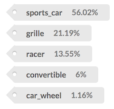

# Tagbox tutorial: Recognizing images

In this tutorial we will install tagbox on your computer and start using the API to
generate tags that describe images.

## Install Docker


The first thing we need to do is to install Docker.

To install Docker, head over to the Docker website to [download Docker Community Edition](/out/docker/install)
for your computer.

Or pick from this list of popular operating systems:

* [macOS](/out/docker/download/mac)
* [Windows](/out/docker/download/windows)

Follow the instructions in the installer until you have Docker up and running.

Validate that Docker is indeed running by opening a terminal and doing:

```bash
docker version
```

You should see some output that lists various version information.

If you get an error (like `docker: command not found`) then the installation was not successful, and we
recommend you consult the [Docker website](/out/docker/install).

## Run tagbox

Running tagbox is extremely easy, you just need to `docker run` the `machinebox/tagbox` image with the
`MB_KEY` environment variable configured.

* You can get the actual commands you need to run from your Account page where we auto-fill your actual key

Open a terminal, and do:

```bash
MB_KEY="INSERT-YOUR-KEY-HERE"
docker run -p 8080:8080 -e "MB_KEY=$MB_KEY" machinebox/tagbox
```

* Remember to replace `INSERT-YOUR-KEY-HERE` with your actual box key
* `-p 8080:8080` tells Docker to expose the container's port `:8080` as your local port `:8080`
* `-e "MB_KEY=$MB_KEY"` provides the `MB_KEY` environment variable to the container
* `machinebox/tagbox` is the name of the tagbox image on [Docker Hub](https://hub.docker.com/u/machinebox/)

This command will download the latest version of tagbox (if you don't already have it) and spin up
a running container.

Assuming you see no error messages, it's time to jump into the Interactive console.

## Interactive console

The Interactive console is the homepage for every box. You can use it to learn about the capabilities
of the box, see what API calls are available, and make actual calls too.

Once your box is running, open a web browser and go to [http://localhost:8080/](http://localhost:8080/).

You should see the latest tagbox console:


The left hand side of the page reveals the status of the box. Boxes can take a few seconds to warm up,
so wait until you see the status change to `Ready` before continuing.

## Submit some real images

In the Interactive console, go to the */tagbox/check endpoint* section, and access the *By URL* tab.

Notice that the API is pretty trivial, and there is even a way to use the service right from this page.

Click the *Try it now* link to open the panel:


Select the *Car* image from the *Samples* section, which will autofill the *URL* box, and click *POST*.

This will submit a URL to this image:


The API call looks like this:

```json
POST /tagbox/check
{
  "url": "https://machinebox.io/samples/images/car.jpg"
}
```

It's important to remember that the call is made to your locally running tagbox, the image is downloaded and analyzed and the results are returned. If you submit an image from your local hard-drive (as we do below), the data never leaves your computer.

Once analysis is complete, you will be presented with the results:



The top result in this case `sports_car`, which is correct. Try the others too.

## Understanding the response

The actual JSON response from the API call is also displayed:

```json
{
  "success": true,
  "tags": [
    {
      "tag": "sports_car",
      "confidence": 0.5602228045463562
    },
    {
      "tag": "grille",
      "confidence": 0.21198685467243195
    },
    {
      "tag": "racer",
      "confidence": 0.13552699983119965
    },
    {
      "tag": "convertible",
      "confidence": 0.060064539313316345
    },
    {
      "tag": "car_wheel",
      "confidence": 0.011693383567035198
    }
  ],
  "custom_tags": [
    {
      "tag": "cars",
      "confidence": 0.67,
      "id": "car1.jpg"
    }
  ]
}
```

The Interactive console explains what this all means, but notice that all the `confidence` values add up
to 1. This is because they are describing a probability.

Machine learning is never 100% sure of anything, but the results are ordered by `confidence` such that the most
likely answer appears first in the array.

## Making API requests without the console

In production we do not expect you to use the console to obtain the tags. Instead, as a developer, it is your
job to integrate with the simple API endpoints to utilise the services.

Mac and other unix users can test this using the `curl` command.

Open another terminal window and run the following command:

```bash
curl -H 'Content-Type: application/json' -d '{"url":"https://machinebox.io/samples/images/monkey.jpg"}' http://localhost:8080/tagbox/check
```

This will make a RESTful JSON HTTP request to the `/tagbox/check` endpoint, submitting the `monkey.jpg` URL.

After a moment, the results will be printed to the terminal in JSON format.

## Submit your own images

Of course, tagbox performs great when you are using sample content&mdash;why would we include
examples that didn't work?

You get a real sense for what tagbox can do when you start submitting your own images, or images from
around the web.

Go back up and switch to the *POST the file* tab, and expand the *Try it now* dropdown.

This time, the console will make a different kind of request to tagbox where the file data is posted
directly, instead of being downloaded from a URL.

Click *Choose file* and select a file from your local hard drive before clicking *POST*.

## Using your own custom tags

With the last release of tagbox you are able to use your own tags, the endpoint `http://localhost:8080/tagbox/teach` allows you to POST any image and tag, to customize tagbox to your own needs, in your own dataset.

Using your own tags you are able to:

* Generalize your image classification problem, using tags that represent your business.
* Perform simple but specific use cases like, like classify concepts that Tagbox was not supported before.
* Make corrections, in cases that Tagbox returns false positives.
* Search by visual similarity, and recommend images that are similar to each other.

Check out the documentation on the console, and try it, to find out the posibilities.

## What next?

Now that you've mastered tagbox, why not see what magic you can do with [facebox](/docs/facebox).
