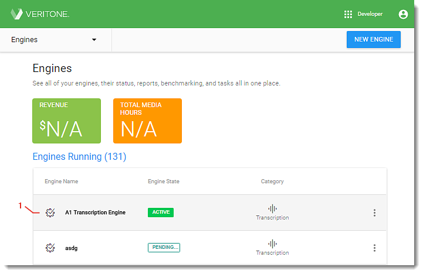
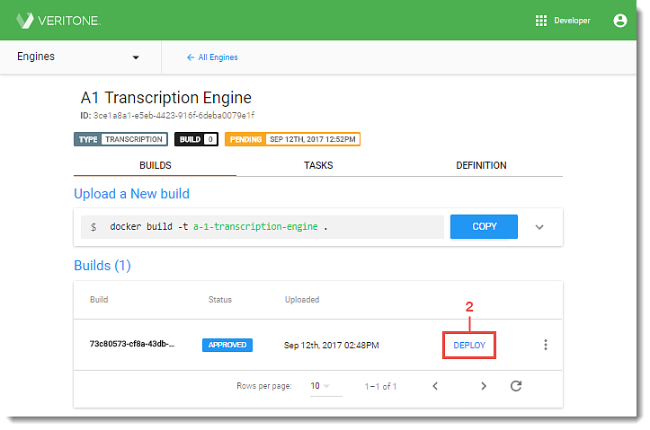
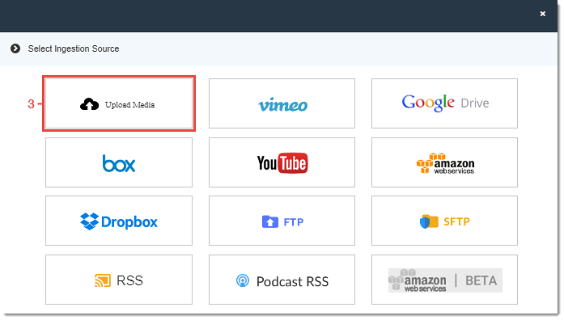
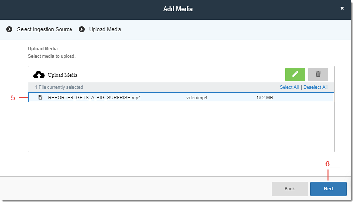
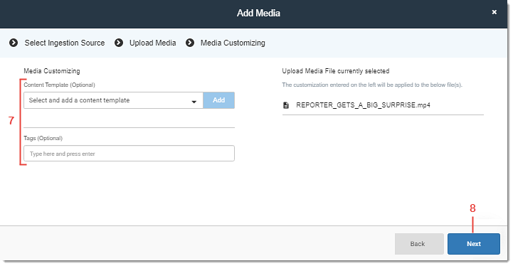

# Step 6 - Deploy an Engine

Congratulations! Your engine has been built, tested, and approved. Now, with the click of a single button you will make it available to users in the Veritone Platform.

|**To deploy an Approved engine**| |
|--------|--------|
|1.[ Navigate to the *Engines* page](/engines/quick-start/step-6-deploy-engine) in Veritone Developer and click the desired **engine** in the Engine table. The *Engine Details* page opens to the *Builds* tab.| 

 |
|2. Scroll down to *Builds* and click the **Deploy** on the right of the *Approved* build in the list. A confirmation message displays and the build is deployed to production in Veritone.|

|

#### View a Deployed Engine in Veritone CMS

Once your engine is deployed, it's available for task processing through Veritone CMS.

|**To view a deployed engine in Veritone CMS**| |
|--------|-----|
|1. Click the **App Picker** icon in the upper right of the window and select **CMS** from the drop-down list. Veritone CMS opens.| 

 |
|2. Click **New** in the upper left of the window and select **Media** from the drop-down. The *Select Ingestion Source* page opens.|

|
|3. Click the appropriate **ingestion source tile** to upload media content. The page to add content through the selected ingestion source opens.|

|
|4. Follow the instructions to upload content through the selected ingestion source. |

|
|5. If your ingestion content is URL-based, proceed to step 7. For non-URL file uploads, click each file to upload or click **Select All** to choose all files. 6. Click **Next** in the bottom right corner of the page. The *Media Customizing* page opens.|

|
|7. Enter a *Source Name* (URL-based content only), choose to use an existing *Content Template* from the drop-down and click **Add** (optional), and enter desired *Tags* (optional). 8. Click **Next** in the bottom right corner. The *Add Workflows* page opens.|

|
|9. Click **Advanced Cognitive Settings** in the upper right of the window. The *Advanced Workflow* page opens.|

|
|10. Click **Create New.** The *New Cognitive Workflow* page opens.|

|
|11. Click the *Available Engines* drop-down and select your engine's category from the list. The organization's available engines for the selected category display.12. Locate your engine in the list to confirm deployment and availability for task processing.|

|
