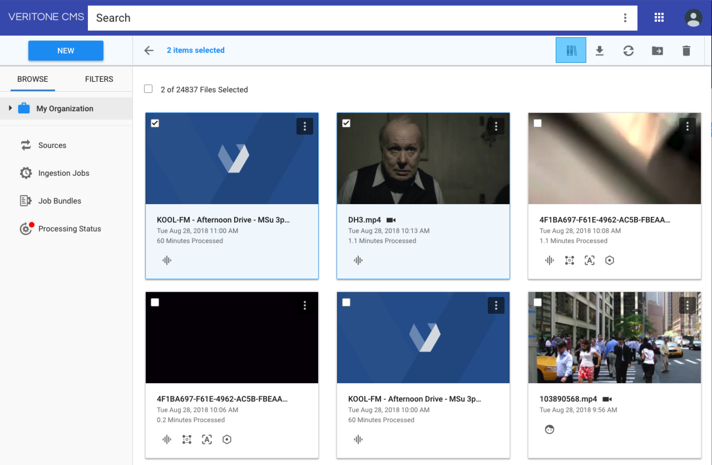
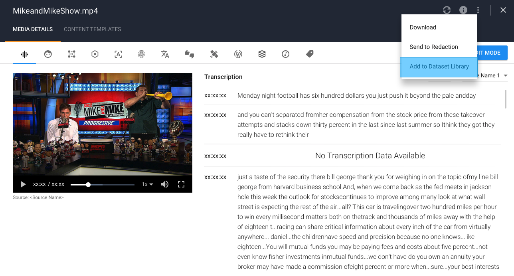
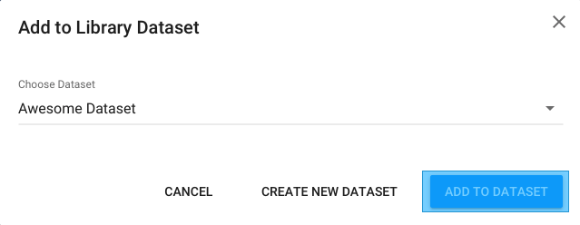
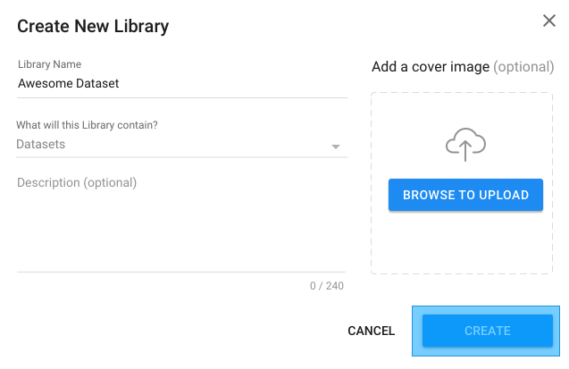
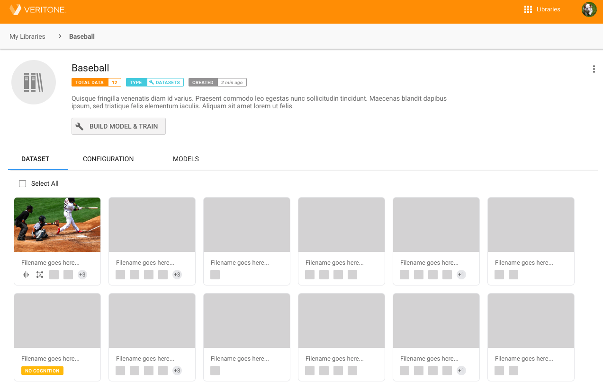
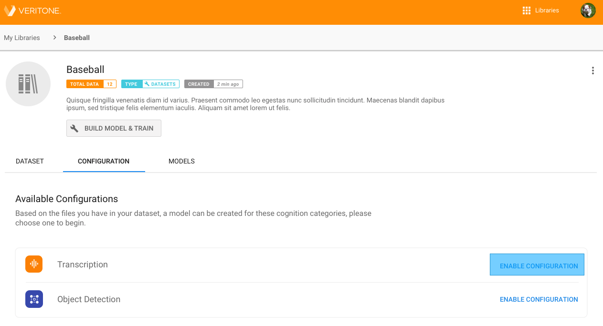
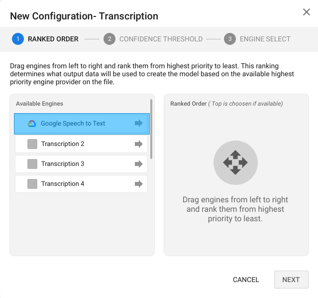
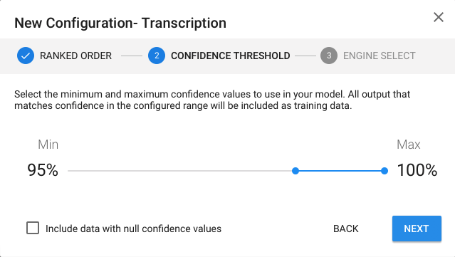
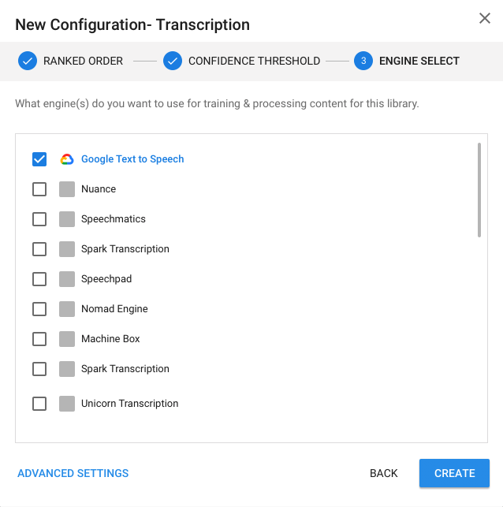
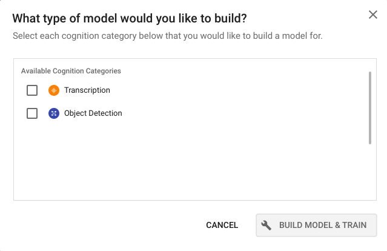

# Dataset Library

## Overview
Dataset Library is a part of the Virtuous Cycle Ecosystem. It enables library training with the previous engine outputs in order to create higher accuracy models.

## Data Structure
A valid Dataset Library consists of 2 parts, Datasets and Dataset Configurations.

#### Dataset
In a dataset library, dataset is a pool of selected TDO IDs. Typically, TDOs with high accuracy or TDOs containing manually corrected data.

#### Dataset Configuration
Dataset configuration is instructional data for selecting the proper engines & data (from the dataset) for model training process. A typical dataset configuration contains:
- **configurationId:** dataset configuration id.
- **libraryId:** the library that the configuration belong to.
- **engineCategoryId:** target cognition to build a model for.
- **targetEngineIds:** engines that will be used for training.
- **rankedSourceEngineIds:** engine providers ranked from highest to lowest priority. The model will be built based on the highest ranked Provider output from each TDO.
- **confidence:** confidence filter. The training process uses this filter to select the appropriate training data in the dataset base on its confidence level.
  - **min:** minimum confidence filter. Training data having confidence value lower than this is ommited.
  - **max:** maximum confidence filter. Training data having confidence value higher than this is ommited.
  - **allowNull:** boolean flag to ignore confidence value in the training data.

## Availability
Dataset library features are available for both API & UI usages

#### API:
##### Create Dataset Library
A dataset library can be created using the same api to create a regular entity library. With one exception, **libraryTypeId** option has be **"dataset"**. <br/>
A typical api to create Dataset Library should look like:

```graphql
mutation {
  createLibrary(input:{
    name: "library name goes here",
    description: "library description goes here",
    coverImageUrl: "link to cover image goes here",
    libraryTypeId: "dataset"
  }) {
    id
  }
}
```
<br/>

##### Add Temporal Data Objects to a Dataset Library
Once created, dataset library can start getting its dataset through **addLibraryDataset** mutation. Both libraryId and tdoIds options are required in this mutation.

- **libraryId** (string): id of the dataset library to add tdos to.
- **tdoIds** (array of string): an array of tdo ids to add to the dataset.

```graphql
mutation {
  addLibraryDataset(input: {
    libraryId: "Dataset Library Id",
    tdoIds: [
      "First Tdo Id"
      "Second Tdo Id"
      "Third Tdo Id"
      "Fourth Tdo Id"
      "..."
    ]
  }) {
    libraryId
    tdoIds
  }
}
```
<br/>

##### Remove Temporal Data Objects from a Dataset Library
Previously added Tdos can also be removed from the dataset via **deleteLibraryDataset** mutation
- **libraryId** (string): id of the dataset library to remove tdos from.
- **tdoIds** (array of strings): an array of tdo ids to remove to the dataset.

```graphql
mutation {
  deleteLibraryDataset(input:{
    libraryId: "target library id"
    tdoIds: [
      "first tdo id to remove"
      "second tdo id to remove"
      "third tdo id to remove"
      "..."
    ]
  }) {
    libraryId
    tdoIds
    message
  }
}
```
<br/>

##### Retrive Dataset
Dataset info is accessible through library & libraries queries via the **dataset** option.
```graphql
{
  library (id: "library id") {
    dataset {
      tdoIds
      libraryId
    }
  }
}
```
<br/>

##### Create Dataset Configuration
Since dataset configuration is an extension of library configuration, it can be created through **createLibraryConfiguration** mutation with 2 additional properties, **rankedSourceEngineIds** and **confidence**.
- **libraryId** (string): library id.
- **engineCategoryId** (string): cognition id.
- **targetEngineIds** (array of strings): array of engine ids.
- **rankedSourceEngineIds** (array of strings): array of ranked engine ids with highest priority first.
- **confidence** (object): confidence filter.
<br/>

**Side Note:** _libraryId_ & _engineCategoryId_ are not editable after the creation.

```graphql
mutation {
  createLibraryConfiguration (input:{
    libraryId: "",
    engineCategoryId: "",
    targetEngineIds: [
      "engine to train 1",
      "engine to train 2",
      "engine to train 3",
      "..."
    ],
    rankedSourceEngineIds: [
      "source engine 1",
      "source engine 2",
      "source engine 3",
      "..."
    ],
    confidence: {
      min: 0,
      max: 100,
      allowNull: false
    }
  }) {
    id
  }
}
```
<br/>

##### Edit Dataset Configuration
All valid dataset configurations are editable through **updateLibraryConfiguration**. **updateLibraryConfiguration** has mostly the same properties as **createLibraryConfiguration**. However, instead of taking a pair of _library id_ & _engine category id_ as unique keys,  **updateLibraryConfiguration** takes _configuration id_.<br/>

```graphql
mutation {
  updateLibraryConfiguration (input:{
    id: "configuration id"
    targetEngineIds: [
      "engine to train 1",
      "engine to train 2",
      "engine to train 3",
      "..."
    ],
    rankedSourceEngineIds: [
      "source engine 1",
      "source engine 2",
      "source engine 3",
      "..."
    ],
    confidence: {
      min: 0,
      max: 100,
      allowNull: false
    }
  }) {
    id
  }
}
```
<br/>

##### Delete Dataset Configuration
```graphql
mutation {
  deleteLibraryConfiguration(id:"configuration id") {
    id
    message
  }
}
```
<br/>

##### Retrieve Dataset Configurations
Dataset Configurations are accessible through library & libraries queries via **configurations** option. The return value includes both new configurations & old configurations which have already been used for training.
```graphql
{
  library (id: "library id") {
    configurations {
      records {
        id
        engineCategoryId
        targetEngineIds
        rankedSourceEngineIds
        confidence {
          min
          max
          allowNull
        }
      }
    }
  }
}
```
<br/>
<br/>

#### UI Work Flow
##### Setup a Dataset Library
The process of setting up Dataset Library via UI consists of 2 steps:
- Select tdos. This is done through either CMS or Media Detail Page
- Select target library & add the selected tdos to the library. This step can only be accomplished via a Dataset Adder module.

**Step 1. Select Tdos:**
  - Option 1: Select Tdos from CMS
    - Step 1: Check all all tdos to use for training. 
    - Step 2: Select library button in the bulk edit bar to open Dataset Adder module.
<kbd></kbd>

  - Option 2: Select Tdo from Media Detail Page
    - In Media Detail Page, click on more button then select **Add to Dataset Library** to trigger Dataset Adder module.
<kbd></kbd>

<br/>

**Step 2. Add Tdo to Dataset:**
  - From Dataset Adder module, select a desired dataset library then click **ADD TO DATASET** button to add tdos.

<kbd></kbd>

  - If the desirable Dataset Library is not yet created, click on **CREATE NEW DATASET** button to create one. Then repeat step 2.

<kbd></kbd>

##### Manage Tdos in a Dataset Library
Tdos added to a dataset can be previewed & removed via the Dataset Manager component.
To open Dataset Manager module:
- Go to Library App
- From Library App, click on a dataset library to view library detail page.
- Dataset Manager module is located in the DATASET tab of the library detail page.
<kbd></kbd>

##### Manage Dataset Configuration
All Dataset Configurations, which haven't been used for building models, are accessible through Dataset Configuration Manager module. This module is also the place to create new configurations. It consists of Cognition List and Configuration Editor.
To open Dataset Configuration Manager:
- Go to Library App
- From Library App, click on a dataset library to enter library detail page.
- From library detail page, select CONFIGURATION tab to open Configuration Manager.

**Cognition List:** Display all aviable cognitions and its configurations status. The cognition options are formed using existing tdos in the dataset & egine categories that have run against them.
<kbd></kbd>

**Configuration Editor:** This is the main UI to create & edit Dataset Configurations. It is only accessible through ENABLE CONFIGURATION buttons and EDIT buttons in the Cognition List module. Configuration Editor consists of 3 submodules, Ranked Source, Confidence Slider and Engine Selector.
- **Ranked Order Source Engines:** select and order source engines by dragging them from left to right, up & down. Engines that are placed on top have higher priority.
<kbd></kbd>

- **Confidence Slider**
<kbd></kbd>

- **Training Engine Selector**
<kbd></kbd>

##### Build and Train Models
Once Dataset & Dataset Configurations are properly created, **BUILD MODEL & TRAIN** button will become clickable.

To start a library model training process:
- Click on **BUILD MODEL & TRAIN** button to open **Cognition Selector** component
- From **Cognition Selector** select the desired cognition and click **BUILD MODEL & TRAIN** button to start the training.

<kbd></kbd>