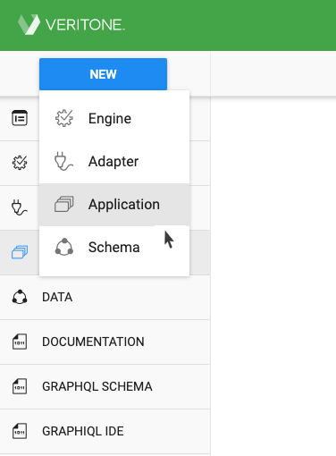
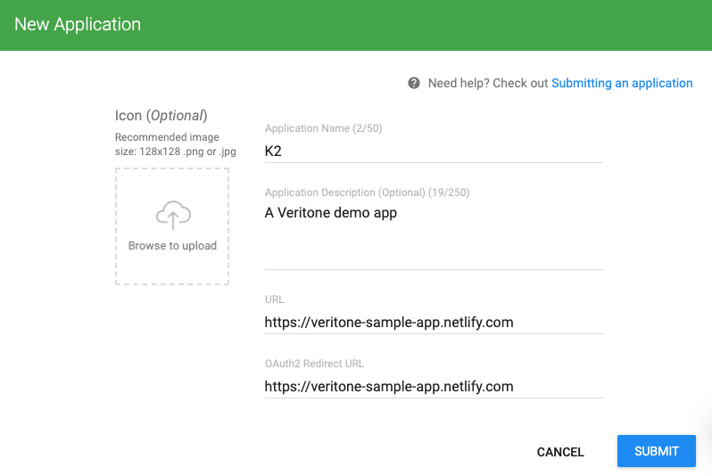
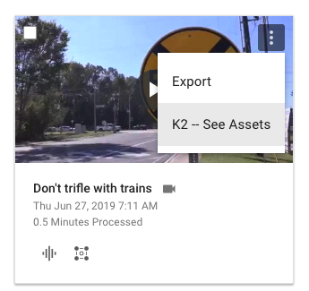
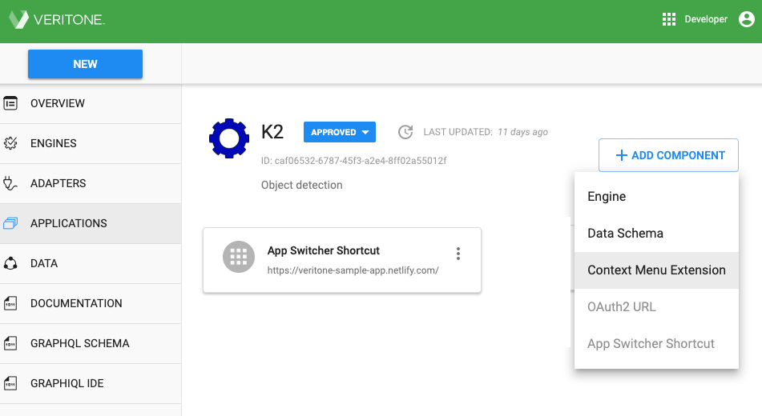
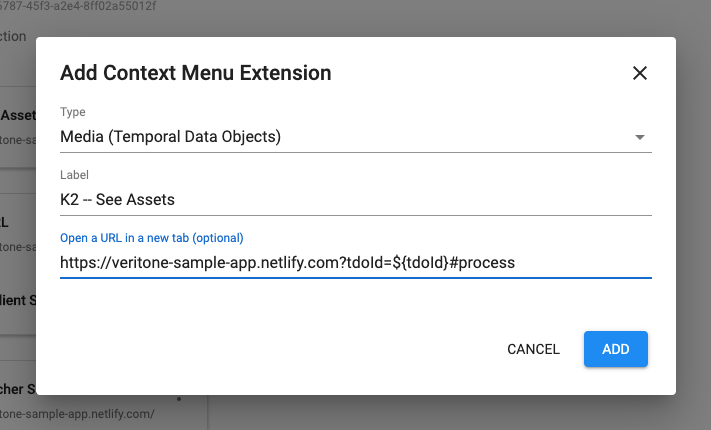

<!-- markdownlint-disable -->

<h1 style="display: inline;">Step 1: Register Your App with Veritone &nbsp;</h1>&nbsp;&nbsp;<aside class="small">
<b>ESTIMATED TIME:</b> 10 minutes
</aside>

In this step, we'll create a simple HTML page and register it as our "app" with the Veritone Developer portal.
Once this app is registered, we can go ahead with various kinds of integration, such as OAuth integration, Context Menu integration, and so on.

## HTML for the K2 App

The HTML for our app (nicknamed 'K2') is about 55 lines long and looks like this:

The page is in three zones (Login, TDO Detail, and New Job), each beginning with an 'H1' tag.
There's also a handy footer containing links that will let you jump directly to any zone.

Let's not worry too much about what's in the HTML right now.
The important thing is merely to have _some_ kind of home page for your app.
That means you need an HTML page that lives at a public URL.
Ours lives at [https://veritone-sample-app.netlify.com](https://veritone-sample-app.netlify.com).

> If you use the sample code from our open-source project at [https://github.com/veritone/veritone-sample-app-netlify](https://github.com/veritone/veritone-sample-app-netlify), be sure to grab not only the `index.html` file, but also the `styles.css` file and the `scripts/utils.js` file. Those 3 files comprise the whole "app."

## Register the App

Since the code for our app is already [available](https://github.com/veritone/veritone-sample-app-netlify), let's go ahead and register the app with Veritone.

"Registering" the app means giving it a Name and Description (and optionally, an icon), and specifying its URL, so that Veritone knows where to delegate requests.

1\. Go to [https://developer.veritone.com/applications/overview](https://developer.veritone.com/applications/overview).

2\. In the upper left, click the **NEW** button and select **Application** from the menu that appears.

3\. Give the application a Name and a Description, and specify a URL for the app as well as the URL to which OAuth responses should go.

4\. Optionally, upload an image icon for the app, using the "Browse to Upload" widget in the upper left.

5\. Click the **Submit** button.

The app is now registered with the system, but is in a DRAFT state:

> Take note of the fact that the app has an ID shown in grey, under the title.
> In this case, it is `ID: 0f905d85-9235-4746-90d1-76afa2a305c0`.
> We will need this ID later, when setting up authentication.

## Submit Your App for Approval

When you're ready, click the grey DRAFT button next to the app's Name (see screen shot, above) to expose a menu of choices ("Edit," "Submit," and "Delete").
Select **Submit**.

The Veritone system administrator will be notified of your submission.
Within 24 hours, you should receive an e-mail approving your app (or, possibly, asking for additional information).

Once your app has been approved, you can use the drop-down menu (the one that currently says "DRAFT") to select "Deploy."
This, in turn, will cause the app's status to change to "Active."

!> Don't forget to set your app's status to **Active** (by choosing "Deploy" in the drop-down). This final, manual step is essential for making your app usable.

Note that while your app is in DRAFT mode, it is visible only to you and other developers within your organization.
Once it has been set to Active, it will be visible (in Veritone's App Switcher menu) to all registered users within your organization.

## Create a Context Menu Extension

While we're at it, let's go ahead and specify a CME (Context Menu Extension) for the app.

> You can do this step before _or after_ your app is approved by Veritone.

**What It Means:** Veritone allows you to put a custom command in the UI that's seen when a user clicks the "kabob menu" icon on a media file in the [Veritone CMS](https://cms.veritone.com).

In the example above, clicking the "kabob menu" in the upper right corner of a video's tile makes a context menu appear, with two commands: "Export" and "K2 -- See Assets".
The "K2 -- See Assets" command is a custom CME command, which, if invoked, will cause our app to be called via HTTP GET (but only if we configure the CME's parameters, as shown below).

Let's look at how that CME was created. (It's easy!)

1\. Go to [https://developer.veritone.com/applications](https://developer.veritone.com/applications).

2\. Click **Applications** in the sidebar menu on the left. A list of applications will appear.

3\. Find your app in the list, and click it. A detail view will appear.

4\. In the detail view, find and click the **+ ADD COMPONENT** button, in the upper right, to expose a menu (as shown above).

5\. Select **Context Menu Extension**. The "Add Context Menu Extension" dialog appears.

6\. In the dialog, choose "Media (Temporal Data Objects)" from the picker list to set the value of the dialog's first field.

7\. Enter a string for **Label**.

> This string will be visible to users, in the context menu UI of [Veritone CMS](https://cms.veritone.com), as the CME command name.

8\. In the third field of the dialog, enter the URL that will call your app. Use the app's public URL plus a parameter string with the syntax of `tdoId=${tdoId}` to pass the ID of the user-selected media asset to your app.

> We've entered a URL of `https://vtn-integration-demo.netlify.com?tdoId=${tdoId}#process`. The `#process` on the end is simply an anchor-link designation, to make the browser scroll to a particular point in the app's UI.

That's it! To test your CME, go to the [Veritone CMS](https://cms.veritone.com), and click the kabob menu icon in the upper right corner of any media tile.
You should see your CME's Label string in the list of context menu commands. If you select that command, it should make your browser open your app in a new tab.

<!-- markdownlint-disable no-inline-html -->

 

If there are no media files in your CMS, you can easily upload files to the system by following the <a target="_blank" href="https://help.veritone.com/en/articles/2514452-how-to-upload-process-media-in-cms">steps shown here</a>.

 

 

[Learn how to add Authentication ⇨](developer/applications/app-tutorial/app-tutorial-step-2)
