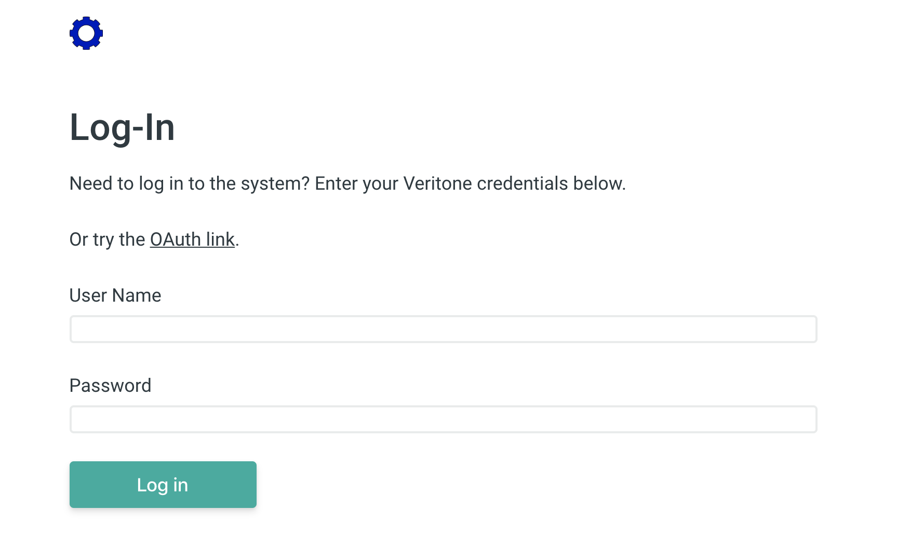
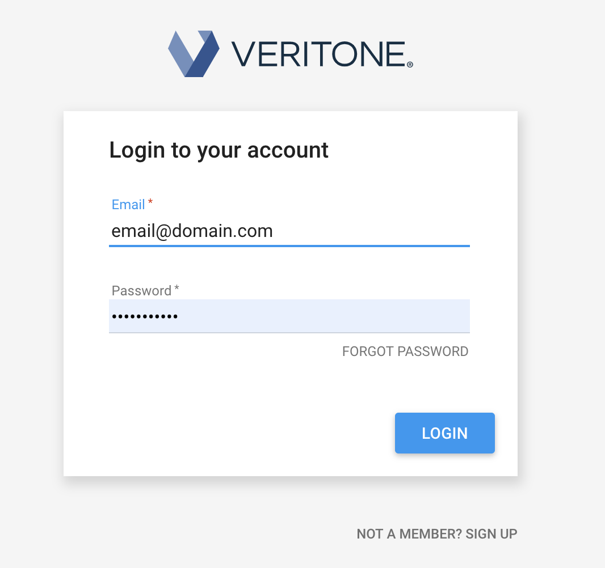

<!-- markdownlint-disable -->
<style>
aside  {
  border-style: solid;
  border-radius: 9px;
  border-width: 2.2px;
  border-color:#ccc;
  padding: 5px;
  background: #e6e8ef;
}

aside.small {
  display:inline;
  font-size:9pt;
  position:relative; top:-4px;
}

.topruled {
  border-top-width: 1.2px;
  border-top-style: solid;
  border-top-color: rgb(76, 76, 100);
  line-height:45%;
}
.bottomruled {
  border-bottom-width: 1.2px;
  border-bottom-style: solid;
  border-bottom-color: rgb(76, 76, 100);
  line-height:45%;
}
</style>
<h1 style="display: inline;">Step 2: Set Up Authentication &nbsp;</h1>&nbsp;&nbsp;<aside class="small">
<b>ESTIMATED TIME:</b> 10 minutes
</aside>

In order to use the Veritone API, you need to obtain a session token (or API key).
In this lesson, you'll learn two ways of obtaining such a token:

Option 1\. First, we show how to log in (and obtain a token) programmatically, via a simple GraphQL query.

Option 2\. A more robust, secure, production-worthy, industry-standard way of doing this is with OAuth 2.0. We'll show one way of implementing OAuth.

[](_snippets/register-developer-account.md ':include')

## Communicating with the Server

Communicating with Veritone's API server is easy. The endpoint is given in our `scripts/utils.js` file as a global:

```javascript
const API_ENDPOINT = 'https://api.veritone.com/v3/graphql';
```

All communication with this endpoint should be via POST, with body and headers set up as follows.

```javascript
// Pass a GraphQL query and a bearer token, get payload suitable for POSTing.
function createVeritonePayload(q, token) {
  let theHeaders = {};
  theHeaders['Content-Type'] = 'application/json';
  if (token) theHeaders['Authorization'] = 'Bearer ' + token;
  let theBody = JSON.stringify({
    query: q
  });
  return {
    body: theBody,
    headers: theHeaders,
    method: 'POST'
  };
}
```

The object returned by this function becomes the `payload` argument of our AJAX workhorse function:

```javascript
// Do a POST and get JSON back.
async function fetchJSONviaPOST(url, payload) {
  return fetch(url, payload).then(function(response) {
    if (!response.ok) {
      throw new Error('fetch() gave status = ' + response.status);
    }
    return response.json();
  });
}
```

This simple function checks for `response.ok`, but otherwise does no error checking.
(You should add exception handling at this function's point of use. See the example of how to do this in the next section.)

## Authentication Option 1: Log In Programmatically

This option is not supported for a production app.
We show it here merely so you can see how easy it is to issue queries to Veritone's server, and how to interpret what comes back.

To support this simple type of log-in, our app presents the user with a typical "username/password" log-in form:



The **Log in** button has an `onclick` handler function called (surprise!) `login()`. That function merely validates the user's inputs and passes those inputs to another function:

```javascript
function loginAndGetToken(username, pw) {
  let q =
    'mutation logMeIn { userLogin(input: {userName: "' +
    username +
    '" password: "' +
    pw +
    '"}) {token}}';
  let payload = createVeritonePayload(q, null);

  fetchJSONviaPOST(API_ENDPOINT, payload)
    .then(json => {
      if (!json.data.userLogin) {
        showSnackbar("That log-in didn't work.", true);
        return;
      }
      _token = json.data.userLogin.token;
      console.log(JSON.stringify(json));
      showMsg(
        'Successful log-in! Your token is: <mark><b>' +
          _token +
          '</b></mark><br/>',
        '#message'
      );
      showSnackbar('Looks good. You got a token.');
      setCookie('token', _token, DAYS_TO_STORE_TOKEN);
    })
    .catch(error => {
      showSnackbar('Error occurred. Check console.', true);
      console.log(error.toString());
    });
}
```

We're passing a GraphgQL _mutation_ that, if the passed-in credentials corresponded to "email@domain.com" and "letmein," would look something like this:

```graphql
mutation logMeIn {
  userLogin(input: { userName: "email@domain.com", password: "letmein" }) {
    token
  }
}
```

If you're not familiar with GraphQL, the mutation, in this case, has an (optional, programmer-supplied) name of `logMeIn`, while the (actual, required) method name is `userLogin`, with an `input` argument as shown.
We are asking for a _return value_ corresponding to the key named `token`.

<div style="transform:scaleX(.91);">

<div 
style="font-family:Palatino;
font-size:12.5pt;
padding:1px 0px 0px 130px;
transform:scaleX(.95); 
transform-origin: top left; "><div class="topruled"><br/></div>
This is the only query you can run against Veritone's API server without a token.
<div class="bottomruled"><br/></div>
</div>
</div><br/><br/>

Veritone's GraphQL server will return a payload in JSON format.
In our code (further above), we check the returned JSON for the presence of a `userLogin` field under `json.data` and (if it exists) we grab the `token` value, storing it in our `_token` global.
We also tack a `catch()` method onto our fetch, at the end, to catch any uncaught exceptions.

## Authentication Option 2: OAuth

In a production app, you will need to use [OAuth](https://oauth.net/) to enable authentication.
One way to do it is as follows.

> A more complete discussion of OAuth strategies can be found [here](https://docs.veritone.com/#/developer/applications/oauth).

Implementing OAuth can be as easy as putting a special link (or button, etc.) in a page; and parsing `location.href` when our app is launched, to see if the URL contains a token.

To construct the OAuth link, we use the following code:

```javascript
const AUTH_BASE =
  'https://api.veritone.com/v1/admin/oauth/authorize?scope=all&response_type=token&client_id=';
const CLIENT_ID = 'caf06532-6787-45f3-a2e4-8ff02a55012f';
const HOME_URL = 'https://veritone-sample-app.netlify.com';

function getOAuthLink() {
  let clientID = CLIENT_ID;
  let auth_base = AUTH_BASE;
  let redirect = '&redirect_uri=' + HOME_URL;
  var OAuthLink = auth_base + clientID + redirect;

  return OAuthLink;
}
```

Recall that when we [registered our app with Veritone](developer/applications/app-tutorial/app-tutorial-step-1?id=register-the-app), we obtained an ID for our app, which (in our case) looks something like `0f905d85-9235-4746-90d1-76afa2a305c0`.
That value is the `clientID` needed in our OAuth URL.

On the first screen of our app (see above), there's a line of text: "Or try the _OAuth link_." The link, in that text, points to

`javascript:location.href=getOAuthLink();void(0);`

which, in turn, expands to

`https://api.veritone.com/v1/admin/oauth/authorize?scope=all&response_type=token&client_id=caf06532-6787-45f3-a2e4-8ff02a55012f&redirect_uri=https://veritone-sample-app.netlify.com`

When the user goes to that URL, the Veritone log-in screen appears.



After the user clicks the **LOGIN** button, our app will be invoked with a URL of

`https://veritone-sample-app.netlify.com/#access_token=eyJhbGciOiJIUzI1NiIsInR5cCI6IkpXVCJ9.eyJ1c2VySWQiOiI5NjBiM2ZhOC0xODEyLTQzMDMtYjU4ZC00ZjBkMjI3ZjJhZmMiLCJjb250ZW50QXBwbGljYXRpb25JZCI6ImEyMmNiNWMwLWRjMDAtNGMzZi1hZGVmLTE4ZTI4ZTViNTYxZCIsIm9yaWdpbkhvc3QiOiJ2ZXJpdG9uZS1zYW1wbGUtYXBwLm5ldGxpZnkuY29tIiwic2NvcGUiOlt7ImFjdGlvbnMiOlsiaW5nZXN0aW9uOmRlbGV0ZSIsImluZ2VzdGlvbjp1cGRhdGUiLCJpbmdlc3Rpb246cmVhZCIsImluZ2VzdGlvbjpjcmVhdGUiLCJqb2I6Y3JlYXRlIiwiam9iOnJlYWQiLCJqb2I6dXBkYXRlIiwiam9iOmRlbGV0ZSIsInRhc2s6dXBkYXRlIiwicmVjb3JkaW5nOmNyZWF0ZSIsInJlY29yZGluZzpyZWFkIiwicmVjb3JkaW5nOnVwZGF0ZSIsInJlY29yZGluZzpkZWxldGUiLCJyZWNvcmRpbmc6Y2xvbmUiLCJyZXBvcnQ6Y3JlYXRlIiwiYW5hbHl0aWNzOnVzYWdlIiwibWVudGlvbjpjcmVhdGUiLCJtZW50aW9uOnJlYWQiLCJtZW50aW9uOnVwZGF0ZSIsIm1lbnRpb246ZGVsZXRlIiwiY29sbGVjdGlvbjpjcmVhdGUiLCJjb2xsZWN0aW9uOnJlYWQiLCJjb2xsZWN0aW9uOnVwZGF0ZSIsImNvbGxlY3Rpb246ZGVsZXRlIiwiYXNzZXQ6dXJpIl19XSwiaWF0IjoxNTYyNzgzMjA5LCJleHAiOjE1NjMzODgwMDksInN1YiI6Im9hdXRoMiIsImp0aSI6ImI0ZGZkZjg2LTdkNmQtNGFiNC05NTE3LWEwN2ZhNWRhNjg2NSJ9.szzsbA5BqkF1fUJ9ciUo-PWPuk5Rs2LASV-CTGOT3hs&token_type=Bearer`

#### 'onload' Handler

When our app fires up, it needs to inspect `location.href` to see if the URL contains a token.
We can do that with a `load` event handler:

```javascript
window.addEventListener('load', function(event) {
  let TOKEN_MARKER = 'access_token=';
  let OUR_URL = location.href;

  // Eagerly try to load token from cookie (every time)
  if (!_token) _token = getCookie('token');

  // Check if our URL contains a token
  if (OUR_URL.indexOf(TOKEN_MARKER) != -1) {
    _token = OUR_URL.split(TOKEN_MARKER)[1].split('&')[0];
    if (_token) {
      showSnackbar('Token obtained via OAuth.');
      showToken('#smallToken', _token);
      setCookie('token', _token, DAYS_TO_STORE_TOKEN);
    }
  }
});
```

In our example, we keep a copy of the token in our `_token` global.
We also store a copy in a cookie.
How you decide to store the OAuth token is completely up to you.

But, how do you actually _use_ the security token? That's what we're going to find out next!

[Add processing logic ⇨](developer/applications/app-tutorial/app-tutorial-step-3)
