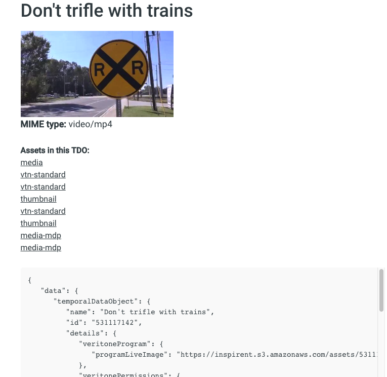

<!-- markdownlint-disable -->
<style>
aside  {
  border-style: solid;
  border-radius: 9px;
  border-width: 2.2px;
  border-color:#ccc;
  padding: 5px;
  background: #e6e8ef;
}

aside.small {
  display:inline;
  font-size:9pt;
  position:relative; top:-4px;
}

.topruled {
  border-top-width: 1.2px;
  border-top-style: solid;
  border-top-color: rgb(76, 76, 100);
  line-height:45%;
}
.bottomruled {
  border-bottom-width: 1.2px;
  border-bottom-style: solid;
  border-bottom-color: rgb(76, 76, 100);
  line-height:45%;
}
</style>
<h1 style="display: inline;">Step 3: Add Processing Logic &nbsp;</h1>&nbsp;&nbsp;<aside class="small">
<b>ESTIMATED TIME:</b> 20 minutes
</aside>

So far, we've: 

* [Registered our app](/developer/applications/app-tutorial/app-tutorial-step-1) with Veritone

* [Created a custom menu extension](https://cms.veritone.com) that appears in the [Veritone CMS](https://cms.veritone.com) UI

* Put an [OAuth link](/developer/applications/app-tutorial/app-tutorial-step-2) in our app, so the user can authenticate to the Veritone site (and obtain the necessary security token for making calls to Veritone's API server)

It should now be possible for somebody in your organization to go to the [Veritone CMS](https://cms.veritone.com), select a media file,
open a context menu, and execute our custom context-menu extension (CME), which &mdash; in turn &mdash; will cause our app to open in a new browser tab. But then what?

You may recall that when we set up our CME, we set it up such that when our app is launched, the app will receive the ID of the [Temporal Data Object](https://api.veritone.com/v3/graphqldocs/temporaldataobject.doc.html) (TDO) associated with the media file on which the menu command was invoked.
We can use that ID (and our API token) to run GraphQL queries/mutations against that media file.
Which means we can subject that file to any kind of AI processing we might want to do (such as transcription, object detection, face recognition, license plate identification, etc.), using any of the more than 300 cognitive engines available in Veritone's aiWARE platform.

One very simple thing we can do is query the TDO to see what kinds of information are associated with it.

<div style="transform:scaleX(.91);">

<div 
style="font-family:Palatino;
font-size:12.5pt;
padding:1px 0px 0px 130px;
transform:scaleX(.95); 
transform-origin: top left; "><div class="topruled"><br/></div>
The Temporal Data Object is a kind of "central switchboard" data object in the Veritone world.
In addition to metadata of sundry kinds, it often holds the web addresses (URIs) of <em>assets</em> associated with the TDO.
For example, if you run a transcription job on a video, the transcript becomes an asset of the video's TDO.
<div class="bottomruled"><br/></div>
</div>
</div><br/>

Let's try it. Let's make our app show a detailed listing of TDO contents.

We'll need to:

1\. Add code to our page `load` event handler, to detect the `tdoId` (if any) in our `location.href`.

2\. Define a custom query, based on the Veritone `temporalDataObject` API method, that brings back detailed informataion about a given TDO.

3\. Create a JavaScript function that runs the query and displays the results, in the browser, in an interesting way.

None of this is hard to do. Let's get started.

### Add TDO-Detection Code to the 'onload' Handler

When our app loads, we need to know if it was called from our Veritone context menu extension (CME).
We can determine that by inspecting `location.href` at load time.
If the URL contains a parameter string with a `tdoId` in it, we know the app was invoked from the CME.

To do this bit of inspection, we can add the following lines of code to our [`load` event handler](developer/applications/app-tutorial/app-tutorial-step-2?id=_39onload39-handler).

```javascript
     let TDO_MARKER = "tdoId=";

	// Check if URL contains a tdoId
    if (OUR_URL.indexOf(TDO_MARKER) != -1) {	    
	    TDO_ID = OUR_URL.split(TDO_MARKER)[1].split(/[#&]/)[0];
	    showSnackbar("TDO ID detected."); // for debug
        showTDO( TDO_ID, "#rawdata" ); 
    }
```

This code says "if the string `'tdoId='` exists in our URL, parse out the TDO ID, and call the function named `showTDO()`."

We need to write the `showTDO()` function, corresponding to item 3 in our list (above).
But first, let's define the custom query that will be used by that function.

## Define the Query

The Veritone API exposes more than 200 GraphQL-based methods you can call.
One of those methods, `temporalDataObject()`, brings back information on a given TDO.
We'll use that method to get detailed information on the TDO whose ID was passed to our app.

One of the nice things about GraphQL is that it lets you specify exactly how much or how little information you want to receive in response to your query.
For example, the `temporalDataObject()` method can be as simple as this:

```graphql
query {
  temporalDataObject(id:"550956470") {
    assetCount
  }
}
```

This query says "invoke the method called `temporalDataObject` for the TDO with ID 550956470, and bring me back just the `assetCount` for that TDO."

But in our case, our app will ask for considerably more information than just the `assetCount`.
Here is the JavaScript String version of the query we will actually use:

```javascript
let TDO_QUERY_TEMPLATE = `{
  temporalDataObject(id: theID) {
    name
    id
    details
    description
    assets {
      records {
        id
        assetType
        name
        signedUri
        details
        container {
          id
        }
      }
      count
    }
    status
    engineRuns {
      count
    }
    sourceData {
      source {
        name
        details
      }
      taskId
      sourceId
      scheduledJobId
      engineId
    }
    thumbnailUrl
    organizationId
    jobs {
      count
    }
  }
}
`;
```

Whoa! We're asking for a _lot_ of information now. But the point is, you can edit this query (adding or removing fields as you wish) to get back _just the information you're interested in._ That's the beauty of GraphQL.

To invoke the query, we'll need to do:

```javascript
    // Query to get TDO data
    let query = TDO_QUERY_TEMPLATE.replace( /theID/, '"'+ tdoId + '"');
    let payload = createVeritonePayload( query, _token );
    let json = fetchJSONviaPOST( API_ENDPOINT, payload).catch(e=>{
    	showSnackbar("Check the console... ", 1);
        console.log("Welp. Got this message: " + e.toString());
    });
    
    // Check for error messages in the json:
    if ('errors' in json) {
        // handle the error(s)
    }
    
    // Do something with the json:
    else if (json.data.temporalDataObject) {
        // maybe log the TDO's name to the console:
        console.log("The TDO's name is " + json.data.temporalDataObject.name);
    }
```

If there were problems with our query at the transport level, the `catch()` on our fetch method will catch them.
If the query was processed by Veritone but yielded other (non-transport) types of errors (maybe involving authentication, or query syntax, or something else), we can detect that by looking for an `errors` field in the JSON response.

## Create Custom Logic to Display the TDO Data

In our app, we want to run the `temporalDataObject` query, then extract various kinds of information from the JSON that comes back, and display that information in the web page.

One thing we might want to do is determine if any _assets_ (artifacts associated with a media file, or with a previous job that was _run_ on the file) are present in the TDO.
If assets do exist, they will be present in an array of `records`.
Each asset (each entry in the array) will contain a `signedUri` field.
We can display the asset URIs as clickable links.
Here's a function that can do that:

```javascript
// Find assets in TDO, and make links out of their signedUri data
function getAssetsAsMarkup( json ) {
	
     if ('assets' in json.data.temporalDataObject ) {
          let records = json.data.temporalDataObject.assets.records;
          let link = '<a href="URL" target="_blank">TARGET</a>';
          let results = [];
          records.forEach( item=> { 
              if (item.signedUri && item.signedUri.length > 0) {
                   var a = link.replace("URL",item.signedUri).replace("TARGET",item.assetType);
                   results.push( a );
              }
          });
 
      if (results.join("").length == 0)
 	     return '<div style="font-size:var(--mediumFontSize);"><b>No assets in this TDO</b><br/><div>';
 	 
 	 return '<div style="font-size:var(--mediumFontSize);"><b>Assets in this TDO:</b><br/>' + 
 	     results.join("<br/>") + "</div>"; 
     }
 	
     return "";
 }
```

This function is invoked, in our code, within the body of _another_ function, `showTDO()`.
The `showTDO()` function (lines 268 to 315 in [our code](https://github.com/veritone/veritone-sample-app-netlify/blob/master/src/scripts/utils.js)) runs our query, error-checks the response, and writes various types of output to the screen, including the name of the media file,
the thumbnail image (if any) associated with it, any assets contained in the TDO (as clickable links),
and (in a `<pre>` block) the TDO's stringified JSON representation. The user sees something like this:



## What's Next?

Now that you know how to [authenticate to Veritone](developer/applications/app-tutorial/app-tutorial-step-2) (to get the API token), [create custom menu extensions](developer/applications/app-tutorial/app-tutorial-step-1?id=create-a-context-menu-extension) in the Veritone CMS, and [run GraphQL queries](developer/applications/app-tutorial/app-tutorial-step-2?id=communicating-with-the-server) in response to a custom menu command, it's a simple matter to run an AI job (say, an _object detection_ job) on a given media file.
So let's do that! Let's see how to run an AI job using the Veritone aiWARE platform.


[Run Object Detection on a Video ⇨](developer/applications/app-tutorial/app-tutorial-step-4)
