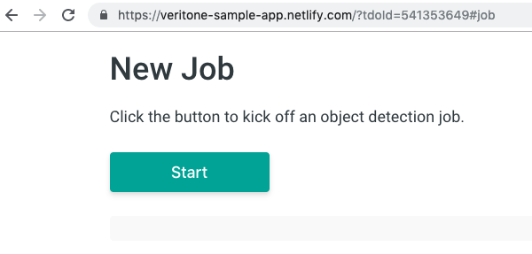
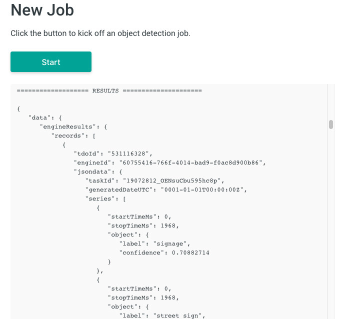

<!-- markdownlint-disable -->
<style>
aside  {
  border-style: solid;
  border-radius: 9px;
  border-width: 2.2px;
  border-color:#ccc;
  padding: 5px;
  background: #e6e8ef;
}

aside.small {
  display:inline;
  font-size:9pt;
  position:relative; top:-4px;
}

.topruled {
  border-top-width: 1.2px;
  border-top-style: solid;
  border-top-color: rgb(76, 76, 100);
  line-height:45%;
}
.bottomruled {
  border-bottom-width: 1.2px;
  border-bottom-style: solid;
  border-bottom-color: rgb(76, 76, 100);
  line-height:45%;
}
</style>
<h1 style="display: inline;">Step 4: Run Object Detection on a Video &nbsp;</h1>&nbsp;&nbsp;<aside class="small">
<b>ESTIMATED TIME:</b> 20 minutes
</aside>

We've seen how to make API calls to the Veritone GraphQL endpoint, but we haven't yet actually done anything AI-related &mdash; until now. We're about to change that!

Let's add a Context Menu Extension that allows a user of the Veritone CMS to designate a video file for _object detection_.

<div style="transform:scaleX(.91);">

<div 
style="font-family:Palatino;
font-size:12.5pt;
padding:1px 0px 0px 130px;
transform:scaleX(.95); 
transform-origin: top left; "><div class="topruled"><br/></div>
By "user of the Veritone CMS," we mean a user within your organization.
By default, apps you deploy are visible only to <em>members of your organization</em>.
<div class="bottomruled"><br/></div>
</div>
</div><br/>

## How an AI Job Works

To run an AI job on the aiWARE platform, you just need to submit a `createJob` mutation, designating a temporal data object (TDO) and one or more _tasks_. Each task, in turn, designates an _engine_ that will handle processing.

**Example**: Suppose we have an `.mp4` file (in Veritone CMS) that's associated with a TDO of ID `"550730768"` and we want to run object detection on this video, using the cognitive engine with ID `"60755416-766f-4014-bad9-f0ac8d900b86"`.
This is the GraphQL mutation we would use:

```graphql
mutation createJob {
  createJob(
    input: {
      targetId: "550730768"
      isReprocessJob: true
      tasks: [{ engineId: "60755416-766f-4014-bad9-f0ac8d900b86" }]
    }
  ) {
    id
  }
}
```

Let's break it down:

- The `targetId` field is the TDO ID.

- We set `isReprocessJob` to `true` because the media file has already been ingested (it does not need to be reingested).

- The array of tasks contains one task, involving just one engine, which corresponds (in this case) to an engine named `"task-google-video-intelligence-chunk-label"` having ID `"60755416-766f-4014-bad9-f0ac8d900b86"`.

- We wish to get back an `id`, corresponding to the Job ID.

Just by POSTing this GraphQL mutation to the API server, we will kick off a processing job. That's all there is to it!

Of course, AI jobs involving video are often long-running, which means we will need to poll the job to see when it's finished. To poll the job, we will run a query that looks like

```graphql
query PollJob {
  job(id: "19062412_sjofb299bs") {
    status
    targetId
    tasks {
      count
      records {
        status
      }
    }
  }
}
```

where `"19062412_sjofb299bs"` is the Job ID we got back from `createJob`.

Polling will result in a JSON response that looks something like

```json
{
  "data": {
    "job": {
      "status": "complete",
      "targetId": "550730768",
      "tasks": {
        "count": 1,
        "records": [
          {
            "status": "complete"
          }
        ]
      }
    }
  }
}
```

<div style="transform:scaleX(.91);">

<div 
style="font-family:Palatino;
font-size:12.5pt;
padding:1px 0px 0px 130px;
transform:scaleX(.95); 
transform-origin: top left; "><div class="topruled"><br/></div>
It's important to check this response not only for the job status, but for task status. That's because it is possible for a job to finish with a status of 'complete' even though a task failed.
<div class="bottomruled"><br/></div>
</div>
</div><br/>

## How to Implement It

Let's look at how this is implemented in our 'K2' app.

Since we want a user to be able to designate a media file (in Veritone CMS) for processing, we'll need to create a Context Menu Extension (CME) with an appropriate command.
All we need to do is repeat the procedure outlined earlier, in [Create a Context Menu Extension](developer/applications/app-tutorial/app-tutorial-step-1?id=create-a-context-menu-extension),
but using a label string of "K2 -- Run Object Detection" and a target URL of `https://vtn-integration-demo.netlify.com?tdoId=${tdoId}#job` instead of `https://vtn-integration-demo.netlify.com?tdoId=${tdoId}#process`.

The only change to the URL is the hash on the end.
This means the browser will simply scroll the page to a different H1 (or content zone) when the app first loads.
We don't need to take any action, programmatically, yet.
Instead, we're going to present the user with a pushbutton labelled **START**.
The job will kick off only after the user pushes the START button. This is what the user will see:



> We previously implemented the 'onload' code that inspects `location.href` for the presence of a TDO ID. The ID gets cached in a global called `TDO_ID`. This part is already implemented; there is no new code to write.

When the user clicks START, we need to:

1\. Create the job query (using our already-cached `TDO_ID`).

2\. Dispatch the query.

3\. If the job kicked off successfully, obtain the Job ID from the response.

4\. Put a Cancel Job button on the screen, in case the user wants to abort.

5\. Use `setInterval()` to poll for job completion.

6\. Post progress messages to the page.

7\. If the job finishes normally, query for the job results, then display the results onscreen. If the job fails or the polling timeout is reached, stop polling and display status messages to the user.

At each step of the way, of course, we will also want to do appropriate error-checking.

## Kicking Off the Job

To create the job query, we have a special function:

```javascript
function createTheJobQuery(tdoID, engineID) {
  let query = `mutation createJob {
      createJob(input: {
        targetId: "TDO_ID",
        isReprocessJob: true,
        tasks: [
        {
          engineId: "ENGINE_ID"
        }
        ]
    }) {
    id
  }
}`;

  return query.replace(/TDO_ID/, tdoID).replace(/ENGINE_ID/, engineID);
}
```

This function will be called from our START button click-handler, `handleJobButtonClick()`:

```javascript
async function handleJobButtonClick() {
  let jobId = '';

  clearScreenLog('#job_log');

  if (!_token) {
    showSnackbar('Looks like you need to log in first.', true);
    return;
  }

  let tdo = TDO_ID;

  // Get the query
  let query = createTheJobQuery(tdo, DEFAULT_ENGINE);

  // Create the payload
  let payload = createVeritonePayload(query, _token);

  // Kick off the job
  let json = await fetchJSONviaPOST(API_ENDPOINT, payload).catch(e => {
    showSnackbar('Check the console.', true);
    console.log('Got this exception:\n' + e.toString());
  });

  // log an update to UI:
  logToScreen('We ran this query:\n\n' + query + '\n\n', '#job_log');

  if (json) {
    logToScreen(
      'We got back this result:\n\n' + JSON.stringify(json, null, 3) + '\n\n',
      '#job_log'
    );
    if ('errors' in json) {
      showSnackbar('Error. Job aborted.');
      return;
    }
    jobId = json.data.createJob.id;
    logToScreen('The jobId is ' + jobId + '.\n', '#job_log');
    logToScreen(
      'We will poll for completion every ' +
        POLL_INTERVAL / 1000 +
        ' seconds, a maximum of ' +
        MAX_POLL_ATTEMPTS +
        ' times.\n',
      '#job_log'
    );

    // create the Cancel button and display it
    createCancelJobButton(tdo, '#addContentHere');

    // POLL FOR STATUS
    _pollkey = setInterval(() => {
      checkTheJobStatus(jobId, DEFAULT_ENGINE);
    }, POLL_INTERVAL);
  } // if json
} // handleJobButtonClick()
```

After a job begins, the user sees updates in a scrolling div:


## Polling for Status

Since our job is long-running, we need to check it periodically to see whether it has finished.

You may have noticed, at the end of the `handleJobButtonClick()` function, a line of code as follows:

```javascript
// POLL FOR STATUS
_pollkey = setInterval(() => {
  checkTheJobStatus(jobId, DEFAULT_ENGINE);
}, POLL_INTERVAL);
```

This bit of code invokes JavaScript's top-level `setInterval()` function and stores the return value in a global variable, `_pollkey`. We will need that value in order to stop polling, later.

Our polling function, `checkTheJobStatus()`, is called every `POLL_INTERVAL` milliseconds, a total of `MAX_POLL_ATTEMPTS` times.

> The global variables `POLL_INTERVAL` and `MAX_POLL_ATTEMPTS` are declared around line 315 of our `scripts/utils.js` file.

Our polling function, `checkTheJobStatus()`, is the longest function in our `utils.js` file, at 80 lines. It's long because we have to check for (and handle) a successful finish; user abort; timeout (`MAX_POLL_ATTEMPTS` reached); and a job status of `'failed'` (which should only happen if a task ends as `aborted`).

## Obtaining Job Results

If the job finishes in the time allotted with a status of `'complete`, we go ahead and fetch the results by issuing an `engineResults` query.
The function that generates that query for us (using arguments of `tdoId` and `engineId`) is:

```javascript
function createEngineResultsQuery(tdoID, engineID) {
  return `query getEngineOutput {
      engineResults(tdoId: "TDO",
      engineIds: ["ENGINE_ID"]) {
        records {
          tdoId
          engineId
          jsondata
        }
      }
    }`
    .replace(/TDO/, tdoID)
    .replace(/ENGINE_ID/, engineID);
}
```

When we run the query, the results will come back in a (potentially large) JSON blob, in [vtn-standard format](developer/engines/standards/engine-output/?id=engine-output-standard-vtn-standard), which our app dutifully displays in the browser window at the DOM node corresponding to `id="job_log"` (CSS selector `#job_log`).



Note that the time-series data can be found as entries in a `series` array under a `jsondata` field of `records`. Each entry looks something like

```json
{
  "startTimeMs": 2669,
  "stopTimeMs": 6072,
  "object": {
    "label": "railroad car",
    "confidence": 0.8477109
  }
}
```

This entry says that from 2.669 sec to 6.072 sec into the video, an object that looks like a _railroad car_ (confidence: 0.8477109) was detected.

## Optional Exercise: Run a Transcription Job

Our app can just as easily run a transcription job as it can run object detection.
To test this, first be sure the app has detected the TDO of a media file (.mp4) in Veritone CMS.
In other words: _Select a video in CMS and execute one of the Context Menu Extension commands we created in this tutorial, so that the app loads from a URL that contains a TDO ID_.
Then, open your browser's JavaScript console (for Chrome, type Control-Shift-J in Windows or Option-Command-J in MacOS), paste the following line of code into the console, and execute it:

```javascript
DEFAULT_ENGINE = '54525249-da68-4dbf-b6fe-aea9a1aefd4d';
```

This will set the global variable called `DEFAULT_ENGINE` to a cognitive engine named `"Transcription - DR - English (Global)"`.

Now all you have to do is click the app's START button, and a transcription job will begin! When the job finishes, a JSON object showing the time-series data for the transcript will appear in the scrolling log div.

## Congratulations!

You've finished the "How to Build Your Own AI App" tutorial. You've learned, among other things:

- How to register a web app with the Veritone site.

- How to create Context Menu Extensions that you or your org's users can invoke from within the Veritone CMS.

- How to authenticate to Veritone with OAuth.

- How to use a security token to make API calls to Veritone's GraphQL server.

- How to query a Temporal Data Object for its various properties and values.

- How to create a Job involving a cognitive engine.

- How to poll for results (and do error checking).

And you did it all with just 55 lines of HTML and 500 lines of JavaScript!

### For More Info

Be sure to check out our [API Examples](https://docs.veritone.com/#/apis/examples), or the [GraphQL API Quick Start](https://docs.veritone.com/#/apis/using-graphql?id=graphql-api-quick-start), and/or the list of tutorials [here](https://docs.veritone.com/#/apis/tutorials/).
