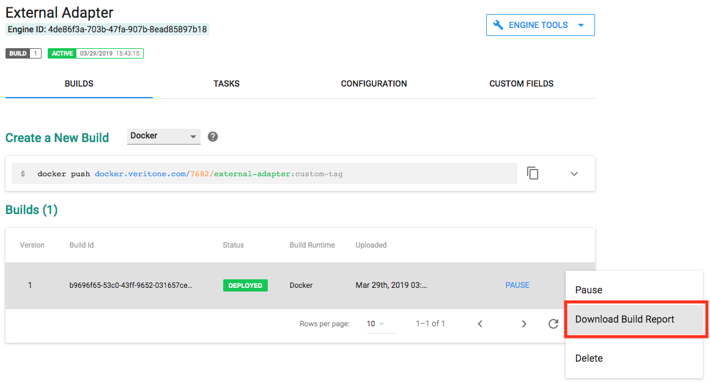
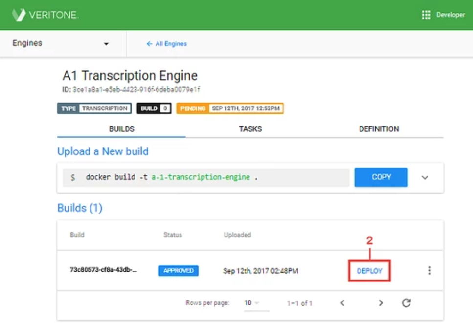

<!-- markdownlint-disable no-inline-html blanks-around-lists -->

# Building Correlation Engines

A [Correlation Engine](developer/engines/cognitive/data/correlation/?id=building-a-data-correlation-engine) identifies relationships between two objects by comparing fields and finding matches that occur in both datasets.

For example, a TV or radio station may have playout data indicating that certain broadcast events were scheduled to take place at certain times.
If the broadcasts were processed by aiWARE, the resulting assets can be examined for the relevant dates/times, and matching can be done to ensure the aired spots agree with the playout logs.

Data correlation requires a [Structured Data Schema](/developer/data/) that defines all of the relevant fields to match against.
The schema uses time-series fields as primary criteria for analysis, but it can also contain custom properties to perform correlation on attributes specific to a user’s needs.

Each correlation engine uses a particular schema, identified by the schema ID referenced the [engine's manifest file](/developer/engines/standards/engine-manifest/).
When a correlation engine receives a task to run, it:

1. Analyzes the input Temporal Data Object (TDO) and identifies fields that match those specified in the schema
1. Extracts Structured Data Objects (SDOs) that conforms to the schema
1. Correlates the structured data to the TDO
1. Outputs the common properties as an asset

## Correlation Engine Components

Name | Responsibilities
--- | ---
Schema | A [json-schema](https://json-schema.org/) that describes the required and optional fields of a SDO. The schema is used to validate against the data that comes into the system and to define what to write to the search index.
Ingestion Adapter | An engine that pulls data from an external data source and saves it to the search index as a SDO through the aiWARE API. Adapters are used with correlation engines that access SDO content stored in aiWARE.
External Data API | Third-party API or a data source that an ingestion adapter or correlation engine can retrieve data from. Correlation engines that access data stored outside of aiWARE can use an external data API to pull in and correlate data.
Search API | API used to search the aiWARE SDO index for data that has been ingested through an ingestion adapter. This API is built into correlation engines that access SDO content stored in aiWARE.
Create Asset API | API to write a SDO (Structured Data Object) asset that contains the correlation results.

**See also:**

- [Working with Structured Data](developer/data/)
- [Getting Started with Engines](developer/engines/getting-started/)
- [Using the Engine Toolkit](developer/engines/toolkit/)

## Correlation Engine Workflow

The correlation engine workflow has the following steps:

1\. **Input Stage**: A task payload containing a TDO ID and schema is sent to the engine.

2\. **Fetch and Analyze TDO**: The engine fetches the target TDO in order to analyze it against the schema for matching fields.

3\. **Fetch Structured Data**: Based on the matching TDO attributes, the engine uses one of the following methods to collect relevant SDO data:

- **Option 1**: Query aiWARE’s datastore to search for matching SDO data.
- **Option 2**: Call external APIs to fetch matching data.

4\. **Correlate**: Structured data are correlated with the TDO fields.

5\. **Output**: Create an asset (consisting of the SDO that contains the correlation results) and add it to the original TDO's `assets`.

> As always, the net result of an engine run is a new asset. The asset type, in this case, is `vtn-standard`.

## Engine Building Steps

Engine development is divided into a series of steps as outlined below.
Each of the steps is described in more detail later this document.
It’s recommended to complete the steps in order, but you can stop at any time and pick up right where you left off whenever you’re ready.

1\. [Define your data schema](#_1-define-your-data-schema)

2\. [Register your engine](#_2-register-your-engine)

3\. [Construct your code to process correlation tasks](#_3-construct-your-code-to-process-correlation-tasks) in aiWARE

4\. [Configure your engine manifest file](#_4-configure-your-engine-manifest-file)

5\. [Package and upload a build](#_5-package-and-upload-a-build)

6\. [Submit a build for approval](#_6-submit-your-build-for-approval)

7\. [Deploy your engine](#_7-deploy-your-engine)

### 1. Define Your Data Schema

A correlation engine relies on a schema as a way of identifying relevant data to correlate.
We use a [JSON schema](https://json-schema.org) &mdash; a file that lays out all of the elements we will match against, and that specifies whether data will be searchable or displayable in aiWARE.

> Each correlation engine references a specific schema to detect, collect, and correlate relevant data.

As part of the engine building process, you’ll create and register a schema that defines the format and content of the data to be analyzed.
Once your schema is registered, you’ll plug the ID into your engine’s manifest.

To create a schema, you’ll use a set of core required properties and then add your own custom properties to the base of information to be evaluated.
After your schema is registered with aiWARE, all of your custom fields are automatically mapped to the index and supported by requests made through the aiWARE Search API.

An example of a schema suitable for use in a correlation engine is:

[](./example-schema.json ':include :type=code json')

?> The `dateTime` and `geoPoint` types referenced in this example are custom aiWARE extensions to the json-schema specification.

The process of defining a schema is straightforward.
Consult the [Structured Data Quick Start](developer/data/quick-start/) for a detailed introduction to schema creation.
Also on that page you'll find a step-by-step guide to deploying your schema through Veritone Developer.
Be sure to read that guide to understand not only how to deploy and update a schema, but how to control versioning.

!> All schemas deployed to aiWARE are public. (Data will be private, but the schema describing the data structure will not be.)

### 2. Register Your Engine

In this step, you’ll register your correlation engine in Veritone Developer &mdash; which serves as a container for your builds.
Registering an engine involves specifying some high-level details, including important information about how your engine expects to work, such as the Engine Category and Deployment Model.

?> Since this engine is implemented as an _adapter_ (ingestion engine), you should review the [Adapter Quick Start](developer/adapters/) before proceeding.

#### Enter Basic Engine Details

When creating your engine, it's important to provide details that accurately and describe your engine.
The information you enter is what users will see in aiWARE when they are selecting engines for processing.

> The process for registering an adapter is covered in the [Adapter Quick Start](developer/adapters/quick-start/step-1?id=_1-enter-basic-adapter-details).
>
> See [Choosing a Deployment Model](developer/adapters/quick-start/step-1?id=_2-choose-a-deployment-model) for details on which deployment model is applicable for your adapter.

### 3. Construct Your Code to Process Correlation Tasks

Engines in aiWARE are purpose-built to process tasks.
When constructing your code, you’ll include elements that enable your engine to perform a logical sequence of task processing actions, including fetching input, retrieving any needed additional assets, processing data, outputting results to an asset.
Along the way, your engine will send notifications back to aiWARE.

At a high level, your engine needs to:

1\. Receive the payload.

2\. Set task status to Running.

3\. Get the task's TDO.

4\. Process the task (carry out correlation logic).

5\. Format and generate output.

6\. Put the output in an _asset_ that will be attached to the TDO by reference. Upload the result.

7\. Handle task failure (if applicable).

> All of these steps, except for Step 4 (the correlation logic), are discussed in detail in [Constructing a Batch Pull Adapter](developer/adapters/guidelines?id=constructing-a-batch-pull-adapter). Correlation logic is discussed below under [Correlation Logic](#correlation-logic).

#### Data Residency

Correlation engines share a common setup to perform task processing, however, based on where the structured data (SDO) data lives, you’ll choose one of two options to set up your engine to fetch SDO content.

- **Option 1 — Data Residing Externally:**
  Data that lives in an external source can be ingested directly as an SDO and correlated to a TDO in real time.
  This option may use third-party APIs to pull in data that conforms to your schema and then automatically performs correlation upon ingestion.
  For organizations with different security requirements, this option offers the flexibility to store data in their own secure environment.
  It also works well when accessing pre-existing datasets that are too large to conveniently pull down into aiWARE.

- **Option 2 — Data Residing in aiWARE:**
  If your engine will be accessing data that’s stored in aiWARE, your engine can query the search index for SDO data to correlate against the TDO.
  With this option, you’ll either use aiWARE APIs or create an adapter to pull in data from an external source and save it to the index as a SDO.

Each step in the task flow must be built into your code.

#### Creating Structured Data Objects (SDOs)

If your data is in JSON form, and you know the schema that you wish to enforce against the data, you can bring the data into aiWARE as a Structured Data Object (SDO) by means of the following GraphQL mutation:

```graphql
mutation {
  createStructuredData(input: {
    schemaId: "1f2f7561-f067-4c08-948d-4f9827451fa6",
    data: {
      adId: "1337",
      advertiserId: "TEST",
      advertiserName: "VTN",
      artistName: "Meachum",
      duration: 30200,
      endDateTime: "2019-06-05T19:11:00Z",
      startDateTime: "2019-06-05T19:09:00.000Z",
      stationBand: "AM",
      stationCallLetters: "WCNN",
      stationCity: "Atlanta",
      status: "PLAY",
      text: "",
      type: "SPOTS"
    }
  }) {
    id
  }
}
```

This mutation will produce a response similar to:

```json
{
  "data": {
    "createStructuredData": {
      "id": "8cce0161-d0ba-4bc0-8c68-6c37ad237453"
    }
  }
}
```

The data from your original mutation is now in the system as an SDO with `id` `"8cce0161-d0ba-4bc0-8c68-6c37ad237453"`

#### Batch Operation

Correlation engines run in `batch` mode, where data is processed serially in discrete quantities.
This mode works by processing the contents of a particular batch before moving on to the next.
Your engine will process and complete an entire task in one invocation as described in the steps below.

1\. The Docker container for your engine will be started up with the environment variables set.

2\. The engine will receive a payload with information about where to retrieve the input data from the GraphQL API.

3\. The engine will process the payload, update the task status, create any updated assets, and exit.

#### Correlation Logic

As mentioned earlier, you will generally proceed by (first of all) finding attributes in the TDO that match your schema; and then, once you've found those items, you'll do one of the following:

- **Option 1:** Call an external API to pull in relevant data. (For example: Station-playout info may be contained in XML files in a remote system. You might need to use external APIs to fetch that data.)

- **Option 2:** Search aiWARE's structured data stores for matching SDO records (see example below).

Here is an example of correlation logic, written in Node.js.
In this case, Structured (SDO) data to correlate is obtained by search.
The search is based in part on start and stop times contained in the passed-in TDO.

[](correlation-example.js ':include :type=code javascript')

More information on how to output the data as an asset in a TDO can be seen in Step 3 of [Constructing a Batch Pull Adapter](developer/adapters/guidelines?id=constructing-a-batch-pull-adapter).

### 4. Configure Your Engine Manifest File

Every engine in aiWARE is built as a Docker container, and every container uploaded to aiWARE must include a `manifest.json` file, which contains important information about your engine and build.
aiWARE relies on the information in the manifest to correctly operate the engine on our platform, so it's important that you be as accurate and comprehensive as you can when creating the manifest.

> A complete description of the manifest format can be found in the [Create Your Manifest File](developer/adapters/quick-start/step-3) section of the [Building Adapters](developer/adapters/) discussion.
Also see the [Adapter Manifest](developer/adapters/manifest) section for a complete breakout of fields.

Here is an example of a correlation engine manifest:

[](manifest-example.json ':include :type=code json')

### 5. Package and Upload a Build

After your engine container is created and your code is set, you'll upload your build as a Docker image.

#### 5.1 Write a Dockerfile

The process for constructing a Docker image is described in [Create a Docker File](adapters/quick-start/step-4?id=create-a-dockerfile).

Here is an example of a Dockerfile for a Node.js engine:

```dockerfile
FROM mhart/alpine-node:8

ENV ENV_APP_HOME /app
ENV NODE_ENV production

RUN mkdir -p $ENV_APP_HOME && apk update && apk add -U git curl file libc6-compat python make gcc g++

ADD manifest.json /var/manifest.json
WORKDIR $ENV_APP_HOME/

ADD package*.json $ENV_APP_HOME/
RUN npm install

ADD . .

ENTRYPOINT node app.js
```

Once your Dockerfile is created, you can package and upload your build by following the instructions in the **Create a New Build** section of Veritone Developer and running the Docker commands shown.


#### 5.2 Package Your Adapter

Build a Docker image from the Dockerfile by clicking copy in the *Package your engine* section and running the `docker build` command.
The Docker build command uses the following syntax:

```bash
docker build -t my-adapter-name .
```

A *Successfully built <image ID>* message displays when the image is created.

#### 5.3 Log into aiWARE's Docker Registry

aiWARE's Docker registry is a central repository for storing Docker images and distributing containers.
After creating your Docker image, you'll push it to your organization's private directory in the repository.
As a Veritone developer, you can access the Docker registry using your aiWARE credentials.
Copy and run the `docker login` command provided in the *Log in to the aiWARE docker registry* section to access the registry.
Then enter your aiWARE username and password to log in.
The docker login command uses the following syntax:

```bash
docker login my-adapter docker.veritone.com
```

#### 5.4 Tag Your Adapter

Once logged into the Docker registry, copy and run the `docker tag` command provided in the *Tag your Adapter* section to give your image a custom tag.
This tag can be anything you would like to help organize your builds.
The command uses the following syntax:

```bash
docker tag my-adapter docker.veritone.com/organizationId/my-adapter-name:custom-tag
```

#### 5.5 Upload Your Build

Copy and run the `docker push` command provided in the *Upload your build via command line* section to upload your build.
The command uses the following syntax:

```bash
docker push docker.veritone.com/organizationId/my-adapter-name:custom-tag
```

Once your build is successfully uploaded to the registry, it displays under the adapter's *Builds* list in the *Pending* state, and compliance testing is initiated.

#### Compliance Testing

When a build is submitted to aiWARE, tests are run against it to make sure it is ready for prime time on our platform.
This testing includes inspecting the packaged manifest; running the adapter with a payload appropriate for the adapter category; and examining the output and network usage of the run.
In addition, a static analysis of vulnerabilities is performed in your Docker container.

An adapter is expected to complete testing within 10 minutes, or it will be considered a timeout.
When testing is complete, aiWARE provides a Build Report with results of the testing that can be downloaded as a JSON file.
If your build did not pass testing, this report can offer insight to help determine the cause.

During testing, the build state displays as *Fetching*.
Once testing is complete, the status changes to *Available* if the build passed or *Invalid* if it failed.
A build in the *Available* state is ready to be submitted to Veritone for final review and approval.

|To download a build report: | |
|--------|--------|
|Under the adapter's *Builds,* click the **vertical ellipsis** ("kabob menu") on the right of the build in the list and select **Download Build Report** from the drop-down list. The Build Report downloads to your computer.| <div style="width: 500px"></div>|

To understand build reports, be sure to look at [Reading a Build Report](developer/adapters/quick-start/step-4?id=reading-a-build-report).

### 6. Submit Your Build for Approval

After your build has passed compliance testing and is in the Available state, the next step is to submit it to Veritone for review by one of our team members.
Use the Veritone Developer UI to do this (see screen shot, below); choose Adapters from the sidebar nav menu, then scroll down to the Builds list and click Submit in the menu.

The review process may take up to a business day to complete.
Once reviewed, the build status will change to Approved or Disapproved.
If your build is Approved, it's eligible to participate in the aiWARE ecosystem and can be deployed at any time.
If your build was Disapproved, it cannot be deployed to production.
In that case, please contact our developer support team for more information.

### 7. Deploy Your Engine

Congratulations! Your adapter has been built, tested, and approved.
Now, with the click of a single button, you can make it available to users in the aiWARE ecosystem.

|**To deploy an approved adapter:**| |
|--------|--------|
|1. Click **Adapters** on the left menu of the Veritone Developer homepage. The _Adapters_ dashboard opens.</br><br> 2. Click the adapter name in the list. The adapter details page opens to the _Builds_ tab. |<div style="width: 500px"></div>|
|2. Scroll down to *Builds* and click **Deploy** on the right of the *Approved* build in the list. A confirmation message displays and the build is deployed to production in aiWARE.|<div style="width: 500px"></div>|
