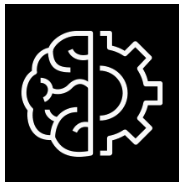
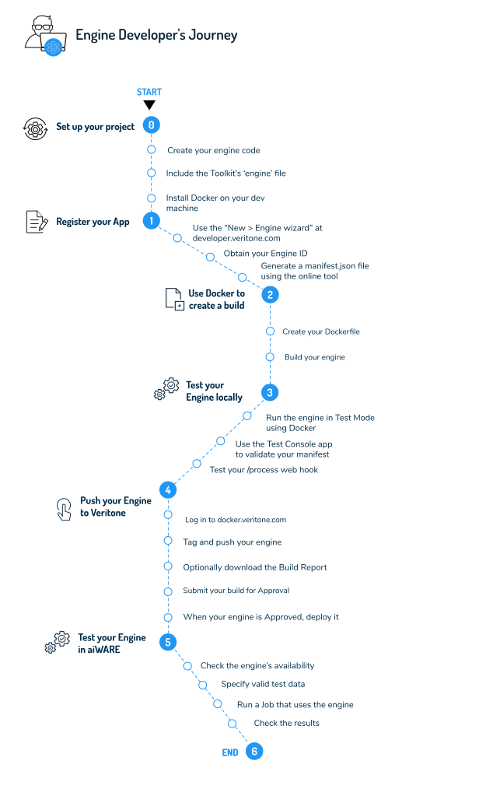

<!-- markdownlint-disable -->

# Tutorial: Build Your Own Cognitive Engine



<div style="font-family: Verdana; font-size:10.5pt; transform:scaleX(.86); transform-origin: top left; 
display: inline-block; line-height:80%;
              border-style: solid;
              border-radius: 5px;
              border-width: 1.2px;
              padding:1px 10px 0px 15px;">
              
**Goal:** Create a custom chunk-mode (stateless) cognitive engine and onboard it so it can be used in aiWARE.

**Technology Stack:** NodeJS, Veritone Engine Toolkit, Docker on Mac or Linux.

**Prerequisites:** Access to a Linux or Mac computer with Docker installed. (Docker for Windows is not supported.)
</div>

In aiWARE, _engines_ afford a modular way to provide different types of cognitive processing.
Cognitive engines process the data brought in by [adapters](developer/engines/?id=adapters-aka-ingestion-engines) and use sophisticated algorithms to extract additional data from which you can derive actionable insights.
Examples of what a cognition engine does include: 

* Natural language processing (NLP)
* Transcription of audio to text
* Convert text to speech
* Detect and/or identify faces or objects in video

<div style="transform:scaleX(.91);">

<div 
style="font-family:Palatino;
font-size:12.5pt;
padding:1px 0px 0px 130px;
transform:scaleX(.95); 
transform-origin: top left; "><div class="topruled"><br/></div>
These are just a few examples of what engines can do.
For a full list of engine classes and capabilities currently supported by aiWARE, see the guide to <a href="https://docs.veritone.com/#/developer/engines/?id=cognitive-engines">Cognitive Engines</a>.
<div class="bottomruled"><br/></div>
</div>
</div>


## How Engines Work

Engines are packaged and deployed as [Docker](https://www.docker.com/) builds, so that when an engine is instantiated at runtime, it runs in its own "container" (essentially, its own Linux instance).

Because aiWARE hosts engines as Docker builds, and because the executable code in an engine is exposed via [webhook](https://en.wikipedia.org/wiki/Webhook), you can write your engine in _any_ programming language.
This is a noteworthy benefit of using Docker.

Another benefit of Docker containerization is that if your engine can be implemented in such a way as to process a file in chunks (without respect to the _ordering_ of chunks), aiWARE can carry out horizontal scaling of your processing automatically.

In aiWARE, stateless engines that can be scaled horizontally are called [segment engines](developer/engines/processing-modes/?id=segment-engines) (or "chunk" engines).
Stateful engines that require contextual knowledge based on the _order_ of data frames are called [stream engines](developer/engines/processing-modes/?id=stream-engines).

Regardless of engine type, an engine's "contract" with aiWARE is quite simple:

* When the engine receives a GET request on a route of `/ready` (or the route you specify in the environment variable called `VERITONE_WEBHOOK_READY`), the engine should respond with HTTP status `200 OK` if the engine is ready to begin, or else `503 Service Unavailable` if it is not ready.
* When the engine receives a POST (of `ContentType` `multipart/form-data`) on a route of `/process` (or the route you specify in `VERITONE_WEBHOOK_PROCESS`), your engine should process the incoming data chunk, then respond with status `200 OK` while sending output formatted as `application/json` data.

 > Your engine's output needs to conform to Veritone's [vtn-standard](developer/engines/standards/engine-output/?id=engine-output-standard-vtn-standard) (specifically, the portion of that schema that applies to your engine's particular [cognitive capability](developer/engines/cognitive/?id=capabilities)).

When your engine receives the `/process` request, it will be able to inspect various fields of the incoming chunk's `multipart/form-data` (see below) to obtain information about the chunk.
The actual _raw data_ of the chunk will be in a file-upload stream associated with the `chunk` field.

### A Simple Segment Engine in NodeJS
Here is how a segment (chunk) engine could look if written in [NodeJS](https://nodejs.org):

```javascript
const MyCognitionLogic = require("./my-cognition-logic.js"),
      express = require('express'),
      multer = require('multer'),
      upload = multer({storage: multer.memoryStorage()}),
      app = express();

let chunkUpload = upload.single('chunk'); // this puts a callback in chunkUpload
let server = app.listen( 8080 );
server.setTimeout( 10 * 60 * 1000 );
 
// READY WEBHOOK
app.get('/ready', (req, res) => {
    res.status(200).send('OK');
});

// PROCESS WEBHOOK
app.post('/process', chunkUpload, async (req, res)=>{
    try {
        let input = req.file.buffer.toString();
        let output = MyCognitionLogic.getOutput( input );
        return res.status(200).send( output );
    } catch (error) {
        return res.status(500).send(error);
    }
});
```

Just 25 lines of code! And yes, it's deployable.

?> Note that this reusable skeleton does no "cognition" per se &mdash; it merely delegates cognitive processing to a custom, user-written external module called `my-cognition-logic.js`.

In this example, the task of reading the file-upload stream is handled by a third-party open-source middleware module called [Multer](https://www.npmjs.com/package/multer).

<div style="transform:scaleX(.91);">

<div 
style="font-family:Palatino;
font-size:12.5pt;
padding:1px 0px 0px 130px;
transform:scaleX(.95); 
transform-origin: top left; "><div class="topruled"><br/></div>
Different programming languages offer different ways of accessing a file upload. In NodeJS, Multer is just one way of handling form-based file streaming.
<div class="bottomruled"><br/></div>
</div>
</div>

The above code fetches the incoming chunk as an in-memory string, then hands the string to the (custom) cognition module.

We'll have more to say about this code in just a minute, since it forms the basis of our "Hello World" engine (see below).

## Fields Available to Engines

Every incoming chunk of data arrives as part of a `multipart/form-data` POST to your engine's `/process` webhook.

The following fields are posted to your `/process` webhook:

* `chunk` - (File) The file to process.
* `chunkMimeType` - (string) The MIME type of the chunk (for example, `image/jpg`).
* `startOffsetMS` - (int) The start time of the chunk (for example, the timestamp of when a frame was extracted from a video). This applies only to temporal data.
* `endOffsetMS` - (int) The end time of the chunk (see `startOffsetMS`).
* `width` - (int) The width of the chunk. (This applies only to visual media.)
* `height` - (int) The height of the chunk. (This applies only to visual media.)
* `libraryId` - (string) ID of the library related to this task. (Applies to engines that require an external library.)
* `libraryEngineModelId` - (string) ID of the library engine model related to this task.
* `cacheURI` - (string) URL of the chunk's source file. 
* `veritoneApiBaseUrl` - (string) The root URL for Veritone platform API requests.
* `token` - (string) The token to use when making low level API requests. (Note: This token is specially scoped and cannot be reused in other contexts.)
* `payload` - (string) JSON string containing any custom task payload.

> It's entirely possible your engine will not need to use any of the above parameters. Their use is optional.

More information on these items can be found in the Engine Developer's Toolkit (see next section).

## The Veritone Engine Developer's Toolkit

If you're interested in building a cognitive engine, your first step should be to download Veritone's [Engine Developer Toolkit](https://github.com/veritone/engine-toolkit/releases).

<div style="transform:scaleX(.91);">

<div 
style="font-family:Palatino;
font-size:12.5pt;
padding:1px 0px 0px 130px;
transform:scaleX(.95); 
transform-origin: top left; "><div class="topruled"><br/></div>
Did you know? You only need to download the <a href="https://github.com/veritone/engine-toolkit/releases/latest">latest release</a>; there's no need to clone the Github repo.
<div class="bottomruled"><br/></div>
</div>
</div>

The Toolkit is packaged as a gzip archive. When you unpack it, notice the Linux binary called `engine` under `/bin`.
You'll want to bundle this binary into your own engine (as described below) so that it becomes the entry point to your Docker container at runtime.
The `engine` binary, in turn, will act as a driver-like intermediary between your code and the aiWARE platform.

> By acting as a go-between, the `engine` binary takes care of low-level aiWARE interactions, so your code can focus more on AI, and less on ceremony.

Note that the Engine Toolkit currently supports segment (chunk) engines only. If you need to write a stream-based cognitive engine, [contact us](mailto:ecosystem@veritone.com).
 
## 'Hello World' Engine: High-Level Overview

At a high level, the steps you need to carry out in order to create and onboard an engine include:

* **Step 0** (this page, below): Set up your project &mdash; create all artifacts except the `manifest.json` file
* **[Step 1](developer/engines/tutorial/engine-tutorial-step-1)**: Register your project with Veritone &dash; During this step, you'll generate a `manifest.json` file, then add it to your project
* **[Step 2](developer/engines/tutorial/engine-tutorial-step-2)**: Customize your Dockerfile and use it to create an engine build
* **[Step 3](developer/engines/tutorial/engine-tutorial-step-3)**: Test your build locally
* **[Step 4](developer/engines/tutorial/engine-tutorial-step-4)**: Push your build to Veritone &mdash; and when it's Approved, use the online UI to Deploy it
* **[Step 5](developer/engines/tutorial/engine-tutorial-step-5)**: Test your engine in aiWARE, and debug as necessary 



In the steps that follow, we'll build a simple text-processing engine that extracts vocabulary words from a file. The JSON output produced by the engine follows the structure shown in the example at [Building a Keyword extraction Engine](developer/engines/cognitive/text/keyword-extraction/?id=engine-output).

> While the example that follows uses NodeJS, you should note that it's possible to use _any_ programming language to create a cognitive engine, as long as the runtimes can be packaged into a Docker image. See [https://github.com/veritone/engine-toolkit/tree/master/engine/examples](https://github.com/veritone/engine-toolkit/tree/master/engine/examples) for engine examples written in Python and Go. 

The purpose of this tutorial is to show you (using actual code and build artifacts) how to structure an engine; package it using Docker; test the engine locally; deploy it onto the Veritone platform, and test the deployed engine, live, in aiWARE.

## Before You Begin

Here's a short checklist of prerequisites:

&#x2714; 1\. **Decide which kind of cognitive capability your engine will support** (and therefore, what the _output_ of your engine needs to look like). Your engine will likely support one of the preexisting capabilities shown in our [Capabilities chart](developer/engines/cognitive/?id=capabilities). (Note that for each entry in the chart, there's a link to a more detailed page showing what the _output_ for the type of engine in querstion should look like.) If your engine supports an entirely new type of capability that's not in our system, by all means contact us. We'll work with you!

&#x2714; 2\. **Determine which MIME type(s) your engine needs to support** in terms of data _input._

&#x2714; 3\. **Understand whether your engine will be _stateless_ (segment; "chunk"), or _stateful_ ("stream")** with regard to the processing of chunks of data. (If your engine can process data chunks in any order, without knowing a chunk's sequence number, it's likely stateless.) _Currently, our Engine Developer's Toolkit supports only stateless engines._

&#x2714; 4\. **Know whether your engine will be [network-isolated](developer/engines/deployment-model/?id=network-isolated), or need [external access](developer/engines/deployment-model/?id=external-access).**

&#x2714; 5\. **Obtain your (free) Veritone system [login](https://www.veritone.com/onboarding/#/signUp),** if you have not already done so.

&#x2714; 6\. **Download the (free) [Veritone Engine Developer's Toolkit](https://github.com/veritone/engine-toolkit/releases/latest)**. 

&#x2714; 7\. **Install Docker** on your (Mac, Linux, or virtualized Linux) development machine, if you have not already done so.

Okay. Ready to get started? Let's go . . .

<style>
aside  {
  border-style: solid;
  border-radius: 9px;
  border-width: 2.2px;
  border-color:#ccc;
  padding: 5px;
  background: #e6e8ef;
}

aside.small {
  display:inline;
  font-size:9pt;
  position:relative; top:-4px;
}

.topruled {
  border-top-width: 1.2px;
  border-top-style: solid;
  border-top-color: rgb(76, 76, 100);
  line-height:45%;
}
.bottomruled {
  border-bottom-width: 1.2px;
  border-bottom-style: solid;
  border-bottom-color: rgb(76, 76, 100);
  line-height:45%;
}

</style>

<br/><h2 style="display: inline;">Step 0: Set Up the Project &nbsp;</h2>&nbsp;&nbsp;<aside class="small">
<b>ESTIMATED TIME:</b> 5 minutes </aside> &nbsp;

<div style="width: 25%"><iframe src="https://player.vimeo.com/video/375527305?color=ff9933&title=0&byline=0&portrait=0" style="border:0;top:0;left:0;width:50%;height:50%;" allow="autoplay; fullscreen" allowfullscreen></iframe></div><script src="https://player.vimeo.com/api/player.js"></script>

You should either clone [the repo for this project](https://github.com/veritone/engine-toolkit/tree/master/engine/examples/hello-world), or create a project locally, in a folder called `/hello-world`, with the following structure:

<pre>/hello-world
    |&mdash; /dist
        |&mdash; engine
    |&mdash; Dockerfile
    |&mdash; index.js
    |&mdash; keyword-extraction.js
    |&mdash; manifest.json
    |&mdash; package.json
    |&mdash; /var
</pre>

!> Important: Do not locate your project at the top level of your root directory, nor at the top level of _any_ large folder! If you do, there's a chance Docker will try to recursively copy your entire directory structure into your Docker image. Heed the warning at the [Docker site](https://docs.docker.com/engine/reference/builder/).

Let's talk quickly about the project files.

### /dist/engine

The `engine` binary, under `/dist`, is the [Engine Developer Toolkit](https://github.com/veritone/engine-toolkit/releases/latest) binary discussed earlier.
Be sure to obtain the latest version of it, and add it to your `/dist` folder.

### Dockerfile

For now, you can just create an empty file named `Dockerfile` (using, for example, the `touch` command in `bash`). We will talk about this file's contents in [Step 2](developer/engines/tutorial/engine-tutorial-step-2).

### index.js and keyword-extraction.js

Writing the code for an engine is easy: All you need to do is create code that can respond to two HTTP requests (corresponding to a `GET` on `/ready` and a `POST` on `/process`), being sure &mdash; in the case of the `/process` call &mdash; to output JSON that obeys an applicable `vtn-standard` sub-schema.

The code for `index.js` is just:

```javascript
'use strict';

const KeywordExtraction = require("./keyword-extraction.js"),
    express = require('express'),
    multer = require('multer'),
    upload = multer({storage: multer.memoryStorage()}),
    app = express();

let chunkUpload = upload.single('chunk');
let server = app.listen( 8080 );
server.setTimeout( 10 * 60 * 1000 );

// READY WEBHOOK
app.get('/readyz', (req, res) => {
    res.status(200).send('OK');
});

// PROCESS WEBHOOK
app.post('/process', chunkUpload, async (req, res)=>{
    try {
        let buffer = req.file.buffer.toString();
        let output = KeywordExtraction.getOutput( buffer, null );
        return res.status(200).send( output );
    } catch (error) {
        return res.status(500).send(error);
    }
});
```

Our "cognition" logic, in `keyword-extraction.js`, is a simple vocabulary-extraction routine that looks like this:

```javascript
module.exports = {

    getOutput: (buffer, configs) => {
        
        // Pass the chunk buffer in, get word-array out:
        let getWordArray = (buffer) => {
            
            let text = buffer.replace(/[^0-9a-zA-Z-']+/g, " ");
            let words = text.split(/\s+/);
            let results = [];
            let undupe = {};
            
            words.forEach(word => {
                if (word.length && word.indexOf("-") == 0)
                    return;
                let wordLowerCased = word.toLowerCase();
                if (!(wordLowerCased in undupe) && word.length)
                    undupe[wordLowerCased] = word;
            });
            
            for (var k in undupe)
                results.push(undupe[k]);
            return results;
        };

        // Pass word array in, get [ keywordObject ] out
        let getVtnObjectArray = (input) => {

            function KeywordObject(labelValue) {
                this.type = "keyword";
                this.label = labelValue;
            }

            let output = [];
            input.forEach(word => {
                output.push(new KeywordObject(word));
            });

            return output;
        };

        try {
            let words = getWordArray(buffer);
            let vtnObjectArray = getVtnObjectArray(words);
            let output = {
                "validationContracts": [
                    "keyword"
                ],
                "object": vtnObjectArray
            };

            return output;
        } catch (e) {
            console.log("Exception: " + e.toString())
        }
    }
};
```

### manifest.json

Because the `manifest.json` file needs to contain the Veritone-assigned ID of your engine (which you don't have yet!), *don't* simply use the `manifest.json` file that comes in the repository version of this project.
In [Step 1](developer/engines/tutorial/engine-tutorial-step-1), we'll show you how to use Veritone's online UI to generate a `manifest.json` file (including the proper engine ID) automatically.

### package.json

Although, strictly speaking, a `package.json` file isn't mandatory, we've provided one:

```json
{
         "name": "hello-world",
         "version": "1.0.0",
         "description": "",
         "main": "index.js",
         "scripts": {
           "test": "echo \"Error: no test specified\" && exit 1"
         },
         "keywords": [],
         "author": "",
         "license": "ISC",
         "dependencies": {
           "express": "^4.17.1",
           "multer": "^1.4.1"
         }
       }
```

### /var

Your `/var` folder should be empty. It will be populated automatically during the Docker build step.

## What's Next?

Ready to begin? Learn how to:

* [Register your project with Veritone](developer/engines/tutorial/engine-tutorial-step-1) &mdash; **Step 1**
* [Use Docker to create a build](developer/engines/tutorial/engine-tutorial-step-2) &mdash; **Step 2**
* [Test your build locally](developer/engines/tutorial/engine-tutorial-step-3) using the Engine Developer Toolkit's Test Console App &mdash; **Step 3**
* [Push your engine build to Veritone](developer/engines/tutorial/engine-tutorial-step-4) &mdash; **Step 4**
* [Test your engine in aiWARE](developer/engines/tutorial/engine-tutorial-step-5) and, if necessary, debug/rebuild/re-deploy &mdash; **Step 5**
