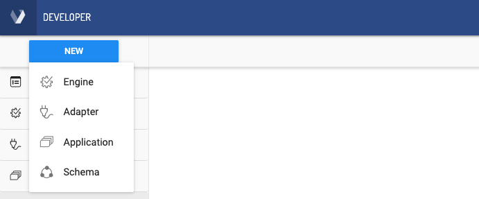
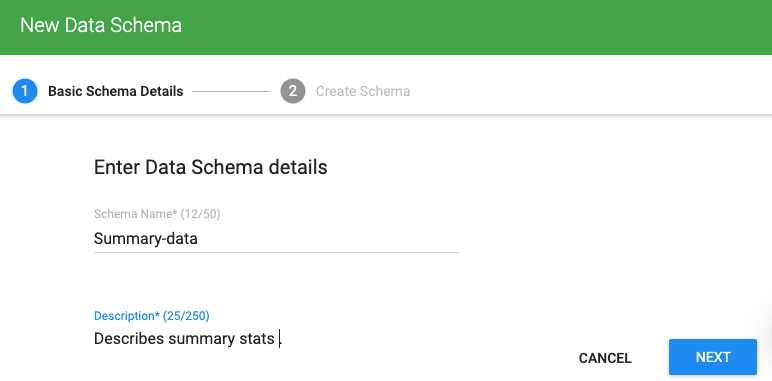
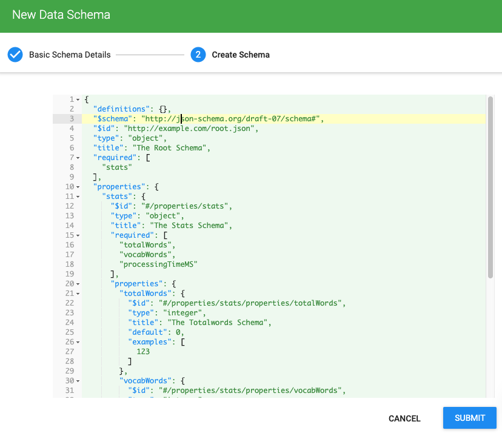
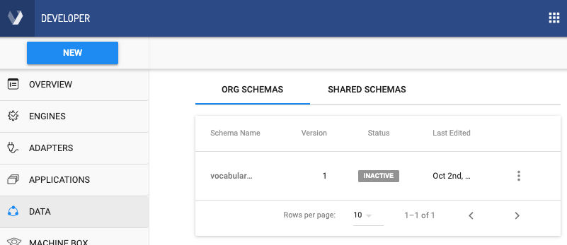
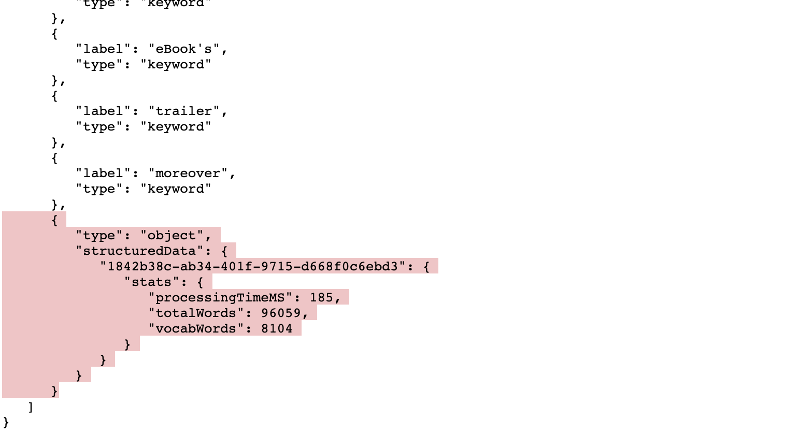

<!-- markdownlint-disable -->

# Deeper Dive: Customizing Engine Output

To achieve high levels of interoperability, Veritone requires all cognitive engines to produce [standardized output](developer/engines/standards/engine-output/?id=engine-output-standard-vtn-standard).
Nevertheless, it's easily possible to customize an engine's output to contain additional data beyond the minimum requirements of the `vtn-standard` schema.

In the mini-tutorial below, we'll look at how to customize an engine's output data. The technique shown here allows your additional data to become fully searchable in the aiWARE platform using the [Search API](apis/search-quickstart/).

?> Other techniques exist for customizing engine output, but some of them do not result in _searchable_ data. See the full discussion under [Extending the Standard](developer/engines/standards/engine-output/?id=extending-the-standard).

### Scenario: Including Summary Data

A common requirement is that you need to include a summary block of data as part of your engine's output. This can be done in a couple of ways.

The fast, schemaless way to do it is to include a `jsondata` blob (arbitrary JSON data of your choosing) under a `vendor` field, as described in [Extending the Standard](developer/engines/standards/engine-output/?id=extending-the-standard).
The disadvantage of this approach is that your summary data will not be indexed and (therefore) will not be searchable.

Another approach is to define a JSON schema for your summary blob, register that schema with Veritone (so that you obtain a schema ID for it), then include a properly structured summary blob in your final output, _along with the schema ID._ This allows aiWARE to validate your engine's _entire_ output and index everything (for searchability).
This is the approach we'll show below.

### Step 1: Create the Summary Schema

In our [Build Your Own Engine](developer/engines/tutorial/) tutorial, we created a simple cognitive engine that  extracts vocabulary from text.
It would be nice to include some summary stats for the job, like this:

```json
{
  "stats": {
    "totalWords": 950,
    "vocabWords": 223,
    "processingTimeMS": 4
  }
}
```

The `stats` object has three fields, each having an integer value. (But obviously, your summary object can &mdash; in theory &mdash; have any number of fields, with any data types supported by JavaScript.)

To use this data structure in our output, we first need to create the JSON schema to which it will conform. That's actually pretty easy. You can use the online tool at [https://jsonschema.net/](https://jsonschema.net/), or something similar, to infer a schema from this sample. The inferred schema, in this case, looks  like:

```json
{
  "definitions": {},
  "$schema": "http://json-schema.org/draft-07/schema#",
  "$id": "http://example.com/root.json",
  "type": "object",
  "title": "The Root Schema",
  "required": [
    "stats"
  ],
  "properties": {
    "stats": {
      "$id": "#/properties/stats",
      "type": "object",
      "title": "The Stats Schema",
      "required": [
        "totalWords",
        "vocabWords",
        "processingTimeMS"
      ],
      "properties": {
        "totalWords": {
          "$id": "#/properties/stats/properties/totalWords",
          "type": "integer",
          "title": "The Totalwords Schema",
          "default": 0,
          "examples": [
            123
          ]
        },
        "vocabWords": {
          "$id": "#/properties/stats/properties/vocabWords",
          "type": "integer",
          "title": "The Vocabwords Schema",
          "default": 0,
          "examples": [
            123
          ]
        },
        "processingTimeMS": {
          "$id": "#/properties/stats/properties/processingTimeMS",
          "type": "integer",
          "title": "The Processingtimems Schema",
          "default": 0,
          "examples": [
            123
          ]
        }
      }
    }
  }
}
```
We customized some  of the `title` fields, but that's optional. Bottom line, we produced a usable JSON schema, in just a few seconds, with a free online tool.

Next, we need to register this schema with Veritone. That's super-easy!

### Step  2: Register Your Schema with Veritone

 1\. Log in to [Veritone Developer](https://developer.veritone.com).
 
 2\. In the upper left, click **NEW > Schema**.



3\. Enter Basic Schema Details (Name and Description) for your schema.



4\. Click **NEXT** to go to the Create Schema page.

5\. In the Create Schema editor window, paste or type your JSON schema.



6\. When you're done, click **SUBMIT**. Your schema is registered and it displays as a line item in the schema summary view.



7\. Using the three-vertical-dots ("kabob") menu on the right, choose **PUBLISH** to make your schema available.

**To obtain the Schema ID:**

8\. Use the kabob menu and choose **VIEW**. In the page that opens, note the schema ID in the browser address window:


The schema ID, in this case, is `1842b38c-ab34-401f-9715-d668f0c6ebd3`. Copy yours. You'll need it in the steps below.

### Step 3: Modify Your Engine Code to Use the Schema

The easiest way to insert our custom data into our engine's output is just to append an extra element to the keyword `object` array.

?> For this example, we'll modify the `keyword-extraction.js` file used in the [Build Your Own Engine](developer/engines/tutorial/) tutorial, complete code for which can be found at [the repo for that project](https://github.com/veritone/engine-toolkit/tree/master/engine/examples/hello-world). Please refer to that code.

In order for our `stats` object to show up properly in our data, it needs to be wrapped in a way that allows aiWARE to recognize it; and it needs to reference the schema ID of the schema we created earlier. Bottom line, we need to insert a Structured Data Object, in our engine's data array, that looks like this:

```json
		{
			"type": "object",
			"structuredData": {
				"1842b38c-ab34-401f-9715-d668f0c6ebd3": {
					"stats": {
						"totalWords": 0,
						"vocabWords": 0,
						"processingTimeMS": 0
					}
				}
			}
		}
```

Let's create the code that will actually do this.

Inside the [`keyword-extraction.js`](https://github.com/veritone/engine-toolkit/blob/master/engine/examples/hello-world/keyword-extraction.js) file, there is exactly one public method, called `getOutput()`. Immediately before the `return` statement in that method, we're going to put code that appends a proper `stats` object to our data:

```javascript
// First we'll put this inner method inline:
function getStructuredData() {
  let schemaId = "1842b38c-ab34-401f-9715-d668f0c6ebd3"; // Use your own schema ID here!
  let sdo = {}; // create empty structured-data object (sdo)
  sdo.type = "object"; // start building the object
  sdo.structuredData = {};
  sdo.structuredData[schemaId] = {};
  sdo.structuredData[schemaId].stats = {};
  sdo.structuredData[schemaId].stats.totalWords = _words.length;
  sdo.structuredData[schemaId].stats.vocabWords = output.length;
  sdo.structuredData[schemaId].stats.processingTimeMS = (1 * new Date) - _startTime;

  return sdo;
}

// Now we can add the structured data to our output:
output.push( getStructuredData() );

return output;
```

> Note that at the top of the file, we also need to add a line:
```javascript
        let _startTime = 1 * new Date;
```

to support the use of our timing variable, `_startTime`, in this snippet.

At this point, you can Save the file, re-build the engine, and test it locally (using Test Mode, as described in the [earlier tutorial]((developer/engines/tutorial/)). Once you've verified that the engine produces the desired output, deploy it to Veritone.

When we ran the modified `hello-world` engine on a large text file, we got a vocabulary-extraction dataset that ended with:


 
The highlighted portion is our custom summary block, showing that 8,104 vocabulary words were extracted from 96,059 total words in just 185 milliseconds.

### Scenario: Including Extra Fields in the Data

Sometimes, you might have a need to add an extra field to each data item in a series. For example, in our vocabulary extraction engine, it would be useful to have an "occurrence count" for every vocabulary word, so that we can see how many times a given word occurs in the input.

This is easy to do. Just insert a Structured Data Object (having its own schema ID) into _every item in the data series_. Follow the procedure outlined above for creating and registering your custom schema. Then modify your engine's code to output data array elements that contain the corresponding Structured Data Object (one per array element).

See the discussion at [Extending the Standard](developer/engines/standards/engine-output/?id=extending-the-standard) for more information.
