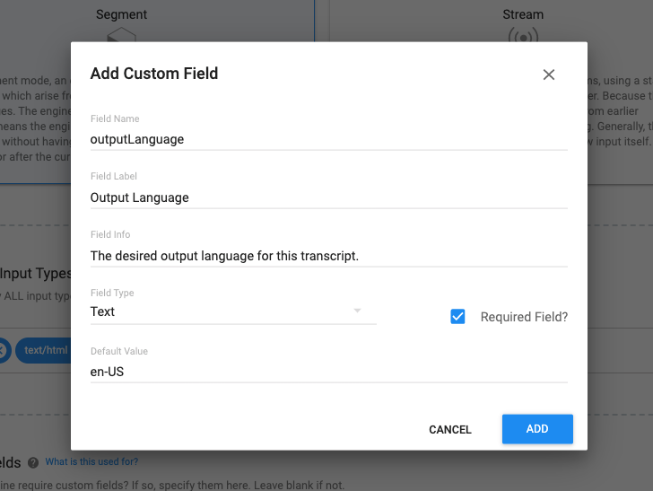
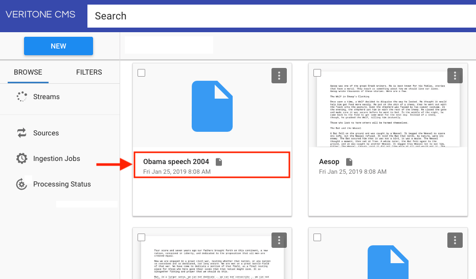
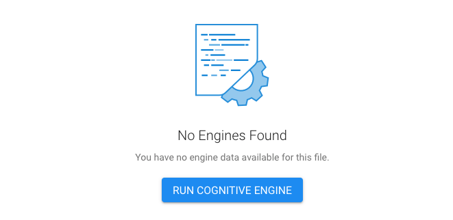
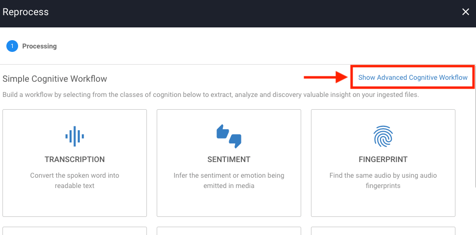

# Deeper Dive: Customizing Engine Input


In a [separate tutorial](developer/engines/tutorial/customizing-engine-output), we looked at how to customize a cognitive engine's _output_.
Below, we'll look at how to customize an engine's _input_, so that if your engine requires that the user specify custom configuration parameters, it becomes possible to do that.

Your engine might need custom input parameters in order to:

* Specify the desired input or output language (e.g. 'en-US') using ISO 639-1 standard language codes.
* Specify a particular time zone.
* Set minimum confidence thresholds.
* Specify the URL of a webhook.
* Point to a schema.

These are just a few examples of custom parameters you may want to pass to an engine at runtime.

As it turns out, it's quite easy to pass arbitrary JSON data to an engine in aiWARE. Let's take a quick look at how it's done.

## The Task 'payload' field

In the GraphQL schema definition for aiWARE's [Task object](https://api.veritone.com/v3/graphqldocs/task.doc.html), the `payload` field is defined as pointing to a `JSONData` blob.
This means you can pass any arbitrary JSON data you want to pass to the engine at runtime, as long as it is referenced in the Task's `payload`.

For example, suppose you want your engine to receive a `cutoff` value, representing a floating-point number between 0 and 1.
You might kick off the job this way:

```graphql
mutation runMyEngineJob {
  createJob(
    input: {
      targetId: "531117144",
      isReprocessJob:true,
      tasks: [
        {
          engineId: "386e022f-edd1-46ec-b1cc-84d203a37250",
          payload: {
            cutoff: 0.5
          }
        }
      ]
    }
  )
  {
    id
  }
}
```

At runtime, the engine will receive a variety of form fields (more fully documented [here](developer/engines/toolkit/?id=process-webhook)), as part of the request body.
The parsed JSON object will look something like this:

```json
{
    "applicationId": "a22cb5c0-dc00-4c3f-adef-18e28e5b561d",
    "cutoff": 0.5,
    "jobId": "19104428_GvNQ57jXtG",
    "organizationId": "17532",
    "recordingId": "531117144",
    "taskId": "19104428_GvNQ57jXtGlRXJv",
    "taskPayload": {
        "cutoff": 0.5,
        "organizationId": 17532
    },
    "token": "eyJhbGciOiJIUzI1NiIsInR5cCI6IkpXVCJ9.eyJjb250ZW50QXBwbGljYXRpb25JZCI6ImEyMmNiNWMwLWRjMDAtNGMzZi1hZGVmLTE4ZTI4ZTViNTYxZCIsImNvbnRlbnRPcmdhbml6YXRpb25JZCI6MTc1MzIsImVuZ2luZUlkIjoiOTk5MjgxMWItOWNlMi00ZmFiLTk0MGItYzU2NmIwMzJlMmUyIiwic2NvcGUiOlt7ImFjdGlvbnMiOlsiYXNzZXQ6dXJpIiwiYXNzZXQ6YWxsIiwicmVjb3JkaW5nOnJlYWQiLCJyZWNvcmRpbmc6dXBkYXRlIl0sInJlc291cmNlcyI6eyJyZWNvcmRpbmdJZHMiOlsiNzMwMTUyMjExIl19fSx7ImFjdGlvbnMiOlsidGFzazp1cGRhdGUiXSwicmVzb3VyY2VzIjp7ImpvYklkcyI6WyIxOTEwNDQyOF9Hdk5RNTdqWHRHIl0sInRhc2tJZHMiOlsiMTkxMDQ0MjhfR3ZOUTU3alh0R2xSWEp2Il0sInNvdXJjZUlkcyI6bnVsbH19XSwiaWF0IjoxNTcyMjc2NjczLCJleHAiOjE1NzI4ODE0NzMsInN1YiI6ImVuZ2luZS1ydW4iLCJqdGkiOiIxZmNlNGI5NC0xMmFlLTQ3NWItOTY1My1hMmE3YWQ3YmIzNDEifQ.egCKGRp58wPR-fDIAHPixI5ahGQ6E2aM5qw4ZWS3Vfg",
    "veritoneApiBaseUrl": "https://api.veritone.com"
}
```

In this case, the `cutoff` field (our custom input) is the second field listed.

?> Note that the API token contained in this block is a specially scoped token that's not usable outside the context of the engine's current runtime session.

> The `taskPayload` field is a legacy field that should be considered deprecated.

## Custom Fields

?> **NOTE:** The discussion shown hereunder is relevant only if you care how your engine appears in the Veritone CMS online UI. It does not affect how custom `payload` properties work (as outlined above). You _need not_ use the Custom Fields UI described below to achieve custom input to your engine. The Custom Fields UI is merely a convenience for users of the Veritone CMS.

When you create and register a new engine in Veritone Developer using the online UI, you are given the opportunity to specify [Custom Fields](developer/adapters/quick-start/step-1?id=_3-add-custom-fields-optional).
If you add one or more Custom Fields to your engine project using this UI, each Field Name you specify will become a property name (key) in the request body that your engine receives at runtime.
Each Field Label you specify becomes a form-field label in the Advanced Cognitive Workflow UI of the [Veritone CMS](https://cms.veritone.com).

Here's how it works: Suppose you are registering a new engine with Veritone, and at the bottom of the first page of the Registration Wizard, you decide to click the **ADD CUSTOM FIELD** button. You would then see the Add Custom Field dialog:



In this example, we've specified a Field Name of `outputLanguage`. The Field Label is "Output Language."

What this means is that if someone using the [Veritone CMS](https://cms.veritone.com) decides to run your cognitive engine against a particular media file, that person will see a UI that allows him or her to specify a value for Output Language. The value so specified will show up as the value of an `outputLanguage` form-field parameter in the body POSTed to the engine's `/process` handler at runtime.

### Example: Using the Advanced Cognitive Workflow UI

To see how this works, try the following:

1\. Log onto Veritone and go to the Content Management System [(https://cms.veritone.com)](https://cms.veritone.com).

2\. Click on the _title_ (not the thumbnail) of any media file. (See arrow in the example below.)



3\. In the Media Details page that opens, click the **RUN COGNITIVE ENGINE** button. (Ignore the "No Engines Found" graphic, if it's showing.)



4\. In the Processing page that opens, click the **Show Advanced Cognitive Workflow** link in the upper right.



5\. Use the **Available Engines** picker to find your engine. Click the green circle+ icon to select your engine and move it into the "Selected Engines" column on the right.


Notice that the **Selected Engine** UI shows a text field labelled **Output Language** (with a default value **en-US**). Because the **Name** of this field was specified as `outputLanguage`, the engine, at runtime, will receive a `body` payload that includes a property of that name:

```json
{
    "applicationId": "a22cb5c0-dc00-4c3f-adef-18e28e5b561d",
    "outputLanguage": "en-US",
    "jobId": "19104498_AxUQ57jXtT",
    "organizationId": "17532",
    "recordingId": "532237145",
    "taskId": "19104428_GvNQ57jXtGlRXJv",
    "taskPayload": {
        "outputLanguage": "en-US",
        "organizationId": 17532
    },
    "token": "ezJhbGciOiJIUzI1NiIsInR5cCI6IkpXVCJ9.eyJjb250ZW50QXBwbGljYXRpb25JZCI6ImEyMmNiNWMwLWRjMDAtNGMzZi1hZGVmLTE4ZTI4ZTViNTYxZCIsImNvbnRlbnRPcmdhbml6YXRpb25JZCI6MTc1MzIsImVuZ2luZUlkIjoiOTk5MjgxMWItOWNlMi00ZmFiLTk0MGItYzU2NmIwMzJlMmUyIiwic2NvcGUiOlt7ImFjdGlvbnMiOlsiYXNzZXQ6dXJpIiwiYXNzZXQ6YWxsIiwicmVjb3JkaW5nOnJlYWQiLCJyZWNvcmRpbmc6dXBkYXRlIl0sInJlc291cmNlcyI6eyJyZWNvcmRpbmdJZHMiOlsiNzMwMTUyMjExIl19fSx7ImFjdGlvbnMiOlsidGFzazp1cGRhdGUiXSwicmVzb3VyY2VzIjp7ImpvYklkcyI6WyIxOTEwNDQyOF9Hdk5RNTdqWHRHIl0sInRhc2tJZHMiOlsiMTkxMDQ0MjhfR3ZOUTU3alh0R2xSWEp2Il0sInNvdXJjZUlkcyI6bnVsbH19XSwiaWF0IjoxNTcyMjc2NjczLCJleHAiOjE1NzI4ODE0NzMsInN1YiI6ImVuZ2luZS1ydW4iLCJqdGkiOiIxZmNlNGI5NC0xMmFlLTQ3NWItOTY1My1hMmE3YWQ3YmIzNDEifQ.egCKGRp58wPR-fDIAHPixI5ahGQ6E2aM5qw4ZWS3Vfg",
    "veritoneApiBaseUrl": "https://api.veritone.com"
}
```

#### Notes

* The existence of Custom Fields does not, in any way, preclude the use of _additional_ custom `payload` fields, if you wish to supply them programmatically as part of a Task.

* You can supply different input parameters (different keys, as well as values) on different invocations of the same engine. The custom-input JSONData blob can differ _per Task_.

* Custom Fields do _not_ automatically show up in the `body` if the relevant form fields are left empty (no value supplied) in the Advanced Cognitive Workflow UI. In other words, you should _check for the existence of a field before using its value._ (And even if the field exists, you should check for an empty string or null value.)
