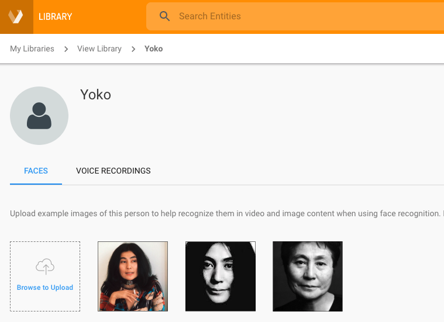
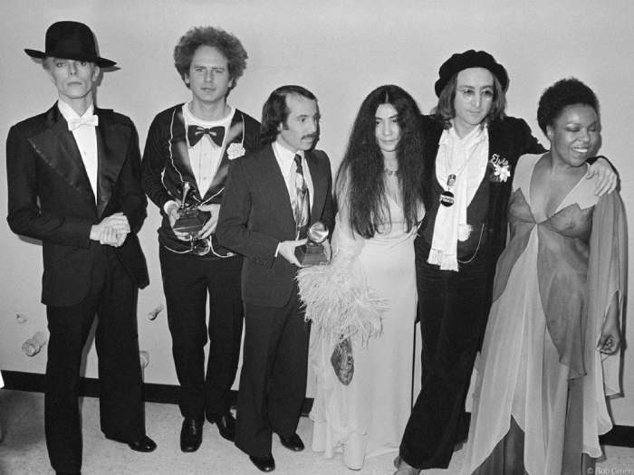

# Deeper Dive: How to Train a Cognitive Engine


Cognitive engines often need to be _trained_ to recognize features of interest.
Training usually involves showing the engine various representative examples of the particular kinds of objects you want the engine to detect.
Generally speaking, this means running the engine in a special "training mode," and submitting exemplars to it, from which it can learn.
The engine ultimately captures its learnings in a state file, which can later be loaded by the engine when it is called upon to analyze audio, video, or other data it may never have seen before.

In the brief tutorial below, we'll show how a face detection engine, running in aiWARE, can be trained to recognize specific people.
We'll use GraphQL mutations and queries to create library objects; populate them with exemplars; initiate training; and then test the trained engine by having it analyze an image it has never seen.

> For this tutorial, we'll be using a face detection engine to analyze still images (rather than video), but the same training principles and API methods that apply to facial images also apply to audio and video engine training (and many other training scenarios).

## Facial Detection in aiWARE

Veritone's aiWARE platform exposes more than a dozen face detection engines, which vary in terms of configuration options (e.g. confidence-thresholding) and other characteristics.
One general-purpose face detection engine that's easy to use "out of the box" is the engine with ID `dcef5300-5cc1-4fe3-bd8f-5c4d3a09b281`, which is named "Face Recognition - I - V2F."
This engine uses Veritone's [Facebox](developer/machine-box/boxes/facebox-overview) technology to carry out face recognition.

> If you want to run Facebox locally, or bundle a licensed version of it into your own standalone (non-aiWARE) app, you can easily do so. To learn more about using Facebox offline, see our tutorial called [Teaching  Facebox](developer/machine-box/boxes/teaching-facebox).

The tutorial that follows assumes you will be using the _online_ (aiWARE-deployed) version of this engine. All interactions with aiWARE will be done through the online GraphiQL IDE. Accordingly, the only prerequisite for this tutorial is a Veritone login.

?> Be sure to obtain your (free) Veritone system [login](https://www.veritone.com/onboarding/#/signUp) now, if you have not already done so.

## Plan of Attack

To train a cognitive engine in aiWARE, you need to:

1\. Create an empty [Library](developer/libraries/engines?id=library-enabled-engines).

2\. Create an empty [Entity](https://api.veritone.com/v3/graphqldocs/entity.doc.html) in that Library.

3\. Add one or more learnable assets (e.g., images) to the Entity.

4\. Publish the Library. (This kicks off training tasks.)

5\. Poll for the status of training tasks.

6\. Test your trained engine(s).

We'll now demonstrate this process by showing how to create the artifacts needed in order to train a facial recognition engine to recognize Yoko Ono. Once training is complete, we'll test the engine by having it analyze a group photo, to see if Yoko can be deteected in the image.

## Step 1: Create an empty Library

Before starting, be sure you are logged into Veritone. Then, go to [the GraaphiQL sandbox](https://api.veritone.com/v3/graphiql) and run the following mutation:

```graphql
mutation CreateLibrary {
  createLibrary(input: {name: "Rock Stars", libraryTypeId: "people"}) {
    id
  }
}
```

This mutation creates an empty Library object named "Rock Stars" in your Organization.

> If you encounter authentication errors when you run this mutation, be sure your login has not expired and that you are not logged into a dev or stage environment. Please log in to [https://www.veritone.com](https://www.veritone.com) and use the IDE at [https://api.veritone.com/v3/graphiql](https://api.veritone.com/v3/graphiql).

## Step 2: Create an empty Entity

In aiWARE, an Entity object collects together the various exemplars that define a detectable target. For example, if we want our facial recognition engine to be able to recognize Yoko Ono, we might create an Entity called "Yoko" and assign multiple individual images of Yoko Ono to the "Yoko entity."

This is easy to do:

```graphql
mutation createEntity {
  createEntity(input: {
    libraryId: "b370ecab-88c0-4e2b-ae9c-7739a7ed16c7",
    name: "Yoko"}) {
    id
  }
}
```

Notice how we used the `libraryId` that was returned in Step 1. This mutation, likewise, will return an `entityId` (which we'll need for the _next_ step).

## Step 3: Add example images to the Entity

Let's add the image that exists online at https://i.pinimg.com/originals/a0/cc/e0/a0cce07f699ef0cd36cba57ce4cd9c51.jpg to the "Yoko" Entity we just created. The image looks like this:


We can add this image to the Yoko entity using this mutation:

```graphql
mutation createEntityIdentifier {
  createEntityIdentifier(input: {
    entityId:"7c7b08e6-6b72-48af-b768-043f023e15cc",
    identifierTypeId: "face",
    contentType:"image/jpeg",
    storeReference:true,
    url:"https://i.pinimg.com/originals/a0/cc/e0/a0cce07f699ef0cd36cba57ce4cd9c51.jpg"
  }) {
    id
  }
}
```

> It's important to set the `storeReference` flag to `true`. This allows us to specify the image by _reference_, rather than by value. If we were to use the flag's default value of `false`, the mutation would fail unless it is POSTed in conjunction with an actual File upload – something you can't currently do in the GraphiQL sandbox. You would need to use curl, Postman, or custom code to do a simultaneous POST mutation/upload.

When training an engine, it's usually a good idea to have more than one exemplar in your Entity coillection.
You might want to take a moment to add at least a couple more images of Yoko to your "Yoko" entity. (All you have to do is run the above mutation multiple times, substituting a new `uri` value each time.)

To see how your Library looks in Veritone's Library app, head over to [https://library.veritone.com](https://library.veritone.com) and drill down into your Entity. Here's what ours looked like after adding a total of three images of Yoko Ono:



?> As you might have noticed, Veritone's Library app offers a point-and-click UI for creating Libraries and Entities, in case you'd rather create those artifacts interactively. For this tutorial, though, we're skipping the UI and doing  everything programmatically.

## Step 4: Publish the Library (to kick off training)

As it turns out, aiWARE is set up so that when you _publish_ a Library, all applicable engines (i.e., all engines that _can_ be trained using such a library) are automatically assigned training tasks targeting that library; and those tasks are immediately queued &mdash; and run, in the background &mdash; automatically. Thus, traininng is largely automated.

> If you want to have greater control over the  training process, see our discussion of [Training Library-Enabled Engines](developer/libraries/training?id=training-library-enabled-engines).

To publish your Library, and kick off training of all applicable engines, run the following mutation in GraphiQL (substituting your own `libraryId`):

```graphql
mutation publishLibrary {
  publishLibrary(id: "b370ecab-88c0-4e2b-ae9c-7739a7ed16c7") {
    name
    entities {
      records {
        name
        id
        identifiers {
          records {
            url
          }
        }
      }
    }
  }
}
```

This mutation will train all applicable engines and result in the creation (and/or updating) of `engineModel` objects containing the engines' learnings.

## Step 5: Wait for training to finish

Use  your `libraryId` (from Step 1) to obtain status  info about the various  `engineModel` objects created during training.

```graphql
query GetLibraryInfo {
  library(id:"b370ecab-88c0-4e2b-ae9c-7739a7ed16c7") {
    engineModels {
      records {
        id
        trainStatus
        engine  {
          name
          id
        }
      }
    }
  }
}
```

This will produce a response that looks something like:

```json
{
  "data": {
    "library": {
      "engineModels": {
        "records": [
          {
            "id": "80960853-97d9-45a0-a339-978609359d42",
            "trainStatus": "complete",
            "engine": {
              "name": "Face Recognition - L - V2F",
              "id": "b74d4058-90f6-453a-9636-5982e34abe0c"
            }
          },
          {
            "id": "0cf73642-3c92-41b0-812e-4c8fe8129e67",
            "trainStatus": "complete",
            "engine": {
              "name": "Face Recognition - F - V2F",
              "id": "434db220-b38f-4bb6-bf65-02a4469559ac"
            }
          },
          {
            "id": "dc0753c6-7180-4e87-9366-016b0bc91d8c",
            "trainStatus": "complete",
            "engine": {
              "name": "Face Recognition - C",
              "id": "799155d9-7d48-4b4c-b98f-501e2894abb0"
            }
          },
          {
            "id": "5d91fe57-8b59-43fb-a7c2-d2934bfbf0eb",
            "trainStatus": "complete",
            "engine": {
              "name": "Face Recognition - B",
              "id": "3f115b93-97be-46f0-b0f2-7460db15ec34"
            }
          },
          {
            "id": "9a30d2c3-5743-48b8-b39a-3c6618f5dd40",
            "trainStatus": "complete",
            "engine": {
              "name": "Face Recognition - M - V2F",
              "id": "fa7e75da-5955-476a-b20c-28e286fdfd8e"
            }
          },
          {
            "id": "2c3a1855-7a29-457b-b8cc-3e4a869a130e",
            "trainStatus": "complete",
            "engine": {
              "name": "Face Recognition - I - V2F",
              "id": "dcef5300-5cc1-4fe3-bd8f-5c4d3a09b281"
            }
          },
          {
            "id": "2326f4d9-f501-4e75-988c-fa081b591d8b",
            "trainStatus": "complete",
            "engine": {
              "name": "Face Similarity - A - V2F",
              "id": "bab908d5-1eb0-4b94-9b0c-5c4bb6a81d78"
            }
          }
        ]
      }
    }
  }
}
```

> Run the query as many times as you need to, until all `trainStatus` fields are shown as `"complete"`. Do not attempt to run a job on a trained engine if the status is not yet shown as `"complete"`. (The wait time for training depends on many factors, but in general, we're talking seconds, not minutes or hours.)

Notice how there's a training record for each engine? These are all the engines that can be trained using JPEG images.

?> Recall that in Step 3, we added assets (EntityIdentifiers) having `contentType:"image/jpeg"`.

## Step 6: Test a trained engine

Now we're at a point where we can choose a trained engine (from the list shown in the last step), and run a job using it.

Suppose we want to analyze an image off the Web, such as the one at [https://www.morrisonhotelgallery.com/images/big/R-361_J_Y_Friends_Grammys1975_Gruen.jpg](https://www.morrisonhotelgallery.com/images/big/R-361_J_Y_Friends_Grammys1975_Gruen.jpg) (see below), to determine whether Yoko Ono appears in the image.



For this example, we'll use the engine called "Face Recognition - I - V2F" (which has an ID of `"dcef5300-5cc1-4fe3-bd8f-5c4d3a09b281"`). Because we are trying to detect whether Yoko Ono is present, we need to tell the engine to use the learnings associated with a `libraryEngineModelId` of `"2c3a1855-7a29-457b-b8cc-3e4a869a130e"`. (This information is in one of the records shown in the data from Step 5 above.) Remember, the point of _training_ is to capture learnings in a special file. We can then call on that file to help analyze images that our engine has never seen before. That's what we'll do right now.

Let's set up a Job using our Face Recognition engine. Since this engine _requires_ a Library, we will need to invoke it with a special payload option of `mode:"library-run"`. We'll also need to pass it the appropriate `libraryId` and `libraryEngineModelId`.

Here's our Job:

```graphql
mutation createJob{
  createJob(input: {
    target:{
      startDateTime:1548432520,
      stopDateTime:1548436341,
      name:"Grammys pic by Gruen"
    },
    tasks: [{
         engineId:"9e611ad7-2d3b-48f6-a51b-0a1ba40feab4",
         payload:{
             url: "https://www.morrisonhotelgallery.com/images/big/R-361_J_Y_Friends_Grammys1975_Gruen.jpg"
         }
    },{
      engineId: "dcef5300-5cc1-4fe3-bd8f-5c4d3a09b281",
      payload:{
        mode:"library-run",
        libraryId: "b370ecab-88c0-4e2b-ae9c-7739a7ed16c7",
        libraryEngineModelId:"2c3a1855-7a29-457b-b8cc-3e4a869a130e"  
      }
    }
    ]
  }) {
    id
    targetId
  }
}
```

Some things to take note of:

* By specifying a `target` block (instead of a `targetId`), we allow aiWARE to create a TDO (Temporal Data Object) for this job on the fly. We do not need to pass a TDO to the job. One will be created for us.
* The first task, involving the JPEG payload, uses the Webstream adapter to ingest the never-seen-before image. This ingestion process will, of course, associate the image with a TDO (the one created dynamically for us), and as a result, the image will appear as a first-class media object in the [Veritone CMS](https://cms.veritone.com).
* The second task uses our Face Recognition engine. Note the `payload` fields. All 3 fields are _required_.

When the above mutation is run, it will give back a Job ID, such as `"19104217_A517gxCHlk"`. We can use that job ID to poll the job &mdash; and obtain results.

```graphql
query PollJob {
  job(id: "19104217_A517gxCHlk") {
    status
    targetId
    tasks {
      count
      records {
        status
        engine {name}
        taskOutput
        startedDateTime
        completedDateTime
      }
    }
  }
  engineResults(jobId: "19104217_A517gxCHlk") {
    records {
      assetId
      tdoId
      jsondata
    }
  }
}
```

Here, we are polling _and_ requesting results, all in one query. The `engineResults` section of the data we get back will be empty, of course, if the job is not complete. But once the job finishes, that section of the query will bring back results.

The JSON that comes back from the job will contain `jsondata` that (in turn) holds an array of potential hits, each with an associated confidence value. Every face in the image will be detected, but most will have a confidence of zero and no associated `entityId`. If Yoko Ono is detected, one of the hits will give a strong confidence value as well as an associated `entityId`. For example:

```json
{
  "startTimeMs": 0,
  "stopTimeMs": 0,
  "entityId": "7c7b08e6-6b72-48af-b768-043f023e15cc",
  "libraryId": "b370ecab-88c0-4e2b-ae9c-7739a7ed16c7",
  "object": {
    "type": "face",
    "entityId": "7c7b08e6-6b72-48af-b768-043f023e15cc",
    "libraryId": "b370ecab-88c0-4e2b-ae9c-7739a7ed16c7",
    "confidence": 0.8070940918637284,
    "boundingPoly": [
      {
        "x": 0.5814843152257078,
        "y": 0.2336734693877551
      },
      {
        "x": 0.6381025248661056,
        "y": 0.2336734693877551
      },
      {
        "x": 0.6381025248661056,
        "y": 0.31020408163265306
      },
      {
        "x": 0.5814843152257078,
        "y": 0.31020408163265306
      }
    ],
    "vendor": {
      "facebox": {}
    },
    "uri": "https://api.veritone.com/media-streamer/image/710916336/2019-01-25T16:08:40.000Z?x[0]=0.5814843152257078&amp;y[0]=0.2336734693877551&amp;x[1]=0.6381025248661056&amp;y[1]=0.2336734693877551&amp;x[2]=0.6381025248661056&amp;y[2]=0.31020408163265306&amp;x[3]=0.5814843152257078&amp;y[3]=0.31020408163265306"
  }
}
```

This hit tells us that the engine is 80.7% confident that the face at the bounding polygon in question is Yoko Ono. The hit's bitmap is specified in the `uri` shown. That bitmap looks like:


The data in the hit includes an `entityId` that clearly identifies this face as belonging to "Yoko."

## Further Reading

Want to know more about Libraries and training? You may want to take a look at:

* [Library-Related API Examples](apis/examples?id=library) &mdash; Queries and mutations you can run interactively in GraphiQL
* [Library GraphQL Schema](https://api.veritone.com/v3/graphqldocs/library.doc.html) &mdash; Our schema documentation
* [Training Library-Enabled Engines](developer/libraries/training?id=training-library-enabled-engines) &mdash; How to schedule training jobs manually.
* [Running Library-Enabled Engines](developer/libraries/running) &mdash; More information on library-enabled engines
* [Training Facebox](developer/machine-box/boxes/facebox-overview) &mdash; How to train Facebox offline (running locally)
* [Build Your Own Cognitive Engine](developer/engines/tutorial/) &mdash; How to write and deploy your own engine to aiWARE
