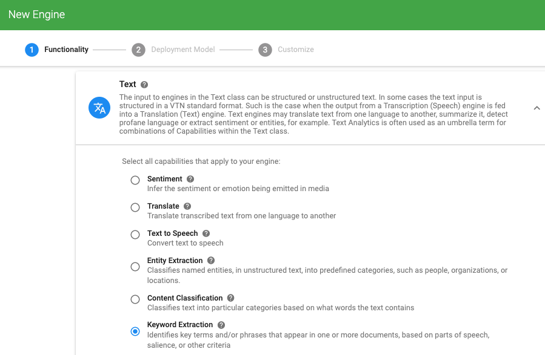
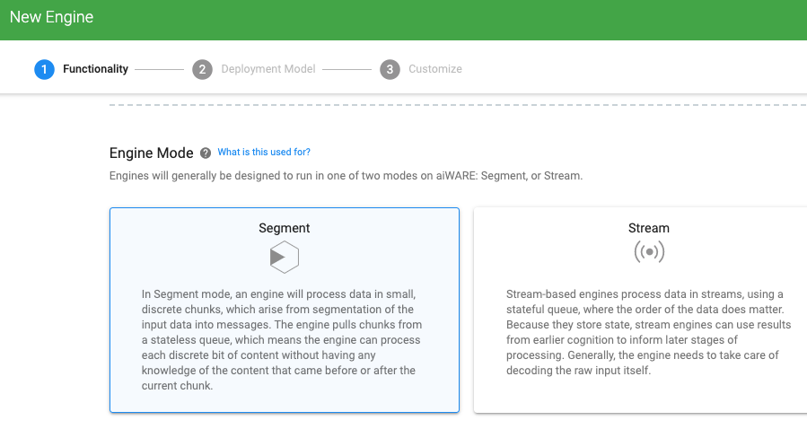
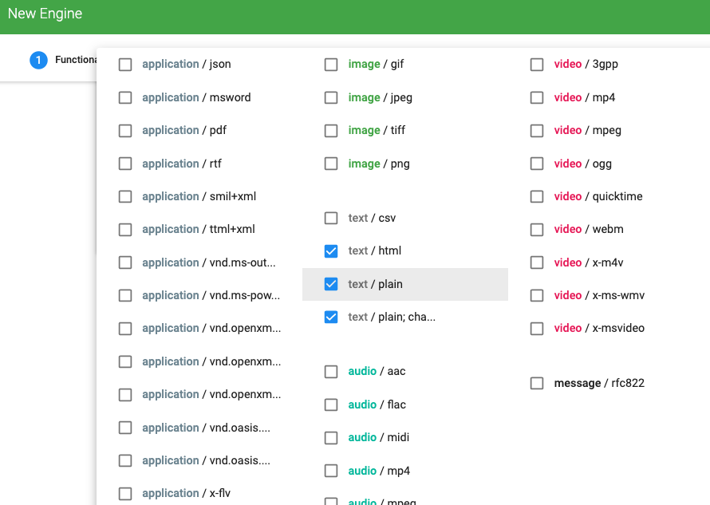
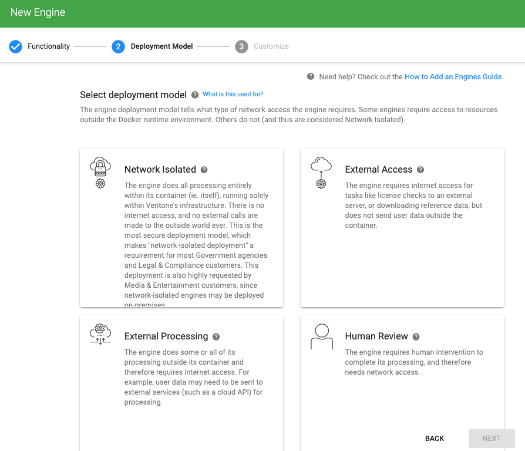
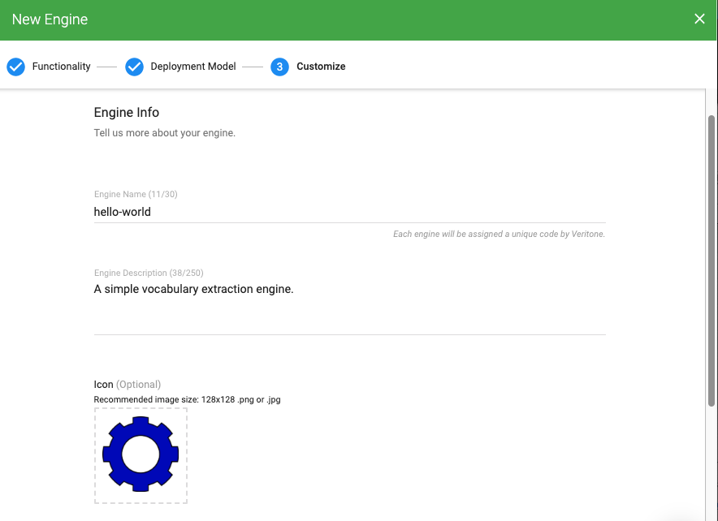
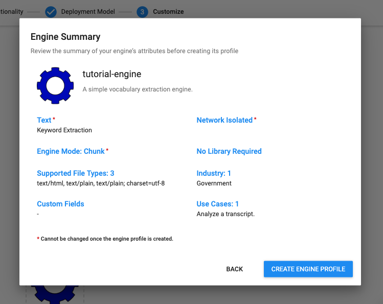
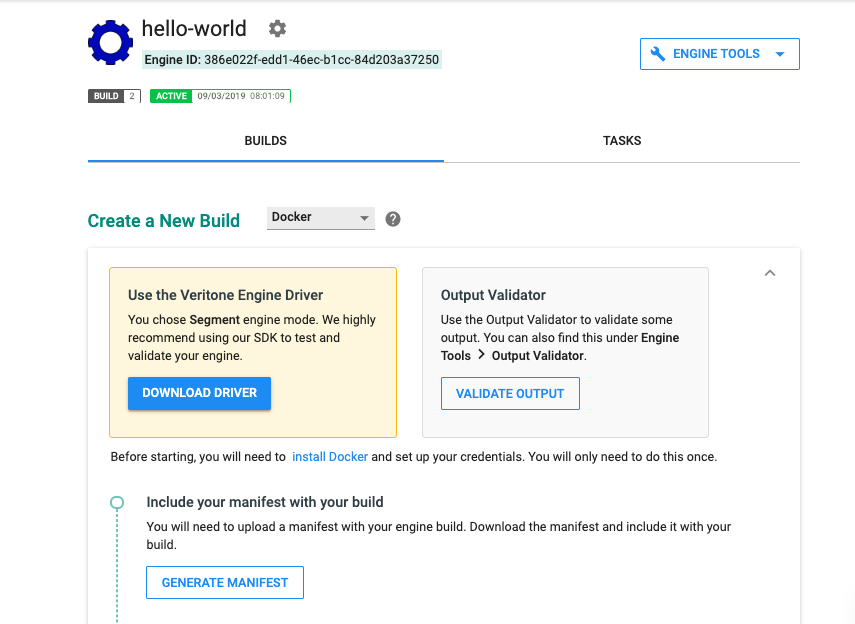
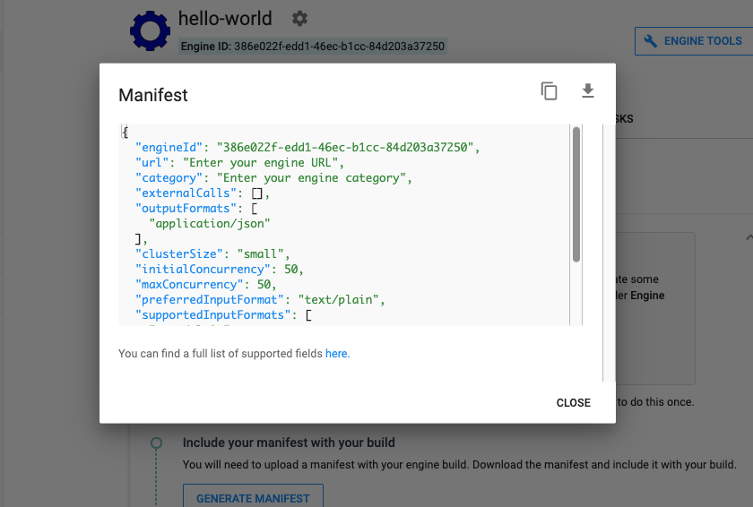

<!-- markdownlint-disable -->

<h2 style="display: inline;">Step 1: Register your engine with Veritone &nbsp;</h2>&nbsp;&nbsp;<aside class="small">
<b>ESTIMATED TIME:</b> 10 minutes </aside> &nbsp;

Assuming you've already accomplished the prerequisites outlined in [Before You Begin](developer/engines/tutorial/?id=before-you-begin), your first step in creating an engine should be to register it with Veritone.

> In this step, you'll obtain a Veritone-assigned Engine ID, and generate your manifest.json file using an online UI.

1\. Go to [https://developer.veritone.com/](https://developer.veritone.com/) and sign in.

2\. Click on the blue **NEW** button (upper left) and select **ENGINE** from the dropdown list. The first page of the New Engine wizard opens. (This is the Functionality page.)

3\. Determine the Engine Class that applies to your engine; click into the associated widget (to expose more choices); and select the capability that applies to your engine.
In our case, the Hello World engine is a **Text** engine with **Keyword Extraction** capability.

4\. Scroll down the page, to **Engine Mode**. Click on the *Segment* tile.

5\. Scroll down to **Supported Input Types**. Click the Supported Formats flyout control, and check each checkbox for each MIME type that applies. Since the Hello World engine supports text input, we've selected `text/html`, `text/plain`, and `text/plain;charset=utf-8`.

6\. If your engine requires custom input options at runtime (for example, if your engine needs to know a 2-letter ISO 639-1 language code on a per-job basis; or any other custom config options), use the **ADD CUSTOM FIELD** button under **Custom Fields** to set this up. (Read more about [Custom Fields](developer/engines/custom-fields/).)

7\. Click the **NEXT** button (lower right corner of page) to proceed to the next page of the wizard. (This is the Deployment Model page.)

Since the Hello World engine does not need to interact with any external web endpoints, it's okay to select **Network Isolated**.

8\. Click **NEXT** to go to the next page of the wizard. (This is the third and final wizard page, called Customize.)

9\. Give your engine a Name, add a Description, specify an icon, and provide other information about the engine.

10\. Click the **REVIEW** button (lower right) to bring up an **Engine Summary** dialog in which you can check the accuracy of the selections you've made in the wizard thus far.

> Use the **BACK** button as necessary to go back through your earlier selections and edit them.

11\. Click the **CREATE ENGINE PROFILE** button to exit out of the wizard and be taken to a **Builds** overview page (which has two tabs: **BUILDS** and **TASKS**).
_Note that your engine's ID is shown near the top of the page, under the engine name._

> You can return to this page any time. Either bookmark the page, or simply click the ENGINES heading in the nav sidebar at [https://developer.veritone.com](https://developer.veritone.com), then pick the engine of interest from your list of engines.

### Create Your manifest.json File

Now that you've registered your project with Veritone Developer, you can generate a `manifest.json` file.

1\. Go to the **Builds** page. (Click ENGINES in the nav sidebar and choose your engine from the list of engines.) See the last screen shot.

2\. Find the **GENERATE MANIFEST** button and click it. A **Manifest** dialog appears, containing the text of your `manifest.json` file.

3\. Download the `manifest.json` file into your project directory (or use the copy-to-clipboard button and paste it into a file called `manifest.json` in your project).

4\. Edit the manifest as necessary to amend any fields that might not be accurate or complete. (For more information: Read about [Engine Manifests](developer/engines/standards/engine-manifest/?id=engine-manifest).)

## Recap and Cheat Sheet

In this lesson, we learned how to: 
* Obtain an **Engine ID** as a byproduct of registering an engine project with Veritone.
* Specify the **Class** and **Capability** of your engine using the engine onboarding wizard at [https://developer.veritone.com/](https://developer.veritone.com/).
* Specify your engine's _processing mode_ (Chunk vs. Stream).
* Specify the engine's supported input-data MIME types.
* Select a _deployment model_ (e.g. Network Isolated vs. External Access).
* Specify the engine's Name, and other metadata.
* Use the UI at [https://developer.veritone.com/](https://developer.veritone.com/) to generate a `manifest.json` file for your engine.

**NEXT**: [Use Docker to create an engine build ⇨](developer/engines/tutorial/engine-tutorial-step-2)
