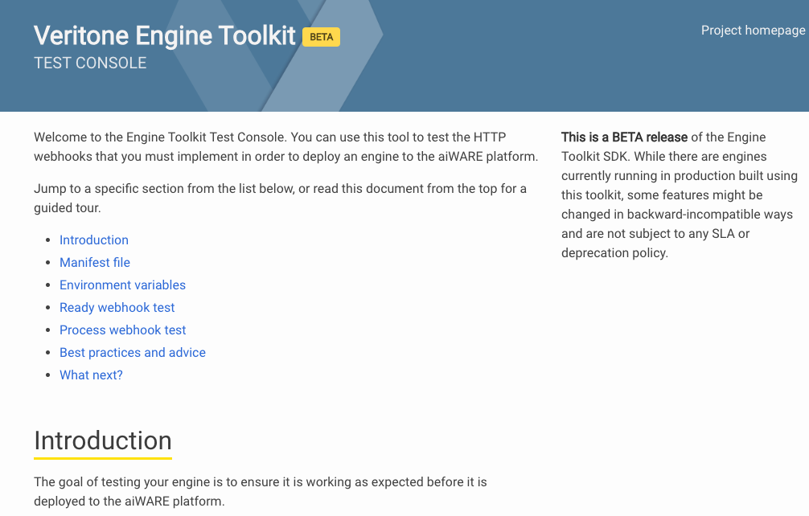
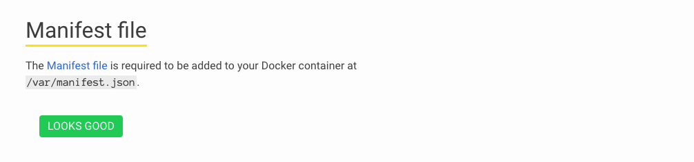
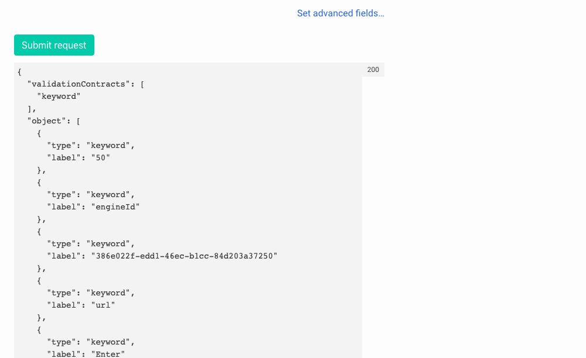

<!-- markdownlint-disable -->

<style>
aside  {
  border-style: solid;
  border-radius: 9px;
  border-width: 2.2px;
  border-color:#ccc;
  padding: 5px;
  background: #e6e8ef;
}

aside.small {
  display:inline;
  font-size:9pt;
  position:relative; top:-4px;
}

.topruled {
  border-top-width: 1.2px;
  border-top-style: solid;
  border-top-color: rgb(76, 76, 100);
  line-height:45%;
}
.bottomruled {
  border-bottom-width: 1.2px;
  border-bottom-style: solid;
  border-bottom-color: rgb(76, 76, 100);
  line-height:45%;
}
</style>
<h2 style="display: inline;">Step 3: Test your engine locally &nbsp;</h2>&nbsp;&nbsp;<aside class="small">
<b>ESTIMATED TIME:</b> 15 minutes </aside> &nbsp;

Veritone's Engine Developer's Toolkit has been designed in such a way that your engine can be run locally, using Docker. This is called running the engine in **test mode**.

## How to Run Your Engine in Test Mode

All you need to do is open a terminal and run the following command:

```bash
docker run -e "VERITONE_TESTMODE=true"  -p 9090:9090 -p 8080:8080 --name hello-world --rm -it hello-world
```

This fires up your `hello-world` container in _test mode_, exposing ports 9090 and 8080. (Port 8080 is the port for your engine's webhooks, whereas 9090 is the port on which the `engine` driver runs its own Test Console web app.)

> By including `--rm` in the [run](https://docs.docker.com/engine/reference/commandline/run/) command, we are telling Docker to remove the container when it exits.
If you don't do this, Docker will balk the next time you issue the same `run` command, saying that the container is already running.
(In which case, you may need to run `docker ps`, note the instance ID of the container, and use `docker stop` to stop the container manually.)

The `-it` options tell Docker to make the session _interactive_ (`-i` &mdash; keep STDIN open), in the time-honored TTY manner (`-t`).
 
After you've executed the above CLI command, check the console to be sure the commasnd executed without errors. (If your engine code contains bugs, it's possible the container will fail to start.)

## Use the Test Console App

If your engine launched normally, you should see a console message something like this:

```pre
Veritone Engine Toolkit (4768c5a)
2019/09/27 14:52:31 engine: running
2019/09/27 14:52:31 WARNING: Test mode (remove VERITONE_TESTMODE before putting into production)
2019/09/27 14:52:31 skipping kafka setup
2019/09/27 14:52:31 running subprocess for testing...
2019/09/27 14:52:31 running test console...

	The Engine Toolkit Test Console is now running.

	Go to: http://localhost:9090/
```

Open a web browser and go to http://localhost:9090/. You should see the **Veritone Engine Toolkit Test Console** page:



Scroll down the page, to "Manifest file." You should see a green **LOOKS GOOD** badge:



> If the badge is red and contains a failure notice, use Control-C to exit the Test Console (and shut down your container), then edit your `manifest.json` file as needed, re-build your engine, and re-run it in test mode. 

If you continue scrolling down the page, you should see green badges for **Environment variables** as well as **Ready webhook test**. The green badges mean your engine is properly configured. 

> If you see red badges, take note of the error message(s), stop the Test Console app with Control-C, make any needed changes to your engine, rebuild it, and re-launch the engine is test mode.

## Test the /process Webhook

If you scroll down to the Test Console's **Process webhook test** subheading,
you will see some HTML form elements that allow you to configure a `multipast/form-data` POST with which to hit your engine's `/process` webhook.


In this case, you can see we used the **Chunk file** File-picker to specify a test file to use for input. (In this case, we decided to use our project's `manifest.json` file. But we could have chosen any convenient text file.)

Notice that we manually entered a MIME type of `text/plain`.

The various other form fields (`startOffsetMS`, `width`, `height`, etc.) are meaningless in the context of text input, so it doesn't matter what the values are. Our engine code ignores these fields.

We can use the green **Submit request** button to cause the `engine` driver to hit our `/process` webhook with the test-mode data chunk we've configured. The result is shown in the page, just under the Submit button:



The output from our engine code shows that we did, in fact, extract "vocabulary words" from our sample text file (`manifest.json`), and we captured those words in the appropriate `vtn-standard` output format for a Keyword Extraction engine.

> If you see a server error (500) message in the data-output area, or any other error message, it means you need to check your engine code for bugs.
Check the terminal console for any additional messages. (You can insert logging traces in your code to make messages show up here in test mode. In Node.js, that's done with `console.log()` or `console.error()`.)

## To Exit the Test Console

To stop your engine and exit the Test Console web app, enter Control-C in the terminal session

## Recap and Cheat Sheet

In this lesson, we learned how to: 
* Run an engine build locally, using `docker run`.
* Enable Test Mode by using an environment variable in the `docker run` command.
* Expose ports on the running container using `-p`.
* Keep STDIN open (and emulate TTY) with `-it` in the `run` command.
* Tell Docker to remove the container instance on exit (via `--rm`).
* Launch the Veritone Test Console app on `localhost:9090`.
* Use the Test Console app to validate the `manifest.json` file.
* Use the Test Console to hit our engine's `/ready` webhook.
* Use the Test Console to prepare a data "chunk" and hit the `/process` webhook.
* Check the output of our engine (using Test Console's onscreen logger).

If your engine can process a known-valid data chunk in test mode (and output proper data to the Test Console web page), without errors, congratulations: You're ready to try deploying the engine to Veritone's aiWARE platform.

**NEXT**: [Push your engine build to Veritone ⇨](developer/engines/tutorial/engine-tutorial-step-4) 
