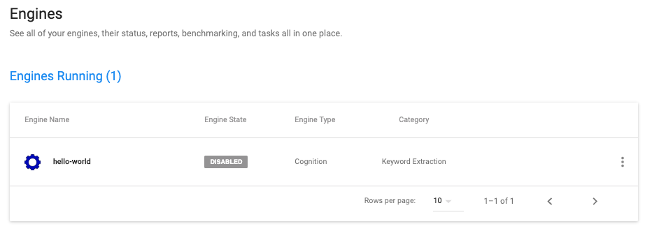
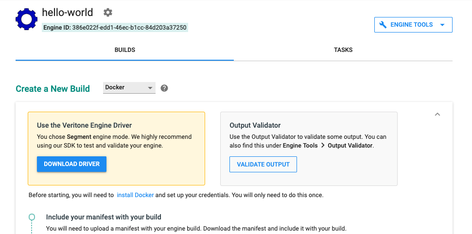
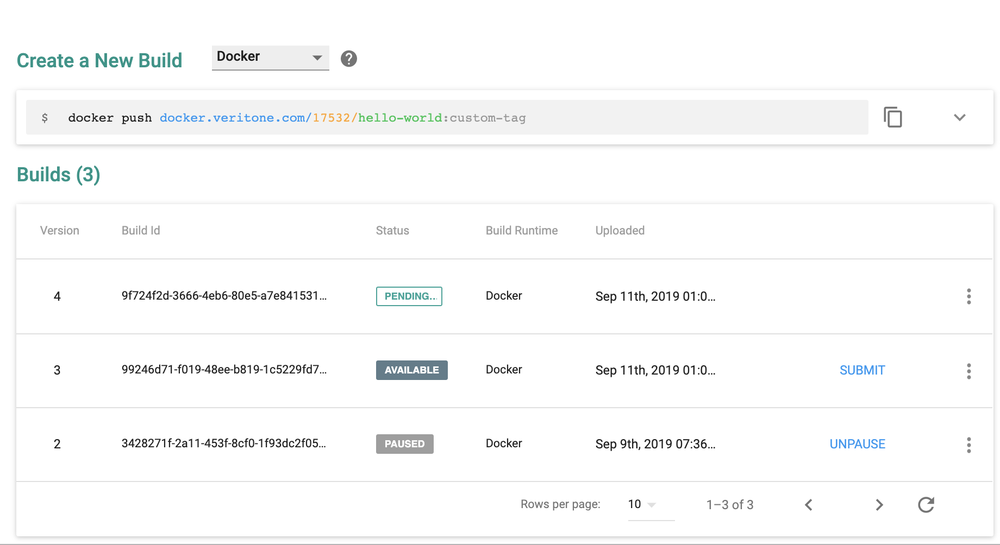
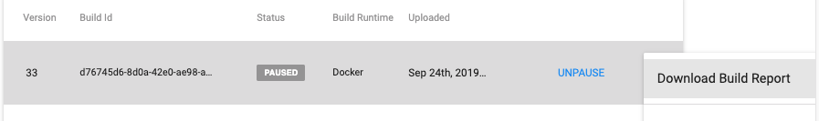
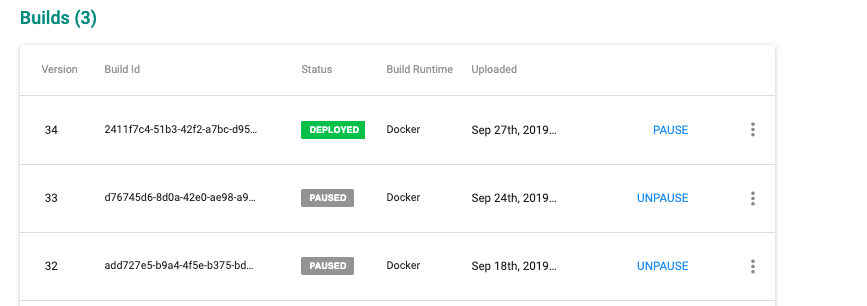

<!-- markdownlint-disable -->

<style>
aside  {
  border-style: solid;
  border-radius: 9px;
  border-width: 2.2px;
  border-color:#ccc;
  padding: 5px;
  background: #e6e8ef;
}

aside.small {
  display:inline;
  font-size:9pt;
  position:relative; top:-4px;
}

.topruled {
  border-top-width: 1.2px;
  border-top-style: solid;
  border-top-color: rgb(76, 76, 100);
  line-height:45%;
}
.bottomruled {
  border-bottom-width: 1.2px;
  border-bottom-style: solid;
  border-bottom-color: rgb(76, 76, 100);
  line-height:45%;
}
</style>

<h2 style="display: inline;">Step 4: Push your engine build to Veritone &nbsp;</h2>&nbsp;&nbsp;<aside class="small">
<b>ESTIMATED TIME:</b> 10 minutes </aside> &nbsp;

In [Step 1](developer/engines/tutorial/engine-tutorial-step-1), you learned how to register your project with [Veritone](https://developer.veritone.com/) via a simple setup wizard. Having done that, and having built and tested (locally) your engine, you can now go back to the Veritone Developer site and onboard your engine.

All you need to do is:

1\. Log in to [Veritone](https://developer.veritone.com/).

2\. Click the **ENGINES** link in the lefthand nav sidebar. This should cause the main content area of the page to refresh and show your Hello World engine (along with any other engines you've onboarded):



3\. Click on your engine's name to reveal the Builds page. If you've never uploaded any builds, the page will show **Create a New Build** near the top, with instructions shown underneath that heading:



If you **have** uploaded builds before, you will see a list of them, along with status information for each one, similar to this:


> Note that the **Create a New Build** detailed UI (with associated instruction list) can be toggled into or out of view with the &or; or &and; control at the right edge of the content widget.
 
4\. The **Create a New Build** checklist starts with "Include your manifest with your build" &mdash; but note, _we already did this._ 
We built the manifest into the engine image in [the last lesson](developer/engines/tutorial/engine-tutorial-step-3).
Therefore we can safely skip down to the checklist item that says "Log into the Veritone Docker server." Do this now, by executing the following command in a terminal console:

```bash
docker login docker.veritone.com
```

Use your Veritone credentials for this.

5\. **Tag** your engine:

```bash
docker tag hello-world docker.veritone.com/17532/hello-world:custom-tag
```

> Use your org number (instead of 17532) and your own arbitrary tag (rather than 'custom-tag') in this command, but remember to push your engine &mdash; in the next step &mdash; using _the same tag._

6\. **Push** your build (again in a terminal session):

```bash
docker push docker.veritone.com/17532/hello-world:custom-tag
```

Again, use your organization number (rather than 17532) and use the same tag that you used in step 5.

7\. Check the **Builds** listing in the Veritone Developer UI. You should see a new build (the one you just pushed) appear in the list, with a status of AVAILABLE.

The possible status values for a build are:

```pre
approved
available
deleted
deploying
deployed
deployFailed
disapproved
fetching
invalid
paused
pending
uploaded
```

8\. If an abnormal status is showing, use the menu control at the right edge of the list item to expose (and select) the **Download Build Report** command. (The Build Report is a JSON file that will contain clues as to what's wrong with the build.)



9\. If the build upload succeeded, click on the blue **SUBMIT** link in the list item, on the right. The build's status changes to **PENDING**. (Veritone will review the build to determine that it meets security and other requirements for onboarding.)

10\. Check the build's status from time to time. It should eventually change to **APPROVED**, at which point you should click on the blue **DEPLOY** command in the UI, to deploy the engine. This makes your engine available to use in API (GraphQL) commands.



### Pausing Engine Builds

As you can see from the prior screen shots, it's possible to have numerous _builds_ of a given engine (with a given Engine ID) in the system. But only one build can be active (with a status of DEPLOYED) at any given time.

As you debug your engine and push revised builds to Veritone's repo, you may want to deactivate old builds, or even delete them. Some things to note:

* You can push a new build while an older one is still active (deployed). A push doesn't overwrite anything.
* You can PAUSE a build to deactivate it (without deleting it).
* Later on, after your engine is in widespread daily use, you should use caution in pausing an active build of a popular engine, since pausing a build could be disruptive to users of your engine.
* You can _delete_ a build by using the Delete command in the flyout (or "kabob") menu. Build numbering, however, continues from where it left off.
* If you see two new builds show up in the Builds list after doing a single push, it means you are probably pushing a bare (untagged) build without first doing a `docker tag`. Best practice is to always precede a `push` with a `tag`, unless you know for sure what you're doing.

## Recap and Cheat Sheet

In this lesson, we learned how to: 
* Use the Veritone Developer online UI to see a list of your engines, and (for any given engine) a list of _builds_.
* Use `docker login docker.veritone.com` to log into the Veritone repo (using your Veritone credentials).
* Use `docker tag` to specify the custom tag your engine should have in the Veritone system.
* Use `docker push` to push the tagged build.
* Determine the status of a pushed build.
* Obtain the Build Report  for a pushed build.
* Submit a pushed build for approval using the online UI of Veritone Developer.
* Promote an Approved build to Deployed.
* Pause and Delete builds.

**NEXT**: [Test your engine in aiWARE ⇨](developer/engines/tutorial/engine-tutorial-step-5) 