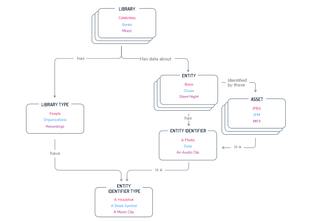

# Working with Libraries

Veritone's Library Application enables collections of digital assets to be created for custom engine training.
After successful training, each engine can then process media and identify specific "entities" that it was trained to identify.
Libraries can be private to an organization and shared between organizations if needed.

## Purpose

A Library's purpose is to provide a structured technical architecture and user-friendly UI to manage digital assets for the training of engines.

## Technical Architecture

**Library**\- A named collection of entities an organization is interested in identifying in media, e.g. American Politicians. A Library's type defines what type of entities it can hold.

**Entity**\- An Entity represents an aggregation of assets (Entity Identifiers) for a defined concept, such as a person, a company or organization, an advertising campaign, a type of object, etc.

**Entity Identifier**\- Assets associated with an entity. e.g. headshots for Face Recognition, voice clips for Speaker Recognition, ad creative for Audio Fingerprinting, DLM for transcription, aliases for transcription

**Entity Identifier Type**\- The type of asset associated with an Entity. e.g. headshot, logo, voice clip, ad, DLM. The Library Type defines what Identifier Types it can support.

**Library Type**\- Describes the type of entities the library contains. Used to tailor the UI experience for specific types of entities (for example, People, Ads, etc).

**Library Version**\- A numerically-indexed revision of a library, containing one or more changes to it's entities or assets.

**Shared Library** \- A library that is shared from one owner organization to one or more collaborators or organizations.

**Training**\- The required step an engine takes to convert the user's library into a format the engine understands.

**Training Model**\- Data generated during an engine's training step. The model is (in some cases) provided to an engine when the engine is run. A model can optionally contain an asset representing the model data.

**Cross-File** **Identification**\- The idea that a Library-trained Engine will identify the same entity in a library when run on multiple media files containing that entity.

**Cross-Engine** **Identification**\- The idea that the same entity can be identified by different engines trained using the same library.

## Object Relationship Diagram

