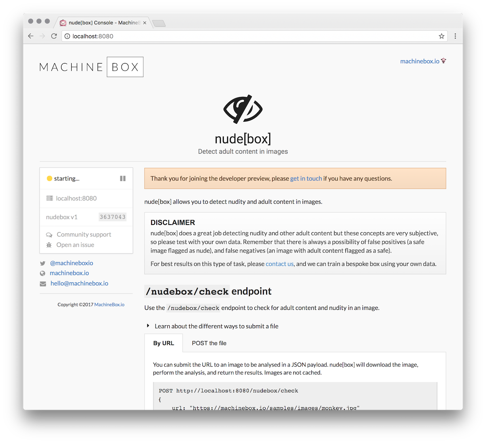

# Nudebox

Nudebox allows you to detect nudity and adult content in images.

* BLOG: [nevernude: Automatically cut out NSFW nudity from videos](https://blog.machinebox.io/automatically-cut-out-nudity-from-videos-using-machine-box-ffmpeg-daa8578de8b5)

## Uses for Nudebox

This capability has a variety of utilities:

* Check to make sure images are safe for your audience before publishing them
* Identify questionable content from a library of images
* Reduce moderation efforts by getting a head start

## Interactive console

When you run Nudebox, you'll have access to an interactive administration console that includes
everything you need to get going; API documentation, working code examples, interactive components, and more.

