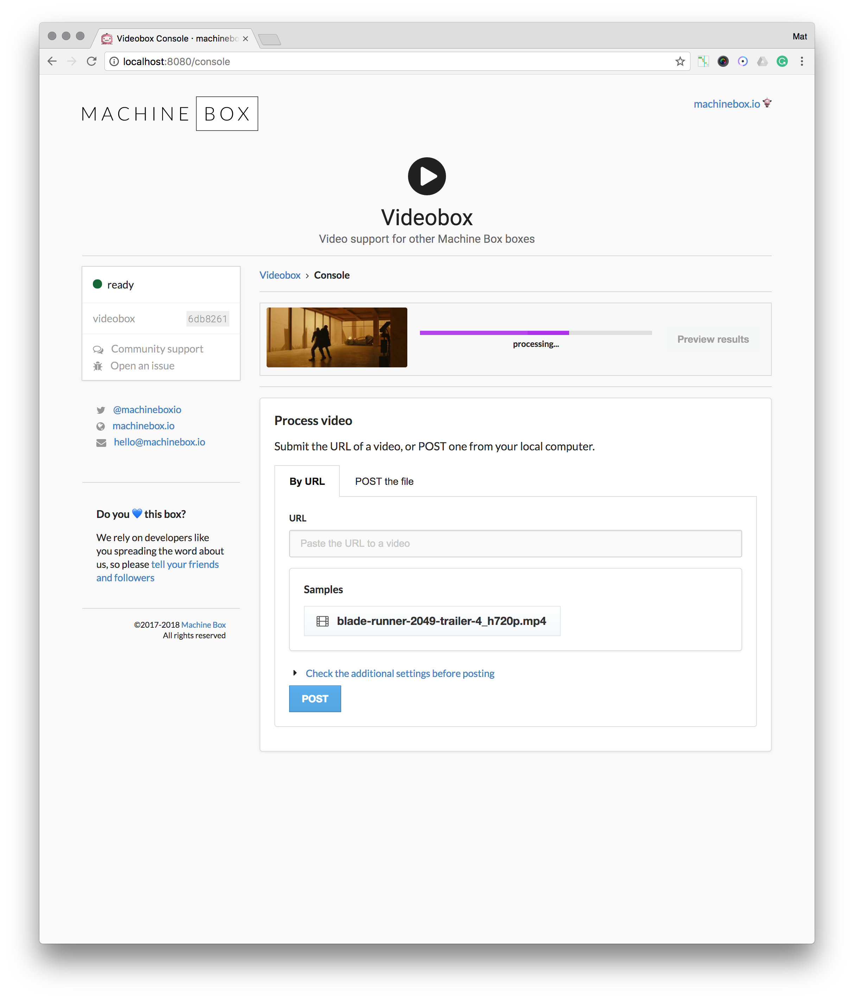

# Videobox tutorial: Processing videos

This guide shows you how to get Videobox running on your development machine. You will be able to process videos with Facebox, Tagbox and Nudebox.

## Run multiple boxes

In this section we will use Docker Compose to run four boxes, Tagbox, Facebox, Nudebox and Videobox.
We will use environment variables to tell Videobox about the other boxes.

Create a directory called `videoboxdev` and add a file inside called `docker-compose.yml` with the following configuration:

```yaml
version: '3'
services:
  facebox1:
    image: machinebox/facebox
    environment:
      - MB_KEY=${MB_KEY}
    ports:
      - "8081:8080"
  tagbox1:
    image: machinebox/tagbox
    environment:
      - MB_KEY=${MB_KEY}
    ports:
      - "8082:8080"
  nudebox1:
    image: machinebox/nudebox
    environment:
      - MB_KEY=${MB_KEY}
    ports:
      - "8083:8080"
  videobox:
    image: machinebox/videobox
    environment:
      - MB_KEY=${MB_KEY}
      - MB_VIDEOBOX_FACEBOX_ADDR=http://facebox1:8080
      - MB_VIDEOBOX_TAGBOX_ADDR=http://tagbox1:8080
      - MB_VIDEOBOX_NUDEBOX_ADDR=http://nudebox1:8080
    ports:
      - "8080:8080"
```

This file describes four boxes, settings the `MB_KEY` for each, and setting the appropriate Videobox ennvironment variables.

In a terminal, navigate to the `videoboxdev` directory and ask Docker Compose to spin up the environment:

```bash
cd videoboxdev
docker-compose up
```

Once the environment is running, you will be able to access the following services in your browser:

* `http://localhost:8080` - Videobox
* `http://localhost:8001` - Facebox
* `http://localhost:8002` - Tagbox
* `http://localhost:8003` - Nudebox

## Open the console

Head over to [http://localhost:8080/](http://localhost:8080/) to access the Videobox interactive console.

Here you can browse the API documentation and learn about how to manage long running processes programatically.


## Process a video

Click on the *Console* button to access the Videobox console. In the *Process video* section, select one of the samples and click the *POST* button.

The video will be downloaded and processed, and you'll see a bar indicating progress:



You can also submit a video by URL using the form, or an API call:

```json
POST /videobox/check
{
  "url": "url-of-video-goes-here"
}
```

The API will return a payload that contains a video ID that you can use to check its status and get the results.

* See the API documentation inside the Videobox interactive console for a complete overview of the available APIs

### Additional settings

Videobox lets you customize its behaviour by providing additional settings when you kick off a video processing operation. You can click the *Check the additional settings before posting* link to control the settings. In production, you would just pass these fields in with the request.

## Checking status

Videobox takes some time to complete its tasks, so you must periodically check the video to see if it is finsihed.

The console uses the `/videobox/status/{id}` endpoint to get status updates, and `/videobox/results/{id}` to get the results once the `status` is `"complete"`.

## Preview results

Once the video has finished processing, click the *Preview results* button next to the video to jump to the results page.

This page contains an overview of the information the other boxes were able to find, as well as the raw JSON output which is available to you via the API.


## Conclusion

With these simple steps, you can now use the Machine Box capabilities with your videos as well as images.
