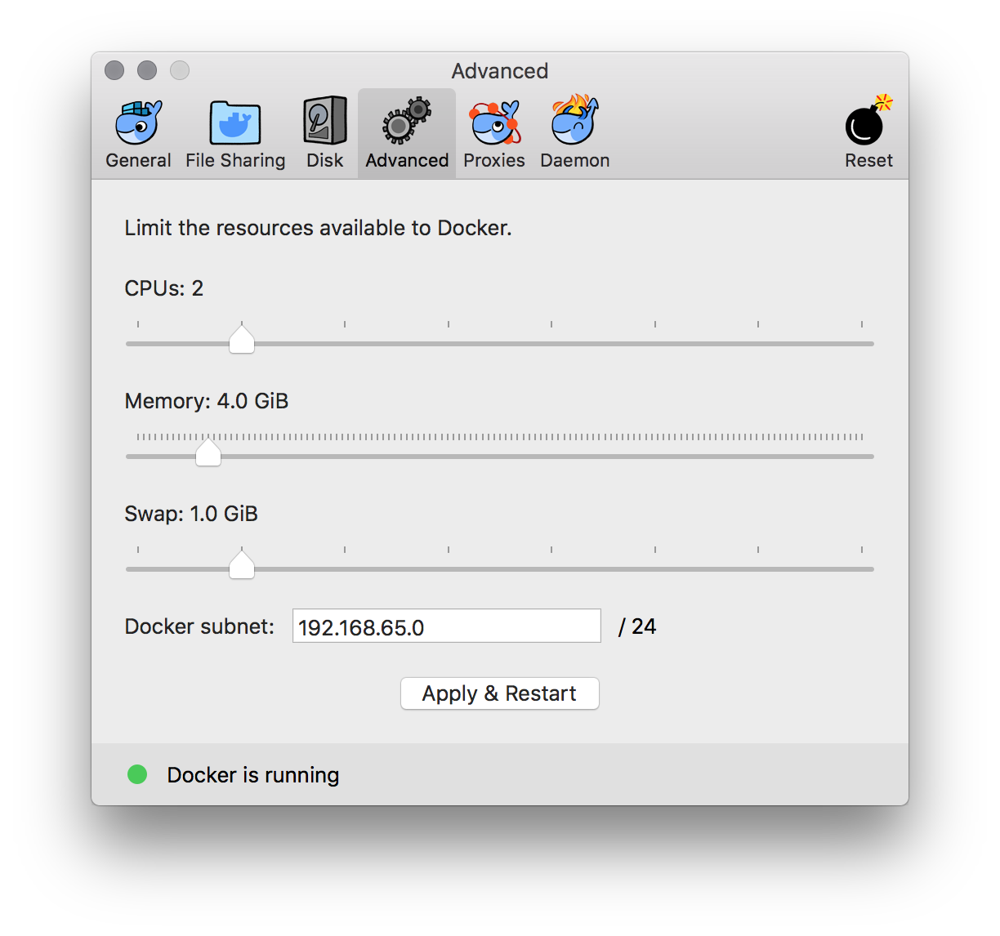

# Docker


## What is Docker?

You can think of Docker as a lightweight virtual machine, which has its own file system, processes
and storage--just like a normal computer. But since they're lightweight, they can be deployed anywhere
and every cloud hosting company supports them.

You don't need to know anything about Docker to use Machine Box, but you will need to install it
before you can spin up boxes on your local development machine. Below, we provide links to get you
going.

* You can learn more about Docker by visiting the [Docker homepage](https://machinebox.io/out/docker/homepage).

## Installing Docker

To install Docker, head over to the Docker website to [download Docker Community Edition](https://machinebox.io/out/docker/install)
for your computer.

Or pick from this list of popular operating systems:

* [macOS](https://machinebox.io/out/docker/download/mac)
* [Windows](https://machinebox.io/out/docker/download/windows)

## Minimum requirements

Some of our boxes are CPU or RAM hungry, so we recommend you run the Docker daemon with the following preferences:

* 2 CPUs
* At least 4GB RAM



* If you're using Docker Compose, you can [specify these settings in the docker-compose.yml](https://docs.docker.com/compose/compose-file/#resources) file.

## Once installed, how do I update the container?

You only need to do docker pull, to keep your container up to day, for example to update Facebox run:

```bash
docker pull machinebox/facebox
```

If you want to have the lastest features and bugfixes, do it often. We may consider tagging the container if we break the API backwards compatibility.

## Learn more about Docker

If you want to learn more about Docker, there's a pretty good tutorial on the Docker
website which contains more than enough information:

* Head over to [the Docker website to learn more](https://machinebox.io/out/docker/learn)

Remember that you don't need to know much about Docker to use our boxes, as the [tutorials](docs/tagbox/recognizing-images) make clear.

## Where can you deploy Docker containers?

Once you've got some Machine Learning magic working, you can actually deploy Docker
anywhere:

* On your local servers (this is nice if you don't want your data leaving your network)
* In [Google Cloud Platform](https://machinebox.io/out/docker/deploy/google)
* In [Digital Ocean](https://machinebox.io/out/docker/deploy/digitalocean)
* In [Microsoft Azure](https://machinebox.io/out/docker/deploy/azure)
* And basically everywhere

The best part is that our pricing ignores the number of instances you run, so you're free to
scale as much as you need. Go forth, and build awesome things.

## Legal stuff

Veritone, Inc. is in no way affiliated with Docker, we are merely using their tech to deliver
ours to you. And you can use it to deploy the boxes anywhere. If you have any questions, please [get in touch](/contact) and we'll be glad to help.
