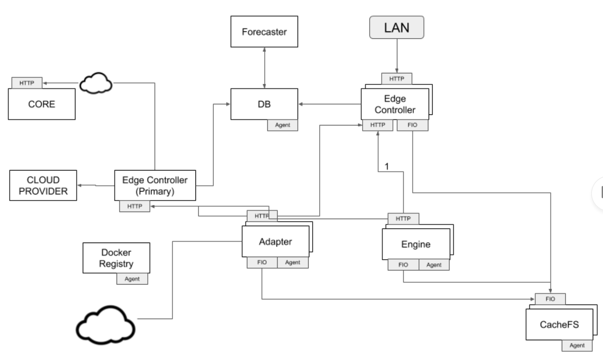
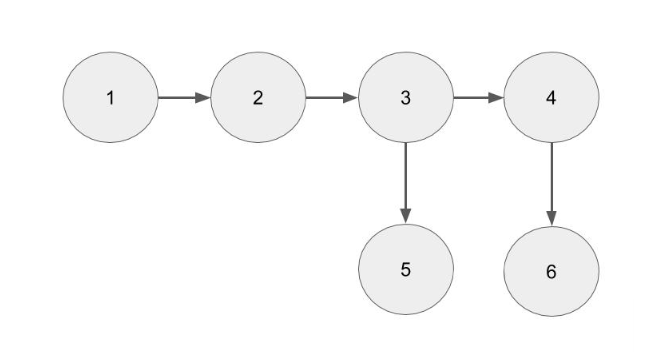
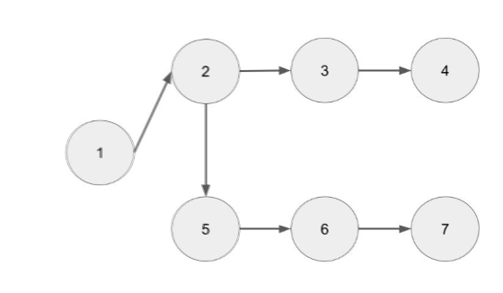
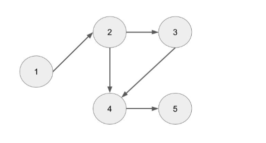
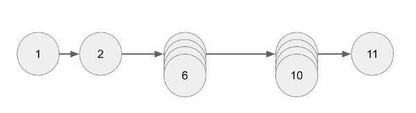
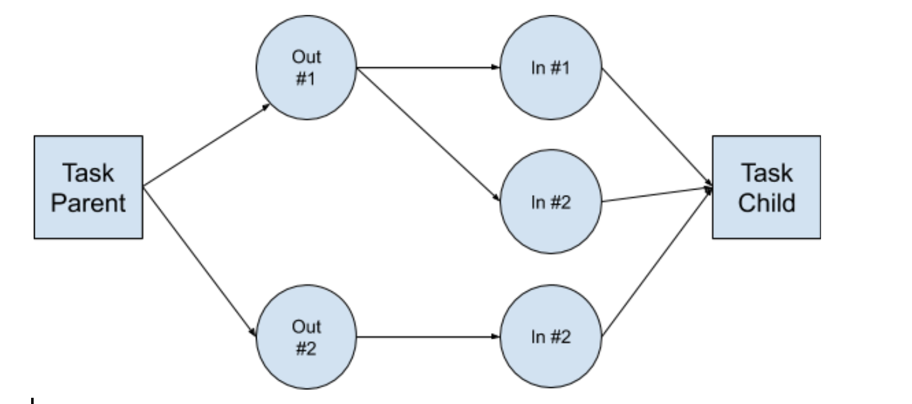

<!-- markdownlint-disable -->

# aiWARE Cognitive Execution Framework (Edge)

Veritone's aiWARE Cognitive Execution Framework (also known as Edge) is the cognitive processing subsystem of aiWARE.
Its primary purpose is to ingest data (structured or unstructured streams and files) and cognitively analyze ingested data sets in a predictable manner that meets the host applications' SLA and business objectives.
Edges may be deployed as standalone subsystems in supported public clouds, integrated into 3rd party on-premise software, or deployed on-premise at customer locations.   Edge may also connect to an aiWARE Core subsystem/s, which provide augmented functionality and hosted applications.   

Edge is designed to be a stateless cognitive processing unit, not a long term repository for information.   In the larger aiWARE architecture this function is handled by Core.   Edge does provide short term persistence of all data and an API to access it.  This short term memory duration is configurable (but limited) and dependent on the resources allocated to an Edge installation.

Throughout this discussion, references to Edge and New Edge are equivalent and refer to the new architecture currently being built and deployed on a rolling basis (partially converting Old Edge to New Edge with each release).  Old Edge and Current Edge are also equivalent and represent the Edge that is being replaced. 

## Framework Components



### Edge Agent
An Edge is deployed by installing and running a single executable, Edge Agent (EA).  EA is responsible for the installation and management of all Edge Subsystems described throughout this document.   EA provides environment and installation parameters to the subsystem being launched.  In an Edge deployment EA is the only native process that is run directly on the host operating system.  All other subsystems are launched by EA as docker containers.

#### Database

This is the single source of truth for edge. All environment, subsystems, stats, data and process control values are stored in the database.   

#### Controller

This is the central service API that registers hosts, engine instances, manages all work and communicates to the DB layer.
 
Controllers are deployed in a stateless manner, typically behind a load balancer, to achieve API and business logic scalability of an Edge.    Within this cluster, a single Primary Controller is promoted from within the group to serve as the Edge supervisor, responsible for a host of critical functions: [AL NEED YOU INPUT HERE] 

#### Engines

All work performed by Edge is done through an open set of docker processes that ideally execute discrete transformations from a set of input to a set of outputs, for example transcoding, facial identification, etc…  We call these processes, Engines.
 
Engines are responsible for ingestion (such engines are often called _adapters_), cognition, or arbitrary workflows.
 
In a cloud configuration, Edge Agent or Master Controller is responsible for setting up autoscale groups for Engines, based on either CPU or GPU. The settings for this group are setup using the Edge Admin HTML interface or a config file that then populates the DB.
 
#### File System

The file system (FIO) is used by Engines either as a scratch space for transitory storage during execution and also as the sole input and output mechanism. For each discrete engine process, all of the information contained in the database (plus additional debug data) will be persisted in the file system. It will contain enough information to rebuild the database for reprocessing or restarting the tasks and jobs.
 
The file system is NFS 4 and is mounted through a docker NFS deployment.

#### Docker Registry

Every subsystem (other than Edge Agent) is run as a Docker container. Every engine is also a Docker process. These Docker images are stored within the Edge installation. The process of populating the framework's Docker registry and ensuring it is up to date per the Edge configuration is the job of XXX.

#### Forecaster

Forecaster is a process used to analyze and predict the capacity of the Framework and to dynamically forecast the best set of Engines to have running on each Engine Server at any point in time.  Forecaster will use a containerized forecasting AI engine, similar to AWS Forecaster service.  The goal of the model is to control the autoscale of servers and the distribution of engine types to meet the SLA for all jobs at the lowest cost and the lowest failure rate.
 
#### HTML Admin Dashboard
Controller publishes an administrative API that is fronted by an Admin Dashboard HTML interface. This HTML application is deployed on the Controller Server as a separate container HTML application running on port 8080.

### Examples of Common aiWARE Edge Processing and Functionality

**Audio Transcription and Translation**

1. Ingest
2. Transcode
3. Transcribe
4. Translate
5. OutputWriter
6. OutputWriter



A common function of aiWARE applications is to ingest a stream of audio or video and to run a series of chained AI engines where the output of the prior engine becomes the input to the next.  Multiple engines can branch off the same output and processing runs in parallel.

1. The audio is ingested by an ingestion engine (often called an “adapter”). Adapter are different then engines because they pull data from external sources. In this step the stream or file is chunked into fixed byte size chunks and then routed to the next engine.

2. Transcoding is typically done through the “Stream Ingestor” engine.   It is a wrapper function for FFMPEG and it formats the audio for the transcription engine.  In this case, where the next engine is transcription the output files overlap, so there will be no breaks in the audio transcription and the transcription process can run in parallel.

<!-- 
Limitations in current Edge:
Can’t run Stream Ingestor in parallel
It is always called as a default part of the DAG after ingestion
The transcode instructions are hard coded option vs programmable via the calling application.  So application and SI are tethered.
-->

3. Transcription engines processes the chunk files (that overlap for some fixed offset to ensure that audio transcription doesn’t miss words broken by the file boundary)

?> Limitations: The overlap size output by SI (step 2) is hard coded. In some cases the transcription engine should run as a stream engine and the chunk boundary can be set to zero, since the processing of transcription will be done serially by one engine.

4. Translation engines process the transcription output and convert it from language A to B.

5. OutputWriter is a process that writes the output of the engine back to aiWARE Core.

6. OutputWriter writes the output of the engine back to aiWARE Core.

**Video Transcription and Face Identification**

DAG (Directed Acyclic Graph) for the job:

1. Ingest
2. Transcode
3. Transcribe
4. OutputWriter
5. FaceDetect
6. FaceId
7. OutputWriter



A common function of aiWARE applications is to ingest a stream of video and transcribe and detect faces to see who is speaking or being spoken about.

1. The video is ingested by an ingestion engine (often called an “adapter”).  Adapter are different then engines because they pull data from external sources.   In this step the stream or file is chunked into fixed byte size chunks and then routed to the next engine.

2. Transcoding is typically done through the “Stream Ingestor” engine.   It is a wrapper function for FFMPEG and it formats the audio for the transcription engine.  In this case, where the next engine is transcription the output files overlap, so there will be no breaks in the audio transcription and the transcription process can run in parallel.
Limitations in current current Edge:
Can’t run Stream Ingestor in parallel
It is always called as a default part of the DAG after ingestion
The transcode instructions are hard coded option vs programmable via the calling application.  So application / SI are tethered.

3. Transcription engines processes the chunk files (that overlap for some fixed offset to ensure that audio transcription doesn’t miss words broken by the file boundary)
Limitations:
The overlap size output by SI (step 2) is hard coded, in some cases the transcription engine should run as a stream engine and the chunk boundary can be set to zero, since the processing of transcription will be done serially by one engine.

4. OutputWriter is a process the writes the output of the engine back to aiWARE Core TED.
5. FaceDetect Engine detects faces.
6. FaceId matches face against a predefined facial database.
7. OutputWriter

**Closed Captioning Live Video / Real-Time**

1. Ingest
2. Transcode
3. Transcribe
4. ClosedCaption
5. OutputWriter



A common requirement in broadcasting is implementation of a real-time, reliable closed-captioning system. This is challenging because of the real-time nature and the multi-input requirements for the DAG.

1. Video is ingested by an ingestion engine (an _adapter_).

2. Transcoding is typically done through the “Stream Ingestor” engine.   It is a wrapper function for FFMPEG and it formats the audio for the transcription engine.  In this case, where the next engine is transcription the output files overlap, so there will be no breaks in the audio transcription and the transcription process can run in parallel.
Limitations in current current Edge:
Can’t run Stream Ingestor in parallel
It is always called as a default part of the DAG after ingestion
The transcode instructions are hard coded option vs programmable via the calling application.  So application / SI are tethered.

3. Transcription engines processes the chunk files (that overlap for some fixed offset to ensure that audio transcription doesn’t miss words broken by the file boundary)
Limitations:
The overlap size output by SI (step 2) is hard coded, in some cases the transcription engine should run as a stream engine and the chunk boundary can be set to zero, since the processing of transcription will be done serially by one engine.

4. Merge engine, combines the transcript back into the video feed for closed captioning.

5. OutputWriter is a process that writes the output of the engine back to aiWARE Core TED.

**Fast Face Redaction**

DAG (Directed Acyclic Graph) for the job:

1 Ingest

2 Transcode

7 Transcribe

11 OutputWrite



Challenge: The time to redact a file is proportional to the length of the media file being ingested.   

* The video is ingested by and ingestion engine (often called an “adapter”).

?> All transcoding, now represented by engines (2-6) in the diagram, are handled by a new engine: “Stream Ingester 2” or SI2  This engine can now be run as a typical engine and scheduled into the DAG,  It takes its processing commands as an input so it is no longer tightly coupled to an application.  In this specific use case, the engine chunks the incoming video feed into multiple fixed size MP4 files that overlap for N(secs) and start and end on keyframe boundaries.

* Engines 3-6 : The output files from 2 are then processed in parallel by the SI2 engine in parallel.   This stage converts the MP4 chunks into JPEG/MP4 format.

* Engines 7-10 : Face Detection is now run in parallel vs its current serial engine.   

* Engine 11 : OutputWriter is a process that writes the output of the engine back to aiWARE Core TED.


## Edge Implementation

### DB Table Definitions

The DB is a Postgres database and it is the source of ground truth for any aiWARE Edge installation.

> Please see https://github.com/veritone/project-edge/tree/master/sql for the database table definitions.

### Edge Configuration
The edge configuration is stored in the database. The following outlines the different configuration options.  The configuration sections are admin, controller, db, registry, nfs.

### Admin

Section | Key | Default Value | Description
-- | -- | -- | --
admin | controller_urls | [] | This is a list of all valid controller_urls.  Hosts that have controllers are automatically added to this

### Controller

Section | Key | Default Value | Description
-- | -- | -- | --
 | | | 
 
### DB

Section | Key | Default Value | Description
-- | -- | -- | --
db | host | NULL | The pg host to use for database
db | port | 5432 | The pg port to use for the database
db | username | NULL | The pg username to use for connecting to the database
db | password | NULL | The pg password to use for connecting to the database

### Registry

Section | Key | Default Value | Description
-- | -- | -- | --
registry | host | NULL | Host
registry | port | 9001 | Port for registry
registry | username | NULL | Username
registry | password | NULL | Password

### NFS
The first NFS server becomes the NFS root. Subsequent NFS servers are shards.

Section | Key | Default Value | Description
-- | -- | -- | --
nfs | root_path | NULL | 
nfs | shard<N>_path | NULL | 
nfs | mapping | .* 1 | Maps everything to shard 1

## Primary Controller (Edge Manager)
* Initial Startup
* Usage Reporting 
* Loading Engines
* Initial layout of services across 
* Checking all resources and availability
* Dumping DB backups to file system periodically
* Error notifications
* Also remove stopped hosts from EC2/Azure after a period

Host modes: Hosts can be more than one
* Database
* Registry
* NFS
* Engine
* Controller
* HTTP Interface 
* Controller Primary
* Pulls work, syncs with core (Stateful)
* HTTP Interface

Cluster config:
* Controller Primary: IP & Port
* Edge Manager Backup: IP & Port
* Database: IP, Port, Host, dbname, username & port
* Controller: Set of IP&Ports

NFS:
* Array
* IP & path & (data, or partition)
* Registry: IP&Port
* Terminate mode (detach or shutdown -h now yes)
* Min servers required per

## Agent 

An Edge is deployed by installing and running a single executable, Edge Manager.  Edge Manager is responsible for the installation and management of all Edge Subsystems described throughout this document.   Edge Manager has a config file that provides environment and installation parameters either as a remote HTTP payload or via an embedded config file.

It will do the following for joining:
* Connect to controller (and/or edge manager)
* Mount /cache file system
* Launch and terminate containers
* Provide status updates on host status

For creating the cluster, it will do the following:
* Wait for configuration on the webadmin interface or command line
* Optionally install postgres (DB) locally
* Optionally install controller as a service locally
* Optionally install 
* Optionally prep host to share /cache (or some other directory) as FS cache

Every X hours or on errors, the agent talks to Edge Manager for new or updated configuration.

Joining a cluster:
* ./agent --controller=http://controller:9000/ --token=abcdef (Change to --config=URI)

Creating a cluster:
* ./agent

## Primary Controller

## Controller Module

### Overview
   
The Controller’s principal function is to assign tasks to engines and adapters in an optimal manner to meet SLAs and minimize costs.  It is also responsible for communicating with external services via an HTTP API. 
   
To achieve this goal there are several core functions that a controller must manage:
*    Controlling the starting and stopping of engines
*    Provide data to Master Controller to properly scale engine hardware
*    Provide stats data to the DB and Forecaster, so it can properly forecast engine and hardware demand
*    Routing data from one task to the next
*    Control the assignment of engines to tasks
*    Manage failures and retries
*    Log data for analysis
*    Billing metrics
*    HTTP API
*    Admin
*    Edge API

## Controller Functions and Implementation Details
The controller is a cluster of stateless servers that has connections to the DB, to a number of filesystems which store engine / task output data and to engines and adapters via an http server.

### DB Data Overview 
    
#### Admin
Each edge has a set of admin parameters. This data is stored in the following tables:

Table Name | Description
-- | --
core_system | This is the set of available cores and their configuration.
config | This is a configuration table to for Edge.
server_types | A list of the server types containing the necessary information to launch and monitor them.
engine | A list of engines and associated meta-data.   
build | A list of builds for the engines and their status.
scheduled_process | A list of functions that should run on a given schedule.  These are contained as a docker container or host command.
scheduled_process_run | A list of scheduled process runs.

#### Engine Servers

Each Edge has either a fixed or scalable number of servers that it can launch and run processes on to do various tasks.  The types of servers, the number to launch at startup, the launch instructions and other data critical to managing the servers are stored in these tables:
     
Table Name | Description
-- | --
host | A list of servers launched for this edge with associated meta-date.
host_status | This is the status updates from each host

#### Processes

Each edge is configured to run a subset of processes:  engines, adapters, controllers.  This data is stored in the following tables:
     
Table Name | Description
-- | --
engine_instance |     A list of processes running and recently killed that are mapped to the servers they run on.
engine_instance_status |     A list of all processes in the last configurable period (e.g., 24)  that have been launched and stopped.
     
#### Jobs and Tasks
Jobs and their corresponding tasks assigned to an Edge by one or multiple aiWARE Cores or via a local Edge HTTP API are stored here.  Job and task data assigned are stored in the following tables:

Table Name | Description
-- | --
job | This is a list of jobs (scheduled and adhoc) that are either running, waiting to run and recently finished.
task | This is a list of tasks (scheduled and adhoc) that are either running, waiting to run and recently finished. This also includes scheduled tasks referenced by scheduled jobs.
scheduled_job | This contains the job templates (graph definition) for jobs that are scheduled to run on some frequency

#### Task Processing, Engine Allocation and Performance 
The controller reads and writes from DB to maintain state of the jobs, tasks and engine processing them.   Engines are assigned work and report back via an HTTP heartbeat every 5 seconds and also when the assigned work is complete.  Data of this type is stored in the following tables:

Table Name | Description
-- | --
DAG Node | This is the task table above.
task_route | This contains all the edges between the nodes (tasks) along with associated Inputs & Outputs.  This will have a row for each edge.
task_io | This contains all the definitions of Inputs and Outputs.  This data will be duplicated to the TaskVertex table.
task_status | Every Engine Instance will output in its heartbeat the following data in aggregate form: Timestamp, Input ID, number of items processed. Timestamp, Output ID, number of items produced. The Controller will per heartbeat issue atomic sql updates to the vertices to keep the counts current.
engine_instance_status | The heartbeats per Engine Instance will also go here and provide detail. There will be a row for each engine instance, timestamp and input/output.

#### Controller HTTP API
Controller HTTP API is implemented using the fasthttp go library.  We are using a RESTful style for these HTTP-based APIs.

The APIs are defined at https://github.com/veritone/project-edge/tree/master/api/controller in Swagger definition.

General notes:
* GET must be idempotent.  E.g., it cannot change resources
* POST can either create, update resources or take action
* PUT same as POST for this
* DELETE will take action and typically be STOP or DELETE
* PATH will not be used currently.  If used, it will be used for updates to a resource.

#### Request Bodies
All Request Bodies will be JSON.

#### Authentication
Controller on registration of Engine Instance and Host/Node.  The Agent or Engine Instance will include that token in the Authorization Header using the Bearer scheme as documented at https://www.iana.org/assignments/http-authschemes/http-authschemes.xhtml.

### HTTP Response Codes
Errors will be returned as part of the HTTP specification.  The response body will be in JSON format with the following fields:
* ErrorId, String: The error ID
* ErrorDescription, String: Information describing the type of error
8 ErrorDetail: Any relevant information as part of the error such as IDs.
    
Please see https://en.wikipedia.org/wiki/List_of_HTTP_status_codes for more information on HTTP Status Codes.


HTTP Code | Headline | Description
-- | -- | --
201 Created | Node registered correctly.  Response in Body.
400 Bad Request | Request not in appropriate format or missing information.
401 Not Authorized | Currently the APIs are not authenticated.
408 Client Timeout | The client timed out in sending information.  The client can repeat the request.
409 Conflict | Engine Instance is already registered.  The Engine Instance should generate a new 
415 Unsupported Media Type | The request sent a non supported payload type such as XML instead of JSON.
429 Too Many Requests | The server has too many requests currently. The server will use the Header Retry-After with seconds to try again.  This will follow https://tools.ietf.org/html/rfc6585.
500 Internal Error | These will be tracked.  There should be no 500 errors.

### Engine Instance APIs

HTTP Method | API | Description
-- | -- | --
POST | /engine/register | When an Engine Instance comes up, it will register with the controller and get the first batch of work
POST
/engine_instance/{EngineInstanceId}/getwork
The Engine Instance will use this to update controller on completed work and get additional work. Controller may also respond with terminate.
POST | /engine_instance/{EngineInstanceId}/updatestatus | The Engine Instance will use this to provide status updates (heartbeats) on an interval to controller.
POST | /engine_instance/{EngineInstanceId}/terminate | This will mark the engine instance for termination.
GET | /engine_instance/{EngineInstanceId}/detail | This provides information about the engine instance.
GET | /engine_instance/{EngineInstanceId}/workdetail | This provides information about the work assigned to the engine instance.

### Host APIs

HTTP Method | API | Description
-- | -- | --
POST | /host/register | The agent will use this to register a new host with controller.  The agent will send information about the host, the docker containers running and related statistics.
POST | /host/{HostId}/updatestatus | The agent will use this to update the controller with current information on the host including how much cpu, ram and gpus are available.  The controller will respond with here are the containers to launch and containers to terminate. The controller may also decide to tell the agent to terminate the host.
POST | /host{HostId}/terminate | This will direct the controller to mark the host for deletion.  This will be communicated to the host on the next update status request
GET | /host/{HostId}/detail | This provides information about the host
GET | /host/{HostId}/status | This provides information on the last status update for the host
POST | /host/{HostId}/drain | This updates the host into draining status.  No engines running on that host will be given new work.

## Controller Process Flow

### Startup Flow

Step 1:  When a controller launches it connects directly to the database via the PG GO library Lib/PG and establishes a connection pool to read and write from DB.  It stores this connection info in the database in DB Table config and logs it as well.

Step 2:  The controller creates an HTTP Server endpoint for engines and adapters to communicate with it.  The HTTP library used is FastHTTP.  

Step 3:  Startup engine servers (created at edge launch) are running a local aiWARE Agent.  This aiWARE Agent is written in Go and connects to a controller via HTTP connection and registers the server with controller and provides a status update on the engines running on this server (zero for now) and the resource capacity and current usage of them (memory, CPU, Disk).  This information is logged in DB Table: host_status.

Step 4: Controller is in startup mode still.  It checks the DB to see what engines it can run on this Edge and what the base configuration of engines should be.   It will know how many total startup edge servers will be available.   As each Engine Agent connects, Controller tells the agent via http to launch certain engines.  

Step 5:  Engine Agent launches engines.

Step 6:  As each Engine comes online, it makes http requests to Controller via a long lived http connection, waiting work.  It registers itself with controller, which in turn stores this information in the DB Table: [TABLE NAME]

Step 7: Once all the startup servers are launched, registered and startup engines are running, controller changes a field in the DB, telling the Edge cluster that it is ready to process jobs.

Step 8: Controller queries DB to get the highest priority task.  It pings the appropriate engine via http and asks if its ready for work.   If it receives a positive response, it assigns the work to the engine via an http response and logs this in the DB in Table: [TABLE NAME].  If it receives a negative response, controller moves on to the next available engine and takes the appropriate action depending on the type of negative response, for example:  no response, error, system busy, etc….

Step 9:  Controller repeats Step 8, until all tasks are assigned to engines. 

Step 10:  Every 5 seconds, engines report back status and progress on processing to controller via an http post.  This data is logged in DB Tables: [TABLE NAME].

Step 11:  When an engine completes its task, it reports back to controller the units of work completed, errors, retries, etc…  controller stores this information in the DB.  Engines then make a request for more work and are either given work or are left idle.   Go to Step 8 for work assigned.

### Routing
A route is a directed acylcic graph (DAG) that defines the path that data will flow from ingestion to final engine execution for every Job.   Each node on the graph is a task and represents an engine or adapter on edge.   Each vertex represents a route where the output of one engine become the input of another.   For the most part, each Job is associated with a static DAG, defined apriori to execution on Edge; however, the architecture and Edge API’s support dynamic DAGs (modified during runtime, while the data is being routed through the DAG).

### Routing Tables
Each route is defined by a json payload for serialization and communication between services. In the Edge DB, in addition to storing the json, there is a set of routing tables, that break the routes down into more granular parts for tracking and process management.   From an implementation perspective, each vertex in the DAG is represented by two file system folders, an output folder from the prior engine and an input folder for the next engine on the DAG.



#### Routing Tables

This table contains Task Parent and Task Child.

Task (Node) | Field
-- | --
TaskID | GUID for the engine node on a graph
JobID | Job ID
EngineTypeID | Type of engine
ParallelProcessing | Boolean : can have multiple engines for running in parallel for this node
RetryCount | Numeric: 0 - 100, number of retries
ParentCompleteBeforeStarting | Boolean: T if engine requires all input files in the directory before starting engine

In this table, route Parent->Out #1->In #1->Task Child is a row.  That diagram has two more additional rows that can be inserted into the table.

Task_Vertix (DAG Vertix) | Field Name
-- | --
VertexID | Unique ID
TaskParentId | TaskID
TaskChildID | TaskID
ParentOutputID | IO ID
ChildInputID | IO ID
TaskParentOutputFolder | Denormalized.  This is the folder in the ~job directory for the output
TaskParentOutputCount | This is the count produced to the output folder
TaskParentOutputFormat | This is a JSON object containing any format parameters required
TaskChildInputFolder | Denormalized.  This is the folder in the ~job directory for the output.
TaskChildInputCountTotal | This is the total inputs produced.
TaskChildInputCountRemaining | This is the total inputs remaining to be processed
FirstWriteTimestamp | This is the first timestamp an
LastWriteTimestamp | This is the last timestamp an output/input pair was produced


DAG IO | Field Name
-- | --
IO ID | Unique ID
IO_TYPE | Input or Output
Path | String, path from inside ~job folder to the input.  For example:&lt;taskId&gt;/input-&lt;IO_ID&gt;
Format | JSONB Object.  

### DAG Execution Tables
For an up to date definition of tables, please see the github repo: https://github.com/veritone/project-edge/tree/master/sql.

These are here to discuss the main points of the tables and how the execution functions.

task_route | Field Name
-- | --
VertexID | Vertex ID
FirstWriteTimestamp | Timestamp
LastWriteTimestamp | Timestamp
MaxUnits | The total units expected to be created on this Vertex 
ParentOutputUnitCount | The number of units created in the output IO.
ChildInputUnitCount | The number of units created in the child input IO - which should match the ParentOutput.
RetryCount| Number of retries on the vertex
FailureCount | The number of failures on this vertex

Every 5 seconds, every engine reports (via a timestamp) the following data:

task_status | Description
-- | --
EngineID, GUID | The ID of the task
JobID, GUID | The ID of the job
TaskID, GUID | The DAG node being processed
StartTimestamp, timestamp | Timestamp : the time of the last heartbeat, or when the task was first assigned (whichever is later)
DoneTimestamp, timestamp | Timestamp : the time when this heartbeat call was made
WorkRequestID,GUID| 
Inputs, JSON | The input IDs processed.  The number of units processed since the last heartbeat, by input_IO.
OutputCount, JSON | The number of units written to output, by output type
ErrorCount, int | Number of errors
RetryCount, int | Number of retries
FailCount, int | Number of fails
CPU, float | CPU % of container 
Memory, float | Memory % of container

During processing, the engine toolkit on a seperate thread within the process should sample CPU and Memory via a command such as PS (“ps -p [ARRAY of PID] -f -v”) every second, and then publish average values over the 5 second interval.   Note which ones is the engine toolkit.  Docker Container stats.   Add Swap to server.  

## Aligning Task Load with Engine Resources

### Adding Engine Capacity

Step 1:  Every 60 seconds, Engine Agent, checks in with Controller by calling the controller API: [API]

Payload format:

Example:


Step 2:  Controller writes data to DB.   

DB Tables and fields updated:


Step 3:  In response to these check ins, Controller can instruct Engine Agent to launch new engines based on a DB query to the Forecast Table that returns the engine deficiency count to meet current or forecasted SLAs.   The Forecast Table takes into consideration not only SLA but the priority of the SLA Tasks.   Controller should send to EA a request ID, that is subsequently  passed to the new Engine upon startup from EA.  

Payload format:

Example:


Step 4:  Engine Agent launches engine and subsequently registers with controller.  When registering the request ID passed to it at startup is passed back to Controller, so that controller can verify and track the time it takes to request and engine and the lag time to registering.  This is critical information, both from a cost management but also performance management / forecasting.
Removing Engine Capacity
Step 1:  Engines request work from controller with a GetWork request to the API:

Payload format:

Example:

Step 2:  A server that has been marked for shutdown in the DB is returned with the get work DB sql request the controller makes.   Forecaster is responsible for marking a server for shutdown.   API:

Payload format:

Example:


Step 3:  Controller will shut down this engine by sending a shutdown message to the engine in response to the API call in step 1.

Payload format:

Example:


#### Adding and Removing Engine Logic
The decision to add a new engine or to remove it is not a simple task.   Let’s look at a few situations where modifying engine allocation can occur.

Case 1 : High priority task is going to miss its SLA without more engine capacity
Root causes:  poor forecasting, bursting ad-hoc requests

> Solution:  If possible, assign more engines to the task, assuming lower priority tasks exist and engine ping to controller happens within a short enough duration to catch up.

Case 2:  Task forecast predicts that the workload for a given engine type is below and above current capacity
The forecasting process uses data provided by controller to predict engine supply requirements given scheduled and historical ad-hoc demand. In the case where there are clear over and under capacity engines based on the forecast, then the controller’s task is straight forward:  kill the over capacity engines and launch the under capacity based on the SLA rankings in the DB.

Case 3: Task forecast predicts the need for more engines than the hardware servers will support to meet SLAs
Controller is not responsible for solving this problem.   Server Manager queries the database and looks for these situations and launchnes new servers to meet demand.

Case 4: Task forecast predicts that we have excess engine capacity across the board.
In this case, based on the forecasted lowest engine demand, controller will mark a server for termination.  First it marks the server for termination in the DB.  As Engines from this server check-in for more work, controller kills the engine.   When Engine Agent checks in and provides a status report, showing whats running on the box, when this data confirms what the controller and DB should know at some point, that all engines are dead - then controller will send a message to Engine Agent, to kill the server.  Controller will then mark the server as being killed.

## Engine Process Flow

### Startup

Step 1:  An engine is started by a message sent from Controller to the Engine Agent running on the server that in turn launches an Engine with a docker run command.  This process is covered here:  <link>

**Processing Tasks**

Step 1:  An engine makes a request for work to a controller via API:

Payload:

Example:


Step 2:  Controller responds by assigning it a TaskId and the number of units to process.  A unit is a file in the task input folder.  For example, there may be 10000 files (units) in the input task folder, but controller only wants the engine to process 100 of them before checking back in for more work.  This is important, because it allows Controller to re-allocate the engine to work on other higher priority tasks, without blocking on this task until all 10000 files are done.

Step 3:  The Engine reads the directory of files left to be processes in the TaskId Input Folder.  Randomizes the list.   It selects a number of units of work from the randomized list (configurable).  It then tries to process each file.
 
Step 4:  If it is successful opening a file to work, it marks it as being processes.

Step 5:  When it has finished the work on the file, it marks the file as being completed and writes the engine output to the output folder.

Step 6: The Engine keeps track of the work it has performed by calling the API on the RT Engine Library.  

Step 7:  At 5 second intervals the RT Engine Library wakes up and posts a status update to the Controller.   For example:  12 units complete or 11 units complete, 1 error, 1 retry.  Etc.

Step 8:  When the last work is done.  The engine notifies controller that all work assigned is done.

### Engine Agent / Server Startup:
 
Controller reads from DB or config file (initial launch) the count for its baseline number of server/agents  and its maximum server/agents (autoscale).  If there is no config, it starts up in config mode.
 
Depending on the environment (AWS, AZURE, GOOGLE, Docker, Kubernetes), Controller launches initial servers and agent.
 
Agents connects to Controller via HTTP and registers.  This includes computing resources.
Controller responds by telling Agent to launch docker engine containers.
 
Unlike the current Edge method, the Controller DB config also tells controller how much memory / CPU each docker/engine requires to load (idle) and also to handle tasks.  For example:
 
Speechmatics,Build XXX: Idle memory: 3GB, Idle VCPU: 50, Idle VGPU, 50,  Active VCPU: 2000, Active Memory: 5GB, Active VGPU: 1000

Each Server/Agent also has in its config the % memory / %VCPU / %VGPU to pre-load for idle docker/engines.   For example:
 
Server: Build XXXX:  VCPU: 10K, VGPU:0,  MEM: 64GB.   % VCPU IDLE ENGINES: 5%,  % MEM IDLE ENGINE: 50%.
 
Based on the forecast table in the DB, Controller tells agents at startup to launch engines that match the forecast table.   As those engine come live they request work and the edge is now running in base config.

### Edge Engine Work Assignment
 
Each engine requests work from controller when idle, every second.

If the controller assigned work to each request, the engine servers would die, because each server is running more engines in idle mode than the server could handle if every engine was processing work simultaneously.
 
So each Server record in the DB also has a maximum memory, cpu and VCPU load %.
 
So the controller is responsible for assigning work to engines to maintain the maximum load per server.

Adapters will be prioritized over the following engines including Batch engines.

### ScenarioL: Too much work for a given Engine type

Despite overloading engines in idle mode.  If Edge forecasting is not correct, too much (and too little) work for the number of engines running will occur.   How is this situation detected and how is it corrected is the topic of this section.

Step 1:  When an engine requests work and supplies the current load on the server.  The first check that needs to be done is to see if the request is valid from an available resource perspective.  Can this engine be run without overloading the box.  Assuming the answer is yes, move on or reply with no work.

Step 2:  Query DB for work of this type, sorted by highest priority.  For all actively available work, write a row into a stats table with the following data:

* Timestamp
* Engine type
* Count of Total tasks available for work
* Cumulative wait time for all tasks.  {The cumulative wait time is the SUM for all rows returned of the current time - task ready time}

Step 3: When an Agent checks in every minute with the list of containers and load on the server.  This is the opportunity for edge to rebalance engines and overide forecaster.  If no forecaster exists (MVP), the to adjust engine distribution.
* Since all servers by definition will have all their idle space allocated with a maximum number of engines, controller must clear space to load different engines.
* To do this it querries the table created in Step 2 above that will give it a distrubtion of load by engine type.
* Controller kills off using a exponential load algo, engines that are overprovisioned by marking them in a new table by ID, as being marked for death.  So the next time the engine requests work (1x per second) they die.    Controller tells agent to launch new engine type that is underprovisioned.  
* Because there is a lag for engines to load and agents are checking in every minute, the system could occilate.  To mitigate this, every server can only accept rebalancing requests every N minutes : 5 minutes or so.

### Autoscale Up
 
Current (MVP) - Hosts:
The controller runs a process that scans the configured hosts on an interval.  Initially this will be every minute.  If the hosts do not have enough capacity to fulfill all engine launch requests scheduled within the next 5 minutes, the controller launches more hosts.

The system will classify the hosts into server types such as CPU and GPU.  The system will launch the calculated number of hosts.

Current (MVP) - Engines:
The controller runs a process that scans the tasks pending that are not allocated to engines on an interval such as one (1) minute.  The process looks ahead at scheduled jobs for 5 minutes out.  Based on current throughput rates, the controller creates launch requests for the additional engines required.
 
Future (MPV+.1) - Hosts
Every 5 seconds engines are reporting work and resource load.
Every 1 minute engine agents (per server) are reporting on the entire servers load.
 
This data and the scheduled work load on the edge cluster is fed into an engine that is the forecasting tool.

The forecasting provides forecasts for the number of hosts by server type required and the number of engines by engine type.

The controller takes the forecasts and adds hosts and engines to the launch request table.  If there are excess, then controller marks the oldest hosts and engines for termination.

The forecast provides by server instance ID, the exact number and type of docker / engines to run.   If new server are required it will forecast those as well by placeholder Server IDs.  If servers are excess, they will be forecasted with no docker/engines and the marked for killing.   	For clarity, the engine/server forecast is not being done by aggregate counts but explicit assignment for every server.   For example:
 
ServerID : ?????   EngineX:   Count Y
ServerID:  NEW   EngineX: Count Y
..
..

### AutoScale Down
 
Engine TTLs.  Each server when launched has a TTL value that is set at 60 minutes + 0-30 minute random buffer.  
 
When an engine reaches its TTL, it still makes a request to the Controller.  The controller in its judgement should not assign new work and instruct the engine to terminate.
 
When an agent checks in every 1 minute and reports that the TTL is expired on the server and that all engines are killed, the controller instructs the agent to kill the physical server. 
If the TTL has been reached and there are engines on the box still running that : a) are still checking in via heartbeat then the controller will allow this box to keep running until some outside period (Y minutes) past the TTL, before shutting down the box and marking the work for reprocessing or b) the engines have not been checking in with heartbearts and controller should then kill the box and mark the tasks for retry.

### Spot Server Shutdown

Every 5 seconds, each agent checks with Cloud to see if its server has been marked for shutdown.   If so, flag is set on server and agent immediately notifies controller.
 
Controller goes into shutdown mode as if the TTL on the server is expired and follows the same protocol as Autoscale Shutdown.
 
The main goal of hacking a TTL on the servers being low, is to avoid Spot Server Shutdowns.
 
### Edge Admin Web Interface

Every Edge installation has an HTTP web interface that controls the base level installation and access controls for this Edge installation.  It does not replace or replicate functionality already present in Core-Admin application.


#### DX : Data Architecture

**User Data**

Item | Desc
-- | --
User | User name for login, only one admin user / password exists.  The default user name is “Admin”.   Both the username and password must be reset before and Edge will process work.
Password | Password for login.  The default password is “Password#1”.  Both the username and password must be reset before and Edge will process work.
Email | Admin Email.  When set requires verification.
Text / Phone | Phone number for Admin.   
CSSO | CSSO support.  This will be done via Okta Integration.
Reset password | Via Email.  All reset passwords, email and text the current admin at the time of the password reset.

**Edge Setup Data**

Item | Desc
-- | --
Offline Mode | Macro switch that either enables Internet access or disables it.  When online, the fields below control that access.
Internet Outbound Connections Enabled | Should this edge have access to the Internet.  This field must be set to true to allow connectivity to a core.
to allow engines to be remotely loaded. By default this setting is set to true.
Internet Inbound Admin Connections Enabled | This setting allows an edge to be remotely configured via this Admin http interface.  By default this setting is set to False.
LAN Access Mask | The IP address mask for valid connections.  Default is 0.0.0.0   Admin can change this to meet their security requirements, locking it down to a specific IP address if necessary.
HTTPS SSL Security Certificate | 
Bootup Config Source Location | Core, File, Edge DB.  The location of the config. 
aiWARE Local Config File | The URI to the local config file
aiWARE Core Connection | The IP and keys required to connect to a remote core
aiWARE Edge DB IP Address | The IP of the Edge DB where the config table is located.
Admin Log file | The URI to the admin log file.  All actions done on this config are logged.


**Edge Server Environment**

Item | Desc
-- | --
Edge Hosting Environment | Cloud Commercial AWS,  Cloud GOV AWS, AZURE, Private Servers, Single Server
Access Credentials | The username and password that should be used to setup servers and run software on them.

**Server Data**

Item | Desc
-- | --
Primary Edge Manager IP Addr or Hostname | This is the name / IP of the box that is running this HTTP page.
Primary Edge DB IP Addr / Hostname | Valid values:  NA, Not Configured, Error, IP / Hostname. If Not Configured, a command line will be shown that the user should run on the DB server.  If this is a cloud installation, the server should be loaded automatically and no CL should be shown.
Primary Edge Controller IP Addr / Hostname | Valid values:  NA, Not Configured, Error, IP / Hostname. If Not Configured, a command line will be shown that the user should run on the Edge Controller server.  If this is a cloud installation, the server should be loaded automatically and no CL should be shown.
Primary NFS Controller IP Addr / Hostname | Valid values:  NA, Not Configured, Error, IP / Hostname. If Not Configured, a command line will be shown that the user should run on the Edge NFS server.   If this is a cloud installation, the server should be loaded automatically and no CL should be shown.
Local Docker Repository | This is optional.  If this is not set, there will be lag downloading the engine docker images from core over the network which could take awhile. This provides a caching layer for local docker images that new hosts will pull images from when starting a new engine and build. Fields: Registry: Docker registry e.g., docker.myedge.foo.com Username: docker1 Password: foo

**Engine Config**

Item | Desc
-- | --
Engine Server (1-N) | List of engine servers. Each server will show: NA, Not Configured, Error, IP / Hostname. Instructions to launch a new engine server will be shown and the command line instruction to run.   If this is a cloud installation, the server should be loaded automatically and no CL should be shown.
CPU Server Type | Server Type to run (drop down list of supported engines) - list names are dependent on the cloud type
GPU Server Type | Server Type to run (drop down list of supported engines) - list names are dependent on the cloud type
Min Engine Servers at startup | Count - minimum of 1
Max Engine Servers | Max servers to run in the cloud
Server target CPU / GPU Load | Target load of CPU: default 90%
Server Target Memory Load | Target load of Mem: default 75%
Remote Engines Enabled* | T/F - if remote engines (such as Google) can be accessed.  This is the master access control.  There is a similar field in the admin core interface for every edge, but this value overrides the core settings.   Core Admin will show that an edge is not available for remote engines and that only the local admin can change the value.   This is to provide additional security but also to allow an edge to be configured and run without a core. Default : this value is set to true.
Upload Engine | Button to upload a local engine or repository of engines to the local repo.  If no local server repository is configured, this button will provide a prompt directing the user to set one up.
Clone Remote Engine Repository | Rather than having to have an edge always connected to a remote core and engine repository to get the latest engines, this button allows for an edge to connect to a core, clone it and then be taken back into “offline mode”.

PG Notes:
All performance tables should be unlogged.


Process flow:

Adapters, when current assignment is completed or when idle for 1s, ask controller for work to.

Adapters when assigned work by controller:  controller updates values in tables.  Adapter does work.

Adapter heartbeat: pings controller with stats every 5s.  tables are updated by controller.

When a SERVER_PERFORMANCE | KillTimestamp time is reached, controllers can’t assign new work to any engines running on the server, and tell the engine to stop running.  Decrement CurrentEngineCount. 

When CurrentEngineCount reaches 0, Controller notifies EM to kill the server.

Every 20 seconds the forecaster runs and calculates the engine type performance summary tables. 

Use https://aws.amazon.com/forecast/
To generate forecast.  Wrap this as a standard engine in Veritone.

Idle responses aren’t written for those requests.  The engine keeps its own idle count.
Passes idle count in on subsequent requests for controller controller.
When work assigned.  Idle count written or at  max of scan internal = 5s.

Controller kills excess engines and requests agent to launch new ones.
Agent polls controller (1X per minute).
Agent passes Docker PS list…  Controller compares against active engines…. 
Kills engines that are misbehaving, stalled, etc… 
Controller launches engines based on forecaster output.

This table is updated by controller every time an engine makes a request for more work.  

Item | Desc
-- | --
SERVER_PERFORMANCE | DB Table that stores the status of each server
ServerID | 
VeritoneServerType | 
InstanceType | Instance of the server (for example, the AWS server format)
InstancePricePerMinute | 
Cot | 
OSType | 
OS Build Version | 
KillTimestamp | 
LaunchTimestamp | 
DeathTimestamp | 
AgentReadyTimestamp | 
CurrentEngineCount | 
MaxEngineCount | 
EngineIdleResponses | 
TotalUnitsProcessed | 
UnitsProcessedPerSecond | 
PeakCPU | 
PeakMemory | 
PeakDisk | 
CurrentCPU | 
CurrentMemory | 
CurrentDisk | Root & cache?

When an engine is assigned work, a row in inserted into this table.  When a heartbeat occurs, this table is updated.  When an engine finished all work and posts an assigned work complete message, this row is completed.

Item | Desc
-- | --
CONTROLLER_LOG | DB Table that stores the status of each engine
EngineID | 
ControllerID | 
EngineTypeID | 
ServerID | 
RequestID | 
Timestamp | 
RequestType | 
TaskAssigned | 
UnitsAssigned | 
ErrorCount | 
UnitsProcessed | 
EndTimestamp | 
CPU | 
Memory | 
Disk | 
RetryCount | 

Item | Desc
-- | --
ENGINE_PERFORMANCE | DB Table that stores the status of each engine
EngineID | 
EngineTypeID | Instance of the server (for example, the AWS server format)
KillTimestamp | 
LaunchTimestamp | 
TotalUnitsProcessed | 
UnitsProcessedPerSecond | 
TotalIdleTime | 
MaxConsecutiveIdleTime | 
CurrentIdleTime | 
CurrentProcesstMemory | 
ServerID | 
CurrentTaskID | 
ErrorCount | 
RetryCount | 

Item | Desc
-- | --
TASK_PERFORMANCE | DB Table that stores the processing information for every task
TaskId | 
TaskPriority | Integer value between -100 and 100
DueTimestamp | Timestamp when task should be completed
StartTimestamp | Timestamp when first engine is tasked to run
EndTimestamp | Timestamp when last heartbeat received and controller validates that input directory is clear
TotalUnits | Maximum units of work
UnprocessedUnits | Units of work remaining to process
EngineErrorCount | Number of errors reported by engines
EngineRetryCount | Number of engine retries
CurrentEngines | Number of current engines working on task
MaxEngines | Maximum number of engines working on task at any point in time
EngineId | The engine GUID 
CurrentProcessingRate | The rate of units being processed per second
ForecastEndTimestamp | Timestamp of when the task should be completed
ForecastedCurrentEnginesToMeetDueTimestamp | The calculated number of engines concurrently running to meet the SLA

Item | Desc
-- | --
ENGINE_TYPE_UTLIZATION | DB Table that stores the utilization data for each engine type
Timestamp | 20 second time windows
EngineTypeID | Instance of the server (for example, the AWS server format)
EnginesAssigned | Engines assigned work by a controller during this 20s window
EngineIdle | Engines given no work by a controller during this 20s window
EnginesRunning | Total unique engines running during this 20s windows
CummulativeForecastedCurrentEnginesToMeetDueTimestamp | At the end of this 20s window, the total required engines required to be assigned to meet the SLAs of all tasks of this engine type
ExcessEngineCapacity | EnginesRunning - CummulativeForecastedCurrentEnginesToMeetDueTimestamp

Item | Desc
-- | --
JOB_PERFORMANCE | DB Table that stores the processing information for every job
JobID | 
JobPriority | Integer value between -100 and 100
DueTimestamp | Timestamp when job should be completed
StartTimestamp | Timestamp when first engine is tasked to run
EndTimestamp | Timestamp when last task / unit is completed

Item | Desc
-- | --
JOB_TASK | DB Table that stores the jobs
JobID | 
TaskID | 
EngineTypeID | 

Item | Desc
-- | --
ENGINE_SERVER_OS | DB Table that stores the processing information for every job
Engine_TypeID | 
EngineHardwareProfile | 

Current engine has flag for when to start.  Can be overridden by task.
Controller/scheduler creates all task folders and job definition
Engine Toolkit has SI + Output Writer embedded

Admin HTTP Interface
Security


Need a table for cores
Active
URL
Cluster
Tokern
AdHoc Job Support


FS Table

Docker Registry Table

## Appendix A - Docker Information

### Docker Container Information (Engine)

To get docker information from a host, the following can be used:

```bash

cat /proc/self/cgroup

13:name=systemd:/docker/67f6a1cf454d8573f86d85bef7a1bc24e8673a8a9b7a5d5061ccefae23626f79
12:pids:/docker/67f6a1cf454d8573f86d85bef7a1bc24e8673a8a9b7a5d5061ccefae23626f79
11:hugetlb:/docker/67f6a1cf454d8573f86d85bef7a1bc24e8673a8a9b7a5d5061ccefae23626f79
10:net_prio:/docker/67f6a1cf454d8573f86d85bef7a1bc24e8673a8a9b7a5d5061ccefae23626f79
9:perf_event:/docker/67f6a1cf454d8573f86d85bef7a1bc24e8673a8a9b7a5d5061ccefae23626f79
8:net_cls:/docker/67f6a1cf454d8573f86d85bef7a1bc24e8673a8a9b7a5d5061ccefae23626f79
7:freezer:/docker/67f6a1cf454d8573f86d85bef7a1bc24e8673a8a9b7a5d5061ccefae23626f79
6:devices:/docker/67f6a1cf454d8573f86d85bef7a1bc24e8673a8a9b7a5d5061ccefae23626f79
5:memory:/docker/67f6a1cf454d8573f86d85bef7a1bc24e8673a8a9b7a5d5061ccefae23626f79
4:blkio:/docker/67f6a1cf454d8573f86d85bef7a1bc24e8673a8a9b7a5d5061ccefae23626f79
3:cpuacct:/docker/67f6a1cf454d8573f86d85bef7a1bc24e8673a8a9b7a5d5061ccefae23626f79
2:cpu:/docker/67f6a1cf454d8573f86d85bef7a1bc24e8673a8a9b7a5d5061ccefae23626f79
1:cpuset:/docker/67f6a1cf454d8573f86d85bef7a1bc24e8673a8a9b7a5d5061ccefae23626f79
```

Each line has the following format:

&lt;number&gt;:&lt;name&gt;:/docker/&lt;dockerId&gt;

The dockerId, short form, is the first 12 digits, e.g., 67f6a1cf454d.  The full Id in this example is 67f6a1cf454d8573f86d85bef7a1bc24e8673a8a9b7a5d5061ccefae23626f79.

### Docker Info (Agent)

```pre
13:12 $ docker info
Client:
 Debug Mode: false

Server:
 Containers: 2
  Running: 1
  Paused: 0
  Stopped: 1
 Images: 60
 Server Version: 19.03.2
 Storage Driver: overlay2
  Backing Filesystem: extfs
  Supports d_type: true
  Native Overlay Diff: true
 Logging Driver: json-file
 Cgroup Driver: cgroupfs
 Plugins:
  Volume: local
  Network: bridge host ipvlan macvlan null overlay
  Log: awslogs fluentd gcplogs gelf journald json-file local logentries splunk syslog
 Swarm: inactive
 Runtimes: runc
 Default Runtime: runc
 Init Binary: docker-init
 containerd version: 894b81a4b802e4eb2a91d1ce216b8817763c29fb
 runc version: 425e105d5a03fabd737a126ad93d62a9eeede87f
 init version: fec3683
 Security Options:
  seccomp
   Profile: default
 Kernel Version: 4.9.184-linuxkit
 Operating System: Docker Desktop
 OSType: linux
 Architecture: x86_64
 CPUs: 8
 Total Memory: 12.7GiB
 Name: docker-desktop
 ID: 5SZU:EFGV:JQ7P:H2L2:66OI:S45L:XYRG:TK6U:FAFL:NMLU:FQR4:HCXL
 Docker Root Dir: /var/lib/docker
 Debug Mode: true
  File Descriptors: 38
  Goroutines: 60
  System Time: 2019-09-28T22:19:14.0331887Z
  EventsListeners: 2
 HTTP Proxy: gateway.docker.internal:3128
 HTTPS Proxy: gateway.docker.internal:3129
 Registry: https://index.docker.io/v1/
 Labels:
 Experimental: false
 Insecure Registries:
  127.0.0.0/8
 Live Restore Enabled: false
 Product License: Community Engine
```

## Appendix B - HTTP API

### /engine/\[EngineId]/\[EngineInstanceId]

This is the request that the engine issues on startup.  This also provides information about the engine instance.

URL Field | Description
-- | --
EngineId, GUID | The ID of the engine type (In URL)
EngineInstanceId, GUID | The ID of this engine.  This is a random GUID generated by the engine on startup.

**HTTP Methods allowed**

HTTP Method | Request Body | Response Body | Description
-- | -- | -- | --
GET | N/A | InfoResponse | This provides an update to the current status of the Engine Instance as seen by Controller.
POST or PUT | RegisterBody | RegisterResponse | This creates a new Engine Instance.
DEL | DeleteRequest | DeleteResponse | This deletes the engine instance.  This should be done when the engine is shutting down

**InfoResponse**

Key, Value | Description
-- | --
LaunchId, GUID | The ID for the request sent to the Server Agent to launch this engine. This is set as an environment variable AIWARE_LAUNCHID for the docker container.
HostId, GUID | This is the host the Engine Instance is running on.
Startuptime (UTC), timestamp | The time this container started.  This is a timestamp in UTC.
DockerContainerId, GUID | The docker container ID for this engine.  See the docker appendix.
EngineToolkitPID, GUID | The process ID for the engine toolkit
EngineProcessPID | This is the main process pid for the engine if none.  This can be NULL.  If there are more than one, then 
LaunchPayload, JSON | The launch parameters for this container / engine.
LaunchErrors, JSON | Any errors at launch
LaunchStatus, JSON | Ready, NotReady, Error
CorrelationId, GUID | GUID for request.  This is randomly generated by the client.  If this is blank, one will be generated by the server on return.
AdditionalEngineIds, GUID Array | An array of all EngineIds this instance can act as.
RuntimeExpiration, Int Seconds | This is the current TTL of the Engine
LicenseExpiration, Int Seconds | This is the license expiration for the current Engine Instance.

**RegisterBody (POST Payload)**

Key, Value | Description
-- | --
LaunchId, GUID | The ID for the request sent to the Server Agent to launch this engine. This is set as an environment variable AIWARE_LAUNCHID for the docker container.
HostId, GUID | This is the Host ID for this Engine Instance.  This is set an environment variable AIWARE_HOSTID.
Startuptime (UTC), timestamp | The time this container started.  This is a timestamp in UTC.
ContainerId, GUID | The docker container ID for this engine.  See the docker appendix.
EngineToolkitPID, GUID | The process ID for the engine toolkit
EngineProcessPID | This is the main process pid for the engine if none.  This can be NULL.  If there are more than one, then 
Payload, JSON | The launch parameters for this container / engine.
LaunchErrors, JSON | Any errors at launch
LaunchStatus, JSON | Ready, NotReady, Error
CorrelationId, GUID | GUID for request.  This is randomly generated by the client.  If this is blank, one will be generated by the server on return.
AdditionalEngineIds, GUID Array | An array of all EngineIds this instance can act as.
RuntimeExpiration, Int Seconds | This is the suggested TTL by the engine.
LicenseExpiration, Seconds | This is the expiration of the License for this instance.  At this point in time the engine MUST die. This is provided in the environment variable AIWARE_LICENSE.

**RegisterResponse**

Key, Value | Description
-- | --
EngineInstanceToken, String | This is the token that must be sent back in every HTTP request in the Authorization header.
Action, String/Enum | Start, Die
runtimeExpiration, seconds | This is the seconds that Controller specifies for this instance.
CorrelationId, GUID | GUID for request.  This is randomly generated by the client.  If this is blank, one will be generated by the server on return.
Error, Object | If there is a partial error, it will be included in the response.  this will be a standard error object with the following details.  
Warning, Object | If there is a partial warning, it will be included in the response.  this will be a standard error object with the following details.

Errors
GET: EngineInstanceId not found
POST: EngineInstanceId already registered; Malformed
DELETE: Unable to remove engine instance

### /engine/\[EngineId]/\[EngineInstanceId]/work

URL Fields | Description
-- | --
EngineId, GUID | The ID of the engine type (In URL)
EngineInstanceId, GUID | The ID of this engine.  This is a random GUID generated by the engine on startup.

**HTTP Methods allowed**

HTTP Method | Request Body | Response Body | Description
-- | -- | -- | --
GET | N/A | InfoWorkResponse | This provides the tasks being worked on as seen by the Controller.
POST or PUT | GetWorkBody | GetWorkResponse | This gets new control messages for the EngineInstance 

### InfoWorkResponse (GET)

This will return either a single task or a set of tasks.

Key, Value | Description
-- | --
TaskId, GUID | The ID of the task
JobId, GUID | The ID of the job
UnitCountToProcess, int | The number of units of work to process for this task
TaskPayload, JSON | The payload for the task
WorkRequestID,GUID | This is the current WorkRequestID being processed.
JobFolder, Path | This is the path to the job folder in cache

### GetWorkRequest (POST)

Key, Value | Description
-- | --
WorkRequestID, GUID | The ID of this work request
containerStatus, Object ContainerStatus | The status of the container

### ContainerStatus

Key, Value | Description
-- | --
ContainerID | The ContainerID
CurrentCPU, Float | Current CPU as a percentage from 0-100%.  This is a float.  The range is 0-100 not 0-1.
CurrentDiskAvailableRoot, Bytes | Current root disk space
CurrentMemoryUsed, Bytes | Current memory used
CurrentMemoryAvailable, Bytes | Current memory available

### GetWorkResponse (POST)

Key, Value | Description
-- | --
WorkRequestID, GUID | The ID of this work request
Action, String Enum | This is the action to take: ProcessTask, Wait, or Stop
TaskID, GUID | The ID of the task
JobID, GUID | The ID of the job
UnitCountToProcess, int | The number of units of work to process for this task
TaskPayload, JSON | The payload for the task
TaskIO, Array ofObject | This is a set of TaskIO Objects
JobFolder, Path | This is the path to the job folder in cache

### TaskIO

Key, Value | Description
-- | --
TaskIOID, GUID | TaskOutputId or TaskInputID
IOType, String | Type of Input/Output.  Valid Values: Input, Output
IOConfig, JSON Object | Any configuration required for the IO.  This is either for Input or Output.
folderPath, String | Path to IO Folder on disk.  This starts from /cache
InputFolders, Object Array | A comma separated list of input IO Folders.  For each output, the ET must create a link in the specified set of input folders

### IOFolder

Key, Value | Description
-- | --
InputFolder, String | This is the folder a link file must be created in for each output. A path to the input folder starting from /cache.
InputId, String | The input ID for this folder

**Errors**

GET
* EngineInstanceId not registered
* EngineId not valid

POST
* EngineInstanceId not registered
* EngineId not valid

### /engine/[EngineId]/[EngineInstanceId]/status

The Engine Instance will send a status update periodically to Controller.

URL Fields | Description
-- | --
EngineId, GUID | The ID of the engine type (In URL)
EngineInstanceId, GUID | The ID of this engine.  This is a random GUID generated by the engine on startup.

**HTTP Methods allowed**

HTTP Method | Request Body | Response Body | Description
-- | -- | -- | --
GET | N/A | GetStatusResponse | This provides a status update on the last heartbeat for this instance
POST or PUT | StatusRequest | N/A | This sends a new heartbeat to controller.  There is no response body.  The server will respond with HTTP Status 201 Created.

**GetStatusResponse**

Key, Value | Description
-- | --
JobId, GUID | The ID of the job
TaskId, GUID | The task being processed
WorkRequestID,GUID | This is the current Work Request ID
Mode, String/enum | This is the current mode of the engine: Idle, Processing
priorTimestamp, timestamp UTC | The time of the last heartbeat, or when the task was first assigned (whichever is later)
timestamp, timestamp UTC | The time when this heartbeat call was made to the controller
Inputs, IOStatusRespone Array | The input IDs processed.  The number of units processed since the last heartbeat, by input ID.
Outputs, IOStatusResponse Array | The number of units written to output, by output ID
ErrorCount, int | Number of errors
RetryCount, int | Number of retries
CPU, float | CPU % of container 0-100%
MemoryAvailable, Bytes | Memory Bytes available
MemoryTotal, Bytes | Total Memory available to container
CurrentDiskAvailableRoot, Bytes | Current root disk space

**IOStatus**

Key, Value | Description
-- | --
InputID, GUID | The ID of the Input
ProcessedCount, Int | The number of items processed since the last heartbeat or start
ProcessedTotal, Int | The number of items processed since assigned work (start not prior heartbeat)

**StatusRequest**

Key, Value | Description
-- | --
EngineId, GUID | EngineID
BuildId, GUID | BuildID of the current version
JobId, GUID | The ID of the job
TaskId, GUID | The DAG node being processed
WorkRequestID,GUID | This is the current Work Request ID
priorTimestamp, timestamp UTC | The time of the last heartbeat, or when the task was first assigned (whichever is later)
timestamp, timestamp UTC | The time when this heartbeat call was made
Inputs, InputHeartbeatRespone Arra | The input IDs processed.  The number of units processed since the last heartbeat, by input ID.
OutputCount, OutputHeartbeatRespone Array | The number of units written to output, by output ID
ErrorCount, int | Number of errors
RetryCount, int | Number of retries
CPU, float | CPU % of container 0-100%
MemoryAvailable, Bytes | Memory Bytes available
MemoryTotal, Bytes | Total Memory available to container
CurrentDiskAvailableRoot, Bytes | Current root disk space

**StatusAckResponse**

There is no response body.  The server will return: `201 Created`

Errors
GET
POST

### /host/\[hostID]

The Agent POSTs to /host\[HostID] on startup.  This will register the host.  A GET request to this URL will provide last known information about the host.


URL Fields | Description
-- | --
HostID, UUID | The ID of the host.  This is generated by agent on startup. 

**HTTP Methods allowed**

HTTP Method | Request Body | Response Body | Description
-- | -- | -- | --
GET | N/A | HostInfoResponse | This provides information on the host.
POST or PUT | NewHostRequest | NewHostResponse | This registers a new host
DEL | N/A | N/A | This will request the HostID to be deleted.

**HostInfoResponse**

Key, Value | Description
-- | --
HostID, UUID | This is the ID for the Host
AgentID, String | Agent ID -- Git Commit Hash of Agent Build
AgentLabel, String | Agent Build Label.  This is an example: `agent-1.0.1.2342 2019/09/28 11:22:33.041 on hostid`
lastStatusTimestamp, Int, Timestamp UTC | This is the last received timestamp for the host
CPU, float | CPU % of container 0-100%
MemoryAvailable, Bytes | Memory Bytes available
MemoryTotal, Bytes | Total Memory available to container
CurrentDiskAvailableRoot, Bytes | Current root disk space
NumContainers, Int | Number of all containers on host
NumEngineInstances, Int | Number of all engine instances running on host
IPs, Array of IPs | This is an array of IPs.  This includes IP4 and IP6 if supported
DockerInfo, Text | This is the output from `docker info`
DockerHostID, String | This is the docker host id
DockerStorageDriver, String | This is the Docker Host ID.  Example is `5SZU:EFGV:JQ7P:H2L2:66OI:S45L:XYRG:TK6U:FAFL:NMLU:FQR4:HCXL`
DockerServerVersion, String | This is the docker server version.  An example is `19.03.2`
DockerStorageFS, String | This is the backing FS for the storage driver.  An example is `overlay2`
HostKernelVersion, String | This is the host kernel operating system.

### NewHostRequest

### /host/\[HostID]/status

URL Fields | Description
-- | --
HostID, UUID | The ID of the host.  This is generated by agent on startup. 

**HTTP Methods allowed**

HTTP Method | Request Body | Response Body | Description
GET | N/A | This provides information on the last status by the host. | POST or PUT | This registers a new status message

## Appendix C - Github repositories

https://github.com/veritone/project-edge
https://github.com/veritone/realtime
https://github.com/veritone/edge-controller

### File naming

#### Dag constraints

1) Stream to chunk processing has to be serial (single engine instance)
2) Chunk to stream processing has to be serial (single engine instance)
3) Chunk to chunk processing can be parallel or serial.
4) Stream to stream processing has to be serial (single engine instance)

These rules must be enforced at the API level when creating a DAG.

### Input, Output, and Next Input Filenames

**Adapters**

Adapters by definition ingest chunks or stream from external sources. Adapters may run as root nodes or as engines.   Engines may never run as root nodes of a DAG, except batch engines.

When the adapters read from their Input Source or Input Folder (IF or IS) and then write to their Output Folder(s) (OF) and then create hard links to their Child Input Folders (CIF), the following naming convention should be followed.

If an adapter is ingesting chunks and outputting chunks, per the rules above, it can run in parallel or serial.  All output file names use the following format for Adapters:

[Index 0….N] _ [Timestamp] _ [GUID of Adapter Instance] . out
[Index 0….N] _ [Timestamp] _ [GUID of Adapter Instance] . in
[Index 0….N] _ [Timestamp] _ [GUID of Adapter Instance] . json


The .out file is in the OF.
And the .in is in the Child Input Folder (CIF).

### Root Adapter Output Format

Non-root adapters run as engines.

Item | Desc
-- | --
\[Index 0….N] | This is a numeric counter starting at 0 and growing.  If the engine is chunk to chunk, each adapter will start at 0 and increase this count with every output chunk. If this adapter is processing stream to stream, chunk to stream, or stream to chunk then the Adapter must be a singleton for this task and the index number starts at 0 and increases with each output chunk or stream block.
\[Timestamp] | The time the Adapter ingested the first byte for this file.  The timestamp for the last byte should be close to the file timestamp mtime.
\[GUID of Adapter Instance] | Each adapter generates a GUID for its instance and when it start and registers with controller.  This GUID is used for all files generated by this adapter instance.

As each output file is written to the OF, a hardlink to this file in each of the NIFs is created.
.JSON files are created as well.

### CIF Processing

Because engines following the Adapter may start running before the adapter is finished ingesting the content, as is the case with real-time processing… if a failure occurs with engines running directly after an Adapter, the engines run the risk of processing the same Adapter output, causing unforeseen issues downstream.

In the case of a stream input to chunk or stream to stream:
When an engine starts reading an input file, it is marked as .P.  Once the bytes are written to the engine buffer, it is marked as .D.   

In the case of a chunk input to chunk output engine:
When an Engine processes a file from its input directory (primary or single), once the work is completed, the output written and the hard link file created downstream, the .IN file, which while work is being done is marked as a .P,  is then renamed .DONE. 

Important notes:

* There is a record in OF of every chunk and/or file produced.  Those files are never changed or modified. Eventually, they are removed during pruning of old jobs in the filesystem. 
* There is a record in CIF (hard linked) of every file to be processed in whatever state

### Adapter Failure
If an adapter fails, it is detected by controller because a heartbeat is missed 3X.

If missed, controller marks this Adapter Instance (GUID) as failed.

If for some reason the Adapter checks in on a heartbeat or for more work, post being marked as failed, that update is logged as an error, the payload is not stored, and the Adapter is told to die.

Once the Adapter Task is marked as failed, another Adapter is assigned to process this Task.

When the Server Engine Agent checks in with Controller, Controller tells the Server Engine Agent to kill the failed Adapter Instance and to start a new one. 

NOTE: Engines that miss heartbeats will be terminated if they check in again and by agent.

### Child Input Folder (CIF) Processing

Because engines following an engine may start running before the previous engine is finished processing content, as is the case with real-time processing… if a failure occurs, engines run the risk of processing the same input multiple times, causing unforeseen issues downstream.

When an Engine processes a file from its input directory (primary or single), once the work is completed, the output written and the hard link file created downstream, the .IN file, which while work is being done is marked as a .P,  is then renamed .DONE. 

CHUNK ENGINE PROCESSING
1. Engine Toolkit  - ask controller for work.  Controller tells engine to process a given task.
    * Scan IF for up to X items in order.  For example, if X is 100: the list would contain the firtst 100 .IN or .P files, in order of [index #].
    * X is pass in by controller
    * Include .IN and .P; 
    * Skip .error and .done
    * If file ends with .P.# or .P
        - If modified time is more than the configured length of time of processing (suggested time is 90s)  NOTE:  This timestamp is reset by the engine processing that file at heartbeat intervals.  So other engines see the valid last touch timestamp.  So the 1M interval above is acceptable and not dependent on the length of time an engine takes to do its work.
            - Rename back to .in.# where # is the number of retries. This number will increment during the processing step as usual.
                - If the rename fails, drop the file from your internal memory list as a different engine instance has already renamed it.
            - If the # is greater than the max retries, move file to .error
                - If this fails, then drop file from your memory list as another engine has done it.
                - If this does not fail, update controller as this message/chunk errored out and drop it from the memory list
2. If parallel mode, shuffle X items in the modified list (per process in step 1)
3. PROCESSING - Select the top file from the shuffled list.  If no items on list, GOTO Step 1.
4. Rename to <.in filename>.<engine_instance>.P.#
    - \# is by default 0 or an incremented value from .IN# -> .P[#+1]
    - If rename fails, skip file (drop from work list), don’t count as processed and start at PROCESSING (step 4) again
        - If the operation fails due to source file not being there, another engine started processing the file.  
        - If another reason (infrastructure issue, etc) , the file is still skipped and will be picked on another scan of the IF.
5. Send the chunk to the (internal) engine managed by the engine toolkit
6. Engine toolkit - During heartbeats/Status updates, touch the .P file to get a newer time
7.  Engine
    - Successful processing of chunk
        - Engine sends output to Engine Toolkit via Engine Toolkit API over HTTP
        - This continues at step 8.
    - Engine is no longer responsive
        - Engine Toolkit should fail and notify controller and terminate itself
        - Engine Toolkit should also move the .P to .IN.# before terminating
    - Engine sends back error on processing
        - This continues on Step 8.
8. Engine Toolkit - 
    - If successful and if there is output,
        - Please follow the naming conventions above for output 
            - For Stream In, Stream Out: <OUTPUT NUMBER>_<TIMESTAMP>_<ENGINE_INSTANCE_ID>
            - For Stream In, Chunk Out: <OUTPUT NUMBER>_<TIMESTAMP>_<ENGINE_INSTANCE_ID>
            - For Chunk In, Stream Out: <OUTPUT NUMBER>_<TIMESTAMP>_<ENGINE_INSTANCE_ID>
            - For Chunk In, Chunk Out: <INPUT NAME>_<TIMESTAMP>_<ENGINE_INSTANCE_ID> 
                - If the chunk is split into multiple outputs, then <INPUT NAME>.<SEQ #>_<TIMESTAMP>_<ENGINE_INSTANCE_ID>
        - Write the .OUT.TMP file to Child Output Folder (COF)
        - Write the .JSON file
        - Rename .OUT.TMP to .OUT
        - Hard link .OUT to Next Child Input Folder(s) as .IN
        - Hard link .JSON to Next Child Input Folder(s)
    - If error,
        - Move .P# to .ERROR
        - Write .ERROR.JSON
        - Include Error Code, Reason & Detail
    - If cumulative errors is greater than N passed in by Controller in the Work Request. . Note N has to be higher than the max retry count for the .P’s. . It should be at least 1.5x of that retry count.  (Trusting toolkit, not the underlying engine.  We suspect Errors are being caused by the underlying engine behaving poorly)
        - Toolkit:
            1. Move all .ERRORs as reported by InternalEngine in this Work Request to .In# so they can be retried
            2. Only if .# is less than max retries
        - Notify controller of too many errors reached:  Error count > N
        - Controller, makes the determination to kill or not kill engine.
            - Controller tells engine to die and marks DB that engine instance was killed for error > N reason.
        - Toolkit may or may not comply with request from controller. 
            - Toolkit fails to die
                -  When Server Agent checks in and the instance of the bad engine is still alive, controller responds and tells Server Agent to kill the container and to relaunch a new one.
            - Toolkit dies properly
                - When Server Agent checks in.  Controller valiates that engine died and instructs Server Agent to start another process.
            THIS IS A POTENTIAL PROBLEM FOR SMALL CLUSTERS BECAUSE RESTART OF ENGINE LAGS BY 30S.
        - Controller:  Once the cumulative errors on a specific input directory on the DAG either as a % or number, then the task is failed
            - At the DAG level, meta-data will tell Controller what to do whern this happens.. For example:  Stop all processing for this DAG, continue processing, notify application, ...
9. Rename .P (or .P.#) to .DONE
10. Go back to step 4 if items still on list
11. If no items on the list, go to step 1.

NOTE:

    1. On #2 this has to be longer than the NFS positive cache time on the host
    2. On stream (either side) recovery has start at the beginning

Failure Scenarios:

* Internal Engine Dies
* Corrupt File
* Container Crashes e.g., Out of Memory due to Internal
* Container Yanked due AWS issue
* Internal Engine is corrupt and generates errors going forward with good files

### Engine Failure

Engines failures:
    - Toolkit becomes unresponsive to controller.  No heartbeats.
        - Controller marks the engine as failed.
        - Controller responds to Server Agent, to kill this engine and restart another instance.
        - If the failed engine checks in with controller post (a) and pre (b), then controller tells engine toolkit to die.
    - Toolkit still functioning, but underlying engine has become unresponsive or is in an error state.
    - Toolkit will report a failed engine to controller
    - Controller will respond to kill the engine
    - Controller will tell server agent to launch a new instance of failed engine

### Engine Recovery

When an engine is launched in a recovery situation.  

1. If Serial engine (processing a stream input or a stream output)
    - If Engine Node on DAG is marked as “start at latest content” (SEE TODO LIST)
        - When the recovery engine starts, it ignores all the files in the input directory and starts reading from the latest input file index and continue forward
            - This use case is for a real-time streaming scenario where keeping current with new data is more important than processing old content
    - If Engine Node on DAG is marked as “start at file head” (DEFAULT)
        1. The parent engine may still be running and generating new output files and hard links into the input directory
        2. Serial engines must start reprocessing from the first input file.  The input directory will have a combination of .P, .Error, .In, .IS  and .Done files.
        3. In retry mode (which is passed from controller to the engine toolkit), the first step of the engine in retry mode is to reset all input files to .In.
        4. Engine starts processing input directory again and hands data to engine toolkit as outputs are generated.
        5. Engine toolkit generates the output file, but before writing to FS
            it checks the output directory first to see if their is a matching index, 
                - If true, check input for hardlink file, 
                - If hardlink true, then drop output file on floor, so it doesn’t get duplicated by downstream engines.
                - If False, then Engine toolkit writes output to output and CIF directory.
2. If Serial engine (processing a chunk to chunk)
    - If Engine Node on DAG is marked as “start at latest content” (SEE TODO LIST)
        - When the recovery engine starts, it ignores all the files in the input directory and starts reading from the latest input file index and continue forward
            - This use case is for a real-time streaming scenario where keeping current with new data is more important than processing old content
    - If Engine Node on DAG is marked as “recover at error” (DEFAULT)
        - All .Done files are ignored.
        - .P and .Error and .In  files are processed by the chunk engine
        - To avoid duplicates, any .P and Error chunks created are first checked for duplicates in the output and CIF.
            - Engine toolkit generates the output file, but before writing to FS
                - Check input for hardlink file, 
                - If hardlink true, then drop output file on floor, so it doesn’t get duplicated by douwnstream engines.
                - If False, then Engine toolkit writes output to output and CIF directory.
        - Mark .P file as .DONE in input

#### Examples:

Video Stream Adapter to Stream Ingestor to FaceDetection.

Adapter connect to URI :  www.google.com/stream/abcd

The adapter begins writing output files and linking them to the SI input files in the following format:
Index_[timestamp]_GUID.out or .in accordingly

0_1571338004_6R7VqaQHbzC1xwA5UueGe6.out    
1_1571338004_6R7VqaQHbzC1xwA5UueGe6.out    
2_1571338004_6R7VqaQHbzC1xwA5UueGe6.out    
..
..
1000_1571338004_6R7VqaQHbzC1xwA5UueGe6.out    

Hardlinks to CIF

0_1571338004_6R7VqaQHbzC1xwA5UueGe6.in  
1_1571338004_6R7VqaQHbzC1xwA5UueGe6.in    
2_1571338004_6R7VqaQHbzC1xwA5UueGe6.in    
..
..
1000_1571338004_345673456789.in

Each file is 10K bytes in length.

NOTE:

https://github.com/lithammer/shortuuid can be used to convert uuids to compact form
The SI engine ingests the stream and will output chunks at keyframe offsets

This engine is marked as being able to run before all the input files are created, but also without parallelization.

SI starts processing the files in sequence order and creating output files.

File | Desc
-- | --
0+1_1571338004_7R7VqaQHbzC1xwA5UueGe6.out | The first file contains no keyframes, but the second contains one that straddles file 0 and 1 (2 bytes in).
1+1.1_1571338004_7R7VqaQHbzC1xwA5UueGe6.out | The second file contains another keyframe starting at byte 3 and ending at byte 5000 in the same 2nd file.
1.1+15_1571338004_7R7VqaQHbzC1xwA5UueGe6.out | The next keyframe isn’t until the 15th file. 

The Head Detection engine ingests the chunks from SI and will output VTN head data per file.  Each output chunk contains only one head detection.
    
This engine is marked as being able to run before all the input files are created, with parallelization.

HeadDetection launches 10 instances in parallel with the following output files.

File | Desc
-- | --
(0+1)_1571338004_7R7VqaQHbzC1xwA5UueGe6.out    | The first file contains a head
(0+1).1_1571338004_7R7VqaQHbzC1xwA5UueGe6.out     | The first file contains a second head
(140.1+165)_1571338004_7R7VqaQHbzC1xwA5UueGe6.out    | The 2nd - 50.1th file contains no heads, but the 51 does and is being processed by a different engine than the first.

### Error Recovery Examples

**Error #1**
The adapter has an error writing the 1001 file.
The connection is dropped by the host server only 50 bytes into the next 10K byte chunk.
The adapter tries to reconnect N times but fails.  At the 5 second heartbeats to controller it reports that it is alive, but erroring on source.   After a given period, the engine reports a final error and writes the 1001 file as being only 50 bytes long.

_How does this get fixed?_


**Error #2**

The adapter crashes after writing 50 bytes into the 1001 file block, with each block being 10K bytes in standard size.  The input is a live stream.

The adapter skips 2 heartbeats (10 seconds).

Controller marks it as dead.

Engine agent on next check in with controller is told to kill the engine and restart the process.

Controller logs error

For adapter tasks with only 1 copy running:
Controller instructs new agent to pick up work.  It tells the adapter that this is a recovery job, but no recovery check is necessary… only new bytes should be processed. It should write a capstone file 1001 with interrupted stream .IS.  It should then continue on writing 1002

Also, if the adapter is running multiple copies for this tas:
The controller marks the first adapter task as failed, and notifies the other copy it is now primary.  This means the adapter instance has to start hard linking to the CIF folders.  It also has to do recovery to link any files from 1001 to current timecode.


**Error #3**

The adapter crashes after reading 50 bytes into the 1001 file block, with each block being 10K bytes in standard size.  The input is a youtube video, not a live stream.

The adapter skips 2 heartbeats (10 seconds).

Controller marks it as dead.

Engine agent on next check in with controller is told to kill the engine and restart the process.

Controller logs error

Controller instructs new agent to pick up work.  It tells the adapter that this is a recovery job.

The adapter starts processing the video from byte 0.  As output files are prepared to be written, the filename (excluding timestamp) is checked in the CIF (child input folder), either as a .in or a .done.  If it doesn’t exists the file is written, if it does, the MD5 is checked… if it matches, continue.  If it doesn’t match - log error with controller.  Remove.Done file if it exists, and overwrite.IN file.  Important to ensure a race condition doesn’t get created with partially written file.

**Error #4**
Stream ingestor hangs after 8 minutes, just after reading and processing input file 801_…
The output file is written correctly but the input file is never linked.

Controller kills and launches new SI.  The next SI engine asks controller for work.  This task is assigned, marked as serial retry.   All of the input linked files are re-created by the engine toolkit.

The engine knows that the input stream doesn’t have to be reprocessed from file 0.  So it scans the CIF, reading in all files.  It orders them by input prefix.   Based on input prefix, it reads the 801 input file, 802, etc… looking for the next key frame… it finds it at file 815.  It writes the output and links to the CIF…  prefix of file :  801+815_ …

Error #5


**TODO**

Add in SCFS Chunk Read marks input file as .done instead of removing

SCFS input also needs .json with output directory & filename & crc

Add in APIs for getwork to flag this is a reprocess

Coordinator writes Engine Version 2 to FS and drops version 3

Engine Toolkit might be able to restart internal engine to shorten recovery lag

Add to Engine, if Stream, flag mustStartAtBeginning

Add to Stream Engine Start Modes:
* Beginning
* Latest Output

Add to Stream Engine StartEngineLatestModeNegativeOffset (int seconds) default 0

Add to Task table
