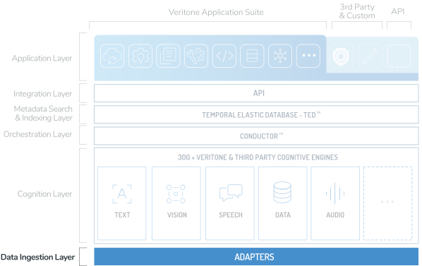
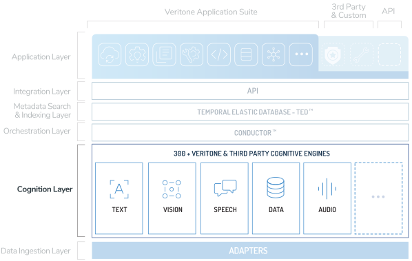
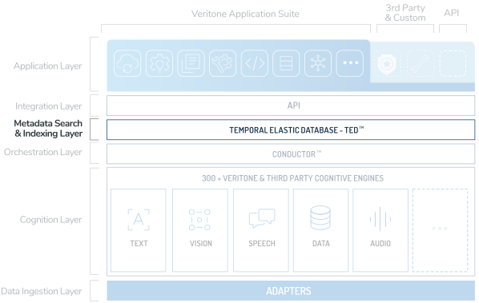
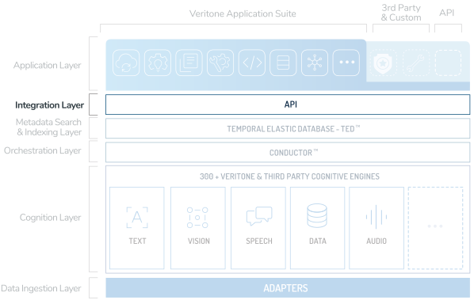

# aiWARE Architecture Overview

Veritone's aiWARE architecture is a layered, componentized, open architecture, built with extensibility and integration-friendliness  in mind.

## Data Ingestion & Storage

aiWARE has been designed with flexibility to ingest and
store virtually any type of structured or unstructured data, whether from
storage or live streams.

Data is generally categorized as "Public" or "Private."  Examples of
Public data are broadcast TV, radio, podcast, or web video.  Veritone
invests in aggregating and processing Public data from many sources in
order to serve customers wishing to search locally or nationally for
specific terms.

Audio broadcast streams are programmatically ingested and "chunked" into
15 minute segments, while video is chunked into 5 minute segments.
 Private data can take many forms, and is only available to the
organization that uploads the media into their Org account.

We continue to expand the availability of what we call "Adapters" (aka
Connectors) that facilitate the easy import of data files from cloud
storage, local storage, web sources, live streams, etc.  Currently
available adapters include:

- Upload from local computer or network drive
- Cloud storage - Google Drive, Box.com, Dropbox
- Web video - YouTube, Vimeo
- FTP/SFTP
- RSS including Podcast RSS
- Amazon AWS
- More coming soon!

Once ingested, source data is stored securely in aiWARE and accessible
via the [GraphQL API](apis/).

For customers who require it, the aiWARE platform can optionally be deployed as an on-premise
solution, replacing cloud storage of the source data files with local
storage.  

## Cognitive Processing

Each engine process selected (whether programmatically by
auto-ingestion, by an end user, or by Conductor) will create a unique
"job" for a given piece of media.

Veritone operates a scalable architecture for engine processing utilizing various engine runtimes.
The most commonly used and most robust runtime is Docker on Linux.
Under this runtime, each new processing job for a given piece of media is given an ID and distributed to a specific edge cluster for processing.
The edge cluster is responsible for orchestrating the running of Docker containers to complete the job.
This architecture is the same regardless of aiWARE deployment model (cloud, on-premise, or hybrid).

Docker containers can either be constructed to call an external API
endpoint for remote processing, run a "network isolated" executable
completely within the Docker, or run within the container but with
external calls to a license or reporting server.

Network isolated versions provide the developer with more opportunities
to earn processing volume and revenue, as they can be selected by
clients requiring strict security - which is often a requirement from
Government or Legal clients for example.

Engine processing can occur in parallel or serial fashion.  For
instance, in the aforementioned broadcast example, all 4 types of
engines selected by a broadcast TV client can run simultaneously.

An example of serial processing is text sentiment analysis, which
requires processing metadata (e.g. a transcript) after the original
transcription job has been processed.  Same is true of translation,
where a French to French transcription is first performed, then the
resulting French transcript (in words) is then translated to English.

[Veritone CMS](apps/?id=cms) displays to the end user the jobs that are queued, in process, and completed.

> For more information on engines, including runtimes, processing modes, deployment models, and more, please see the documentation for [Building Engines](/developer/engines/).

## Engine Orchestration

Users define their workflow for cognitive processing, including the
class of engine or specific engine(s) to run against certain media.
 Depending on the source, this workflow can be defined for all inbound
media or can be performed on an ad hoc basis after ingestion.

For instance, broadcast television clients may choose to run
transcription, OCR, Face Recognition, and Logo Recognition on all
inbound media automatically upon ingestion.

aiWARE's real-time engine architecture means that processing results
can be delivered in seconds or even sub-second depending on the latency
of the input source.

Increasingly, engine processing is orchestrated by Veritone's
proprietary ConductorTM technology.  Veritone's Data Science
team continues to make strides in auto selecting the best engine or
engines to run for each specific data file based on the features of that
file, utilizing robust machine learning that continues to improve over
time.

Intraclass Conductor will select the best engine in a given class,
transcription for example, based on the profile of a file.  Interclass
Conductor will soon automatically select engines across classes based on
what it may learn from a file as one or more engines begin to process
the file.

Ultimately the goal is for Conductor to also determine the domain
context of a file, such that a file from one typical domain that happens
to have characteristics of another domain (e.g. a business related
subject such as team valuation, in the broader context of sports news)
may be routed to a set of narrow engines that specialize in a specific
and perhaps non-obvious field.

## Metadata Indexing and Storage

The output of each engine processing job is a set of metadata that is
output by the engine and stored in Veritone's proprietary hyper-scale,
time-correlated Temporal Elastic Database (TEDTM).

Time correlation based on the media run-time is required to facilitate
effective multi-variant search by Veritone's suite of end-user
applications.

> For more information on the types of data available to be indexed, see the [engine output specifications](developer/engines/standards/engine-output/).

## API Layer

Near the top of the stack, the Integration (API) Layer affords access (via HTTP) to the other underlayers,
via a rich [GraphQL](apis/using-graphql.md)-based Application Programming Interface.

> Read more about our APIs [here](../apis/)

## Applications

Veritone provides a suite of native applications for end users to utilize and extract value from the aiWARE platform.
These applications range from general-purpose applications to highly specialized apps supporting very specific use cases.

> See the [Applications](apps/) section of the documentation for more information.

## Search Functionality

Veritone search intelligence provides a rich set of flexible features that allow users to intuitively search and quickly find the content they’re looking for.
The search framework performs application-specific querying against an organization’s private and public indexes to find data based on specific criteria.
Our advanced search algorithm supports global free-text and filtered searching and delivers high-quality matches in results for even the most complicated queries.
Veritone search features include:

- Searches by keyword, phrase, multiple words in any order, ignored words, date range, and more.
- Autocomplete suggests results as a user searches for content.
- Faceted search options refine results by attributes such as watchlists, faces, locations, objects, and tags.
- Result ranking logic returns the most relevant results by default or can be fine-tuned for specific queries.

> For more information on the search API, see the [search quickstart guide](../apis/search-quickstart/).
