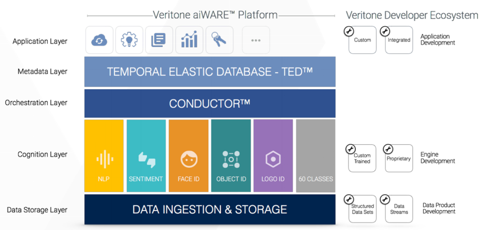

## 1\. Data Ingestion & Storage

The Veritone platform has been designed with flexibility to ingest and
store virtually any type of structured or unstructured data, from
storage or live streams.  

Data is generally categorized as "Public" or "Private".  Examples of
Public data are broadcast TV, radio, podcast, or web video.  Veritone
invests in aggregating and processing Public data from many sources in
order to serve customers wishing to search locally or nationally for
specific terms.  

Audio broadcast streams are programmatically ingested and "chunked" into
15 minute segments, while video is chunked into 5 minute segments.
 Private data can take many forms, and is only available to the
organization that uploads the media into their Org account.

We continue to expand the availability of what we call "Adapters" (aka
Connectors) that facilitate the easy import of data files from cloud
storage, local storage, web sources, live streams, etc.  Currently
available adapters include:

  - Upload from local computer or network drive
  - Cloud storage - Google Drive, [Box.com](http://Box.com), Dropbox
  - Web video - YouTube, Vimeo
  - FTP/SFTP
  - RSS including Podcast RSS
  - Amazon AWS
  - More coming soon\!

Once ingested, source data is stored in Veritone's Amazon S3
environment.  Veritone then passes secure URLs to its engine partners
for them to access and process source media files.

Veritone generally transcodes to create a copy of media files in a
standard format for playback in the Veritone UI, e.g. 480p video or .wav
files for audio.

Alternatively, the aiWARE platform can be deployed as an on-premise
solution, replacing cloud storage of the source data files with local
storage.  All other aspects of the platform perform in the same fashion
in an on-premise deployment.

## 2\. Engine Orchestration

Users define their workflow for cognitive processing, including the
class of engine or specific engine(s) to run against certain media.
 Depending on the source, this workflow can be defined for all inbound
media or can be performed on an ad hoc basis after ingestion.  

For instance, broadcast television clients may choose to run
transcription, OCR, Face Recognition, and Logo Recognition on all
inbound media automatically upon ingestion.  

Veritone utilizes [Iron.io](http://Iron.io) to queue and route
processing jobs across its compute infrastructure.  Each individual
Docker container that processes a job is terminated once processing is
completed.

Increasingly, engine processing is orchestrated by Veritone's
proprietary ConductorTM technology.  Veritone's Data Science
team continues to make strides in auto selecting the best engine or
engines to run for each specific data file based on the features of that
file, utilizing robust machine learning that continues to improve over
time.  

Intraclass Conductor will select the best engine in a given class,
transcription for example, based on the profile of a file.  Interclass
Conductor will soon automatically select engines across classes based on
what it may learn from a file as one or more engines begin to process
the file.  

Ultimately the goal is for Conductor to also determine the domain
context of a file, such that a file from one typical domain that happens
to have characteristics of another domain (e.g. a business related
subject such as team valuation, in the broader context of sports news)
may be routed to a set of narrow engines that specialize in a specific
and perhaps non-obvious field.

## 3\. Cognitive Processing

Each engine process selected (whether programmatically by
auto-ingestion, by an end user, or by Conductor) will create a unique
"job" for a given piece of media.

Veritone operates a scalable architecture for engine processing
utilizing Docker on Linux.  Each new processing job for a given piece of
media will be queued by [Iron.io](http://Iron.io) and assigned to a
compute cluster, then Iron will instantiate a new Docker container for
each job.  

Once the job is completed and the metadata successfully passed back to
Veritone, the Docker instance will terminate. This architecture is the
same regardless of aiWARE deployment model (cloud, on prem, etc)

Docker containers can either be constructed to call an external API
endpoint for remote processing, run a "network isolated" executable
completely within the Docker, or run within the container but with
external calls to a license or reporting server.  

Network isolated versions provide the developer with more opportunities
to earn processing volume and revenue, as they can be selected by
clients requiring strict security - which is often a requirement from
Government or Legal clients for example.

Engine processing can occur in parallel or serial fashion.  For
instance, in the aforementioned broadcast example, all 4 types of
engines selected by a broadcast TV client can run simultaneously.

An example of serial processing is text sentiment analysis, which
requires processing metadata (e.g. a transcript) after the original
transcription job has been processed.  Same is true of translation,
where a French to French transcription is first performed, then the
resulting French transcript (in words) is then translated to English.

The Veritone UI in CMS application displays to the end user the jobs
that are queued, in process, and completed.

## 4\.  Metadata Indexing and Storage

The output of each engine processing job is a set of metadata that is
output by the engine and stored in Veritone's proprietary hyper-scale,
time-correlated Temporal Elastic Database (TEDTM).  

Time correlation based on the media run-time is required to facilitate
effective multi-variant search by Veritone's suite of end user
applications.

## 5\.  User Interface

Veritone provides a suite of native applications for end users to
utilize and extract value from the aiWARE platform.

Veritone CMS is the repository for accessing source media files,
indicating any engine processing that has already been performed on each
asset.  Note this is the only application where the entire original
source file resides.

Discovery and Collections are designed to display "Mentions" i.e. the
aperture that contains a specific search item found, with 30 second of
media before and after the item in question (whether a text word or
phrase,
